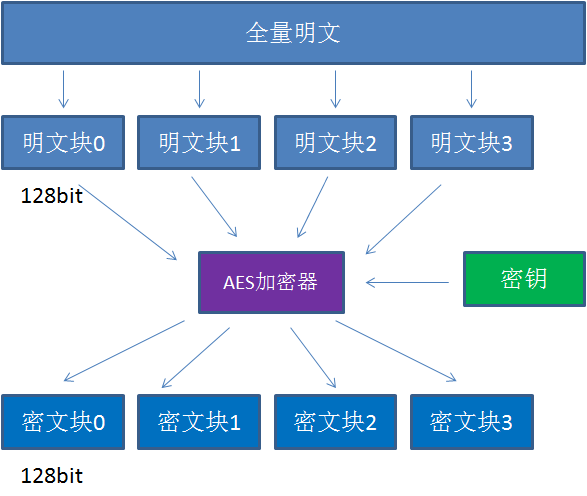
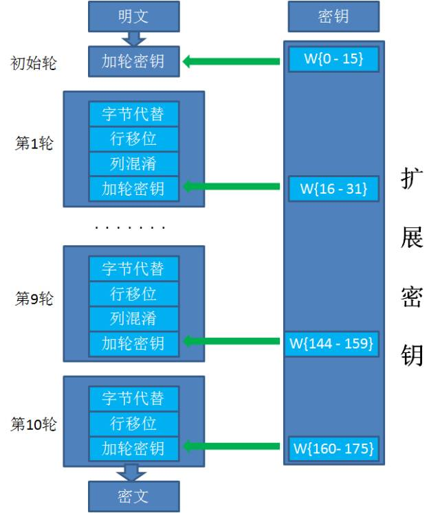

* content
{:toc}

#### 百度

高级加密标准（英语：Advanced Encryption Standard，缩写：AES），在密码学中又称Rijndael加密法，是美国联邦政府采用的一种区块加密标准。这个标准用来替代原先的DES，已经被多方分析且广为全世界所使用。经过五年的甄选流程，高级加密标准由美国国家标准与技术研究院（NIST）于2001年11月26日发布于FIPS PUB 197，并在2002年5月26日成为有效的标准。2006年，高级加密标准已然成为对称密钥加密中最流行的算法之一。

具体见[baidu链接](https://baike.baidu.com/item/aes/5903?fr=aladdin)

#### 基本算法
AES加密也叫对称加密：A用密码对数据进行AES加密后，B用同样的密码对密文进行AES解密。

1. 把明文按照128bit拆分成若干个明文块。
2. 按照选择的填充方式来填充最后一个明文块。
3. 每一个明文块利用AES加密器和密钥，加密成密文块。
4. 拼接所有的密文块，成为最终的密文结果。

AES的Key支持三种长度：AES128，AES192，AES256。Key的长度决定了AES加密的轮数。

除去初始轮，各种Key长度对应的轮数如下：
* AES128：10轮 
* AES192：12轮 
* AES256：14轮 

不同阶段的Round有不同的处理步骤。

1. 初始轮只有一个步骤：
    * 加轮密钥（AddRoundKey）

2. 普通轮有四个步骤：
    * 字节代替（SubBytes）
    * 行移位（ShiftRows）
    * 列混淆（MixColumns）
    * 加轮密钥（AddRoundKey）

3. 最终轮有三个步骤：
    * 字节代替（SubBytes）
    * 行移位（ShiftRows）
    * 加轮密钥（AddRoundKey）
###### 

