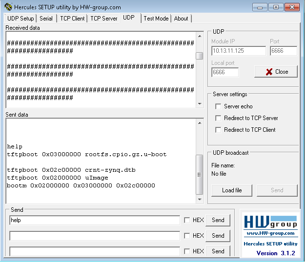

* content
{:toc}

## NetConsole

uboot下的netconsole类似于kernel下的telnet等网络终端功能，将网络作为输入输出的终端，这样就便于我们在PC端通过网络登录设备uboot中运行命令（更准确的说是通过网络向uboot发送命令和接收uboot的反馈信息，netconsole没有登录检查）。 

uboot下netconsole的实现在drivers/net/netconsole.c中，大体原理是在drv\_nc\_init中向uboot下注册stdio\_dev设备，其实就是将其加入到uboot中stdio\_dev链表中。stdio\_dev中实现了读写函数，函数中则实现了向网络中发送数据以及从网络中接收数据。uboot下默认的console是stdio\_dev链表的第一个设备，stdio\_init中调用drv\_nc\_init之前会调用drv\_system\_init和serial\_stdio_init注册了串口的一些stdio设备。因此netconsole不是uboot的默认console。我们可以通过set命令进行设置。

配置过程：

1. 在configs里使能
~~~
CONFIG_NETCONSOLE=y
CONFIG_SYS_CONSOLE_OVERWRITE_ROUTINE=y
~~~
2. 在uboot下
~~~
    => setenv nc 'setenv stdout nc;setenv stdin nc'
    => setenv ncip 192.168.1.1
    => saveenv
    => run nc
~~~
3. 在window下使用Hercules setup utlity通信。

