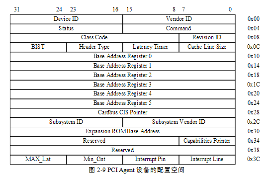
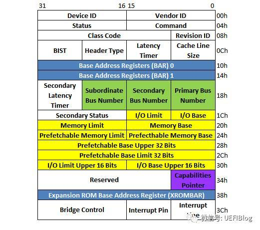
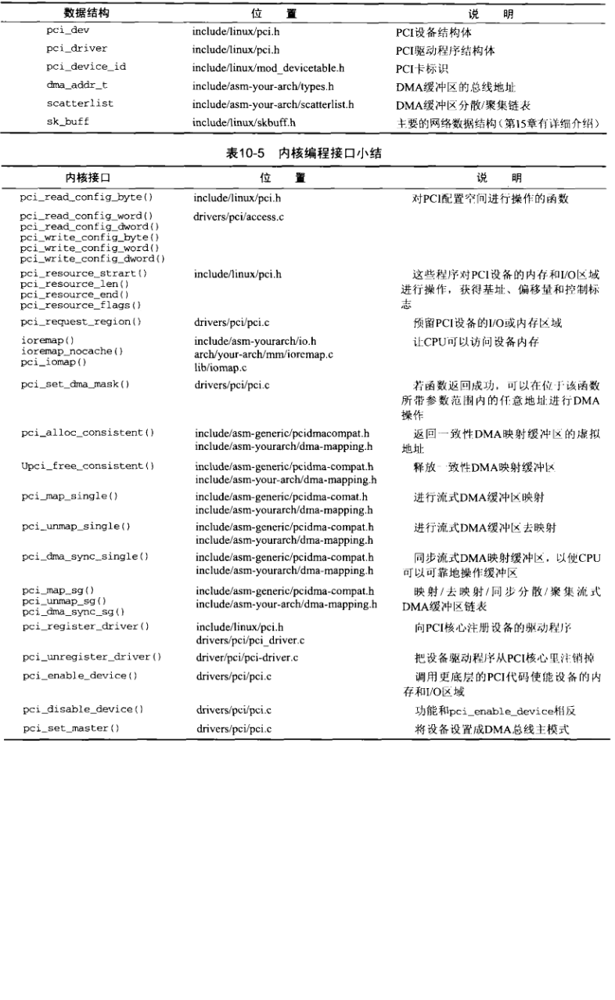

* content
{:toc}

## PCIe的历史
Intel在1992年提出PCI（Peripheral Component Interconnect）总线协议，并召集组成了名为 PCI-SIG (PCI Special Interest Group)（PCI 特殊兴趣组J）的企业联盟。从那以后这个组织就负责PCI和其继承者们（PCI-X和PCIe的标准制定和推广。

PCI总线标准初试啼声就提供了133MB/s的带宽(33MHz时钟，每时钟传送32bit)。这对当时一般的台式机已经是超高速了，但对于服务器或者视频来说还是不够。于是AGP被发明出来专门连接北桥与显卡，而为服务器则提出PCI-X来连接高速设备。

2004年，Intel再一次带领小伙伴革了PCI的命。PCI express（PCIe，注意官方写法是这样，而不是PCIE或者PCI-E）诞生了，其后又经历了两代，现在是第三代(gen3，3.0)，gen4有望在2017年公布，而gen5已经开始起草中。
|pcie version|mask|speed|Throught x1|x4|x8|x16|
|:---:|:---:|:---:|:---:|:---:|:---:|:---:|:---:|
|1.0|8b/10b|2.5G|250MB/s|1GB/s|2GB/s|4GB/s|
|2.0|8b/10b|5G|500MB/s|2GB/s|4GB/s|8GB/s|
|3.0|128b/130b|8G|984.6MB/s|3.938GB/s|7.877GB/s|15.754GB/s|
|4.0|128b/130b|16G|1.969GB/s|7.877GB/s|15.754GB/s|31.508GB/s|
|5.0|128b/130b|32G|3.9G|15.8G|31.5G|63.0G|

## PCI和PCIe架构

一个Host Bridge用于隔离处理器系统的存储器域与PCI总线域，并完成处理器与PCI设备间的数据交换。每个Host Bridge单独管理独立的总线空间，包括PCI Bus, PCI I/O, PCI Memory, PCI
Prefetchable Memory Space。

**PCI标准特点：** 

1.  它是个并行总线。在一个时钟周期内32个bit（后扩展到64）同时被传输。
2. PCI空间与处理器空间隔离。PCI设备具有独立的地址空间，即PCI总线地址空间，该空间与存储器地址空间通过Host bridge隔离。
3. 扩展性强。 可以通过PCI桥扩展出一系列PCI总线，并以Root bridge为根节点，形成1颗PCI总线树。
4. PCI是总线结构，而PCIe是点对点结构。
5. PCI配置空间从256B扩展为4k。同时提供了PCIe memory map访问方式。

## PCI配置空间
1. 前64个字节（其地址范围为0x00~0x3F）是所有PCI设备必须支持的。

2. 此外PCI/PCI-X还扩展了0x40~0xFF这段配置空间，在这段空间主要存放一些与MSI或者MSI-X中断机制和电源管理相关的Capability结构。

通常以三段编码来区分PCI设备，即Bus Number, Device Number和Function Number,简称他们为BDF。有两种访问方式。

#### IO方式:
CPU提供了两组I/O寄存器用于访问配置空间
1. CONFIG_ADDRESS

|31|30-24|23-16|15-11|10-8|7-2|1-0|
|:-:|:-:|:-:|:-:|:-:|:-:|:-:|
|Enabled|extend|bus|device|function|register|00|
2. CONFIG_DATA

如上，在CONFIG_ADDRESS端口填入BDF,即可以在CONFIG_DATA上写入或者读出PCI配置空间的内容。

#### Memory方式(ECAM)
Memory方式访问PCI/PCIe配置空间需要知道MMCFG的基本地址。这个地址是由BIOS program到mmcfg_base寄存器中的。

#### pcie设备BAR空间

其中Device ID和Vendor ID是区分不同设备的关键，OS和UEFI在很多时候就是通过匹配他们来找到不同的设备驱动（Class Code有时也起一定作用）。为了保证其唯一性，Vendor ID应当向PCI特别兴趣小组(PCI SIG)申请而得到。

BAR在bit0来表示该设备是映射到memory还是IO，bar的bit0是readonly的，也就是说，设备寄存器是映射到memory还是IO是由设备制造商决定的，其他人无法修改。
|31-4|3|2-1|0|
|:-:|:-:|:-:|:-:|
|base address|prefetchable|type|space indicator|

space indicator : 0表示memory space，1表示I/O space

type: 00表示32位访问空间，10表示64位

地址空间大小的计算方法：
1. 向BAR寄存器写全1
2. 读回寄存器里面的值，然后clear 上图中特殊编码的值，(IO 中bit0，bit1， memory中bit0-3)。
3. 对读回来的值去反，加一就得到了该设备需要占用的地址内存空间。

比如一个PCI设备占用1MB的地址空间，那么这个BAR就需要实现高12bit是可读写的，而20-4bit是只读且位0。bar0的值应该是0xfff00000.

Command寄存器，该寄存器为PCI设备的命令寄存器，该寄存器在初始化时，其值为0，此时这个PCI设备除了能够接收配置请求总线事务之外，不能接收任何存储器或者I/O请求。系统软件需要合理设置该寄存器之后，才能访问该设备的存储器或者I/O空间。

#### PCI桥设备

三组绿色的BUS Number和多组黄色的BASE/Limit对，它决定了桥和桥下面的PCI设备子树相应/被分配的Bus和各种资源大小和位置。这些值都是由PCI枚举程序来设置的。

**Subordinate Bus Number、Secondary Bus Number和Primary Bus Number寄存器**

Subordinate Bus Number寄存器存放当前PCI子树中，编号最大的PCI总线号。而Secondary Bus Number寄存器存放当前PCI桥Secondary Bus使用的总线号，这个PCI总线号也是该PCI桥管理的PCI子树中编号最小的PCI总线号。

**Memory Limit和Memory Base寄存器**
这两个寄存器存放所有这些PCI设备使用的，存储器地址空间集合的基地址和大小，PCI桥规定这个空间的大小至少为1MB。

## P2041的PCI配置
#### uboot

Uboot启动后，需要配置LAWs（Local Access Window,LBC(local bus controller),PCI 或者RapidIO的ATMU（address translation and mapping unit），没有这些配置，就无法访问设备。

LAWs里信息包含了芯片的地址范围，ATMU提供了PCIE和RapidIO的地址转换功能。

Linux没有更改LAW和LBC的在uboot里的配置，但是可以修改ATMU。

#### devicetree

ranges的定义如下：

开头的第一个32位数表明映射的地址的属性。0x01000000是IO映射，0x02000000是内存映射，0x42000000也是内存映射，支持预取。
		
第2-3个双字表示pci总线的地址空间，用2个双字因为PCI总线可能是支持64位寻址的。
		
第4-5个双字表示放cpu_address ,即cpu存储器域地址空间，是cpu寻址的空间。
	
第5-6个双字表示映射长度

~~~
pci1: pcie@ffe201000 {
	reg = <0xf 0xfe201000 0 0x1000>;
	ranges = <0x02000000 0x0 0xe0000000 0xc 0x20000000 0x0 0x20000000
		  0x01000000 0x0 0x00000000 0xf 0xf8010000 0x0 0x00010000>;
	fsl,msi = <&msi1>;
	interrupts = <16 2 1 14>;
	pcie@0 {
		reg = <0 0 0 0 0>;
		#interrupt-cells = <1>; //表示interrupt specifier占一个cell
		#size-cells = <2>;
		#address-cells = <3>;
		device_type = "pci";
		interrupts = <16 2 1 14>;
		interrupt-map-mask = <0xf800 0 0 7>;
		interrupt-map = <
			/* IDSEL 0x0 */
			0000 0 0 1 &mpic 41 1 0 0
			0000 0 0 2 &mpic 2 1 0 0        /* ARAD uses IRQ2 */
			0000 0 0 3 &mpic 6 1 0 0
			0000 0 0 4 &mpic 7 1 0 0
			>;
		ranges = <0x02000000 0 0xe0000000
			  0x02000000 0 0xe0000000
			  0 0x20000000
			  0x01000000 0 0x00000000
			  0x01000000 0 0x00000000
			  0 0x00010000>;
	};
};

~~~

#### pcie bridge driver

手动配置rootbus的port，连接bus1.配置地址空间，使用command使能。
~~~
// enable the 1 level pex switch upstream port
out_be32((volatile u32 *)(&p204x_pcie2->configReg), PORT(0,0,0,0x18));
out_be32((volatile u32 *)(&p204x_pcie2->dataReg), 0x0001ff00);

// enable the 1 level pex switch and subordinate ports
out_be32((volatile u32 *)(&p204x_pcie2->configReg), PORT(1,0,0,0x18));
out_be32((volatile u32 *)(&p204x_pcie2->dataReg), 0x0102ff00);

// upstream port inband window  0xe000 0000 ~ (0xfffx_xxxx
out_be32((volatile u32 *)(&p204x_pcie2->configReg), PORT(1,0,0,0x20));
out_be32((volatile u32 *)(&p204x_pcie2->dataReg), 0x00e0f0ff); 

 // enable memory and pcie mast
out_be32((volatile u32 *)(&p204x_pcie2->configReg), PORT(1,0,0,0x4));
out_be32((volatile u32 *)(&p204x_pcie2->dataReg), 0x06000000);

note 数据在pci空间是小端
~~~

#### pci equip driver
1. 手动配置设备PCIE的CPU访问空间。bar0对应cpu地址。
~~~
#config base addr
out_be32((volatile u32 *)(&p204x_pcie2->configReg), PORT(bus,0,0,0x10));
out_be32((volatile u32 *)(&p204x_pcie2->dataReg), bar0);

#enable command
out_be32((volatile u32 *)(&p204x_pcie2->configReg), PORT(bus,0,0,0x4)));
out_be32((volatile u32 *)(&p204x_pcie2->dataReg),   0x06000000);
~~~
2. device driver

~~~
#include <linux/pci.h>  
#include <linux/module.h>  

// 在这里指定PCI设备ID，PCI_VDEVICE会组装厂家ID和PCI设备ID，后面的是驱动私有数据，以传递必要的信息。当然也可不写  
static const struct pci_device_id misc_pci_tbl[] = {  
    { PCI_VDEVICE(INTEL, 0x0f1c), 0 },  
    { PCI_VDEVICE(INTEL, 0x0f12), 1 }, // SMBus   
    { },  
};  
MODULE_DEVICE_TABLE(pci, misc_pci_tbl);  

//设备驱动信息
struct misc_driver
{
	struct pci_dev *pdev;
	resource_size_t start;
	resource_size_len len;
}
  
//设备文件操作接口
static struct file_operations misc_fops =
{
    .owner   = THIS_MODULE,
    .unlocked_ioctl   = misc_ioctl,
    .mmap    = misc_mmap,
    .open    = misc_open,
    .release = misc_release,
};

static struct pci_driver misc_pci_driver = {  
    .name           = "misc_pci",  
    .id_table       = misc_pci_tbl,  
    .probe          = misc_pci_probe,  
    .remove         = misc_pci_remove,  
};  

  
static int misc_pci_probe(struct pci_dev *dev,  
        const struct pci_device_id *ent)  
{  
    switch (dev->device)  
    {  
    case 0x0f1c:  
        printk("found LPC pci device...\n");  
        break;  
    case 0x0f12:  
        printk("found SMBus pci device...\n");  
        // 此处可注册设备，如platform设备  
        // platform_device_register  
		//
          
        // 设置PCI驱动数据，在本驱动退出时，可获取到paltform设备从而卸载之  
        pci_set_drvdata(dev, pdev);  
        break;  
          
    default:  
        printk("unknown pci device 0x%x...\n", dev->device);  
        break;  
    }  
  
    return ret;  
}  
  
static void misc_pci_remove(struct pci_dev *dev)  
{  
    // 得到platform设备，卸载  
    struct platform_device *pdev = pci_get_drvdata(dev);  
  
    platform_device_unregister(pdev);  
}  
  

  
// 注册PCI驱动  
module_pci_driver(misc_pci_driver);  
  
MODULE_DESCRIPTION("PCI driver");  
MODULE_LICENSE("GPL v2");  
MODULE_AUTHOR("Late Lee<latelee@163.org>");  
~~~

1. 内核启动时根据深度优先方式扫描PCI总线上的设备。pci_device_probe函数首先通过设备驱动中的misc_pci_tbl表，跟从设备获得vendorID,productID进行比较，看是否一致，如果一致，就返回这个表的地址；如果没有一致的，就表明，这个设备跟这个驱动不匹配，就不需要继续进行下面的操作了，直接退出.

2. 调用pci_enable_device函数来使能PCI设备, pci_set_master

3. 有多个相同设备的也会继续调用probe。直到扫描结束。比如，有2个相同的网卡设备(即网卡芯片ID相同)处于不同的PCI总线情况时，它们对应pci_device_id只有一个ID。但它们在不同PCI总线上，当扫描到设备，会调用2次对应驱动的probe函数。

4. 参考函数

pcie的完整参考程序可在[lxrwangzhan](https://elixir.bootlin.com/linux/v2.6.39.4/source/drivers/net/e1000/e1000_main.c)查看。

#### reference
1. [深入PCI与PCIe之一：硬件篇](https://zhuanlan.zhihu.com/p/26172972)
2. [nxp 36bit addr](https://www.nxp.com/docs/en/application-note/AN4064.pdf)
3. [Linux那些事儿 之 我是PCI ](https://blog.csdn.net/fudan_abc/article/category/345294)
4. [pci express 体系结构](http://blog.sina.com.cn/s/articlelist_1685243084_3_1.html)
5. [PCI驱动probe的一点认知](https://blog.csdn.net/subfate/article/details/53433825)
6. [PCIe驱动开发接口函数](https://blog.csdn.net/YuZhiHui_No1/article/details/45893031)
7. [PCie 驱动](https://wenku.baidu.com/view/8a9f25c7866fb84ae55c8dbe.html)