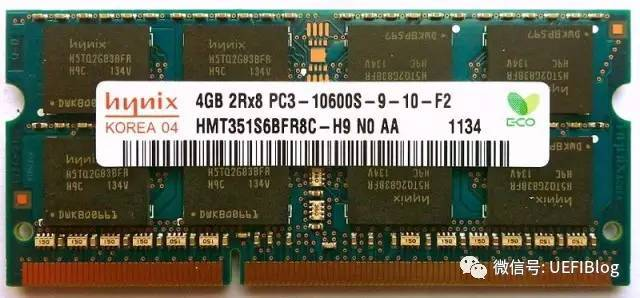

* content
{:toc}

DDR SDRAM全称为Double Data Rate SDRAM，中文名为“双倍数据流SDRAM”。DDR SDRAM在原有的SDRAM的基础上改进而来。顾名思义，和原本的SDRAM相比，DDR SDRAM一个时钟周期要传输两次数据。
从DDR到DDR4主要的区别是在于传输速率的不同，随着时钟周期的不断提高，传输率也不断提高。还有电压也越来越低。

## 内存条的识别

1. 4G 表示内存条容量。
2. 2R x 8 表示2Rank，8表示每个rank的内存颗粒数。内存条2Rx8的意思是由2个rank组成，每个rank八个内存颗粒。由于整个内存是4GB，我们可以算出单个内存颗粒是256MB。
3. PC3-10600S PC3表示DDR3，10600表示带宽，S表示封装是SO-DIMM。PC3-10600S代表DDR3，1333MHz的SO-DIMM。
4. -9-10 表示内存颗粒的时延（Latency）数据，分别代表 CL-tRCD-tRP-tRAS的数据，越小越好。如果内存标签条上的4-4-4-8, 5-5-5-15, 所代表的 CL-tRCD-tRP-tRAS-CMD。

## DDR信号

||name|function|
|-|-|-|
| 片选|CS信号|S0#和S1#每个用于选择是哪个Rank。|
| Bank地址线|BA0-BA2|2^3=8,可以选择8个Bank|
|列选CAS |Column Address Select|用于指示现在要选通列地址|
| 行选RAS#|Row Address Select|RAS#用于指示现在要选通行地址.|
|地址线||A0-A13，用于行和列的地址选择，通常列信号为A0-A9|
|数据线||DQ0-DQ63，用于提供全64bit的数据。|
| 命令||COMMAND,用于传输命令，如读或者写等等。|

#### 读写过程
1.  行有效。RAS#低电平，CAS#高电平。意味着现在行地址有效，同时在A0-A13传送地址信号，即2^13个Row可以选择。
2.  列有效。RAS#高电平，CAS#低电平。意味着列地址有效，这时在A0-A13上传送的是列地址。没错，A0-A13是行列共用的，所以每个格子选择需要有1和2两步才能唯一确定。
3.  数据读出或写入。根据COMMAND进行读取或者写入。在选定好小方格后，就已经确定了具体的存储单元，剩下的事情就是数据通过数据I/O通道（DQ）输出到内存总线上了。

#### 时延

|name||function|
|-|-|-|
|CL|CAS Latency|CAS与读取命令发出到第一笔数据输出的这段时间。第3步读取时需要的时间。|
|tRCD|RAS-to-CAS Delay|内存行地址传输到列地址的延迟时间。步骤1和2要间隔的时间。|
|tRP|Precharge command Period|预充电有效周期，内存行地址选通脉冲预充电时间。步骤1的准备工作要做多久。|
|tRAS|RAS Active Time|内存行有效至预充电的最短周期，步骤1-1整个过程的最小时间。|

#### PCB布线
1. 首先要确定DDR的拓补结构，一句话，DDR1/2采用星形结构，DDR3采用菊花链结构（需要cpu提供write/read leveling).DDR3颗粒比较少（<4)最好也用T型。
2. 元器件摆放

    - 考虑拓补结构，仔细查看CPU地址线的位置，使得地址线有利于相应的拓补结构

    - 地址线上的匹配电阻靠近CPU

    - 数据线上的匹配电阻靠近DDR

    - 将DDR芯片摆放并旋转，使得DDR数据线尽量短，也就是，DDR芯片的数据引脚靠近CPU

    - 如果有VTT端接电阻，将其摆放在地址线可以走到的最远的位置。一般来说，DDR2不需要VTT端接电阻，只有少数CPU需要；DDR3都需要VTT端接电阻。

    - DDR芯片的去耦电容放在靠近DDR芯片相应的引脚
3. 设置线宽与线距
    - 根据PCB材料和阻抗的要求，设置线宽。
    - 线距2W
4. 走线
    - 所有走线尽量短
    - 走线不能有锐角
    - 尽量少打过孔
    - 保证所有走线有完整的参考面，地平面或这电源平面都可以，对于交变信号，地与电源平面是等电位的
    - 走完地址线和数据后，务必将DDR芯片的电源脚，接地脚，去耦电容的电源脚，接地脚全部走完，否则在后面绕等长时会很麻烦的
5. 设置等长规则
    - 每个BYTE与各自的DQS，DQM等长，即DQ0:7与DQS0，DQM。等长，DQ8:15与DQS1，DQM1等长，以此类推。
    - 地址线方面的等长,对于DDR1/2，需要设定每条地址到达同一片DDR的距离保持等长。
6. 绕等长
    - 尽量采用3倍线宽，45度角绕等长，

#### leveling

**写入均衡**

由于DDR3内存采用了FLY_BY拓扑结构，命令、地址和时钟信号与数据和选通信号会在不同时间到达不同的内存模块。为了解决这个问题，DDR3内存引入了整平技术，使各个内存模块接口的数据选通与时钟信号对齐。系统中各个内存模块的每一个数据字节都要进行整平操作。

写入均衡弥补了数据写入操作中内存模块界限处数据选通信号和时钟信号间的偏斜。在启动写入均衡机制前，需要向DDR3内存写入适当的模式寄存器值使其进入写入均衡模式。进入写入均衡模式后，内存模块便有了时钟信号和数据选通信号。内存模块在其边界采样时钟信号，与观测到的数据选通信号进行对比，然后通过数据线将采样值(0/1)反馈给驱动实体，以便为下一个循环中的数据选通信号做延迟调整。这一流程反复进行，直到观测的反馈值从0跳变为1，这表明内存模块边界的时钟信号与数据选通信号对齐。

**读取均衡**

读取均衡主要解决数据读取操作中数据与选通信号之间的偏斜。为了支持此特性，DDR3内存中增加了一个多用途寄存器(MPR)。该寄存器中包含一个预先定义的数据模式，选中后就会在数据线上输出该模式的数据而非内存阵列中的普通数据。在启动读取均衡序列前，需要向DDR3内存中编入适当的模式寄存器值，使MPR数据成为输出数据。之后，读取均衡机制启动，开始向内存模块发送READ命令，并试图通过优化调整数据选通信号的内部延迟来捕获预定义数据。反复重复此流程直到通过调整数据选通信号内部延迟而创建的窗口能够以最佳方式捕获到预先定义模式的数据。读写均衡特性仅涉及DDR3内存，DDR2内存不支持此类特性。

**内存Training**
JEDEC提供了标准做法，叫做Write Leveling Coarse。简单来说，就是内存控制器不停的发送不同时延的DQS 信号，内存 颗粒在DQS-DQS#的上升沿采样CK 的状态，并通过DQ 线反馈给DDR3 控制器（一组01010101的数据）。控制器端反复的调整DQS-DQS#的延时，直到控制器端检测到DQ 线上0 到1 的跳变控制器就锁住此时的延时值，此时便完成了一个Write leveling过程。

## P2041 Driver
## uboot
参照如下的结构，获取ddr的速率，读取spd里的ranks和dimm0数组里进行对比，找到合适的选项，把dimm0的设置写进CPU。

~~~
struct board_specific_parameters {
	u32 n_ranks;
	u32 datarate_mhz_high;
	u32 clk_adjust;
	u32 wrlvl_start;
	u32 cpo;
	u32 write_data_delay;
	u32 force_2t;
};
static const struct board_specific_parameters dimm0[] = {
	/*
	 * memory controller 0
	 *   num|  hi|  clk| wrlvl | cpo  |wrdata|2T
	 * ranks| mhz|adjst| start | delay|
	 */
	{2,   750,    3,     5,   0xff,    2,  0},
	{2,  1250,    4,     6,   0xff,    2,  0},
	{2,  1350,    5,     7,   0xff,    2,  0},
	{2,  1666,    5,     8,   0xff,    2,  0},
	{}
};

~~~

具体可在[uboot-git](http://git.denx.de/?p=u-boot.git;a=blob;f=board/freescale/p2041rdb/ddr.c;h=8bcd2fb5a7a97fa32e909ef9ddcd3a0e5dedf2c7;hb=HEAD)查看。

#### Kernel

uboot的bootm命令能修改dts/dtb文件中的memory部分，把mermory的配置传给kernel。

通常dts文件中的mermoy描述为：
~~~
memory {
device_type = "memory";
};
~~~
bootm启动后，更改成：
~~~
memory {
reg = <0x0 0x0 0x0 0x20000000>;
device_type = "memory";
};
~~~

可以参看[uboot的代码查看](http://git.denx.de/?p=u-boot.git;a=blob;f=common/image-fdt.c;h=9b41f1624848a3fb7cd95b7ea411622d62f8e8b9;hb=HEAD)。

另外，chosen部分也会修改成如下：
~~~

chosen {
linux,initrd-end = <0xffff2ca>;
linux,initrd-start = <0xeda9000>;
linux,stdout-path = "/socp2020@fffe00000/serial@4500";
boottype = "rescue";
bootargs = "rw nosmp console=ttyS0,38400 mem=496M";
};
  	
~~~

## reference
1. [快速读懂内存条标签](https://zhuanlan.zhihu.com/p/26255460)
2. [DDR3必读内容介绍DDR3 ](https://wenku.baidu.com/view/e8c72e785acfa1c7aa00cc94.html)
3. [理解DDR3及调试](https://wenku.baidu.com/view/9db0635dec3a87c24128c490.html)
