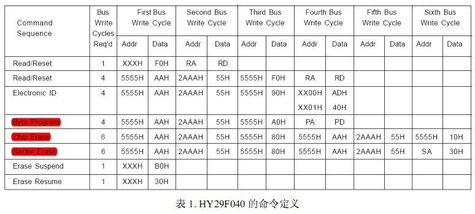
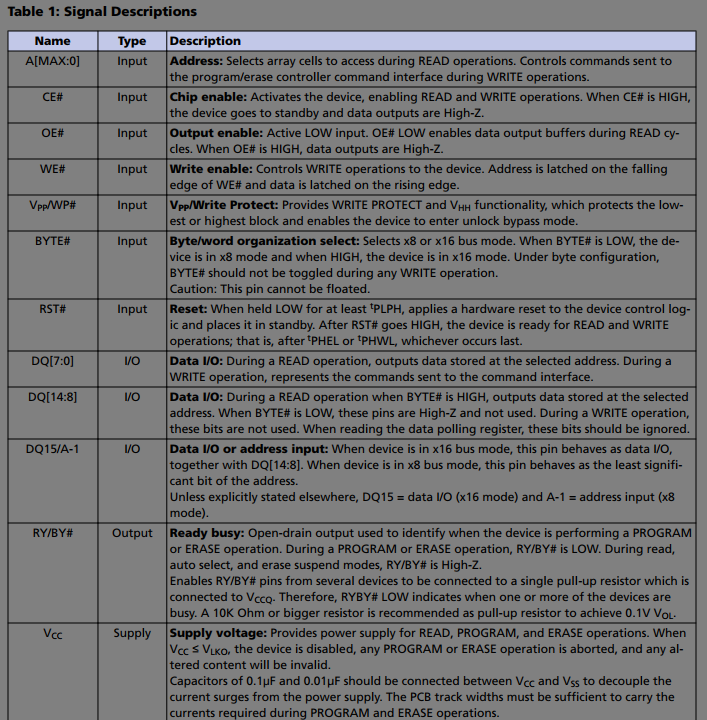
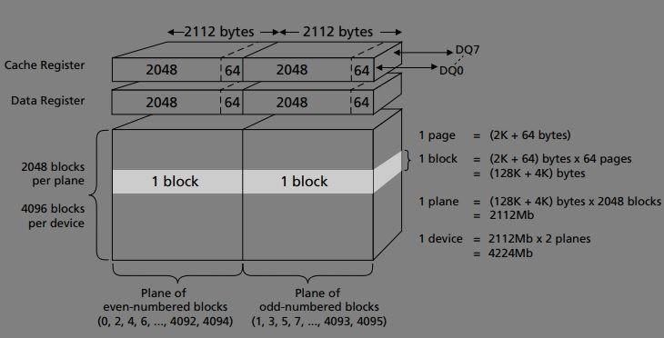
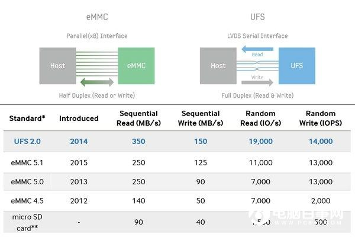

* content
{:toc}

## EEPROM
EEPROM指的是“电可擦除可编程只读存储器”，即Electrically Erasable Programmable Read-Only Memory。

它的最大优点是可直接用电信号擦除，也可用电信号写入。缺点是其工艺复杂， 耗费的门电路过多，且重编程时间比较长，同时其有效重编程次数也比较低。 

EEPROM可以一次只擦除一个字节(Byte)， 常用I2C和SPI来访问。而flash只能按块操作。

## NOR
NOR Flash和普通的内存比较像的一点是他们都可以支持随机访问，这使它也具有支持XIP（eXecute In Place）的特性，可以像普通ROM一样执行程序。这点让它成为BIOS等开机就要执行的代码的绝佳载体。

#### NOR 分类 
NOR Flash 根据与 Host 端接口的不同，可以分为 Parallel NOR Flash 和 Serial NOR Flash 两类。
1. Parallel NOR Flash 可以接入到 Host 的控制器 上，所存储的内容可以直接映射到 CPU 地址空间，不需要拷贝到 RAM 中即可被 CPU 访问。NOR Flash在BIOS中最早就是这种接口，叫做FWH（Firmware HUB），由于其接是并行接口，速度缓慢，现在基本已经被淘汰。
2. Serial NOR Flash 的成本比 Parallel NOR Flash 低，主要通过 SPI 接口与 Host 也就是PCH相连。

#### NOR读写
从支持的最小访问单元来看,NOR FLASH一般分为 8 位的和16位的(当然,也有很多NOR FLASH芯片同时支持8位模式和是16 位模式,具体的工作模式通过特定的管脚进行选择).

FLASH一般都分为很多个SECTOR,每个SECTOR包括一定数量的存储单元.对有些大容量的FLASH,还分为不同的BANK,每个BANK包括一定数目的SECTOR.FLASH的擦除操作一般都是以SECTOR,BANK或是整片FLASH为单位.

在对FLASH进行写操作的时候,每个BIT可以通过编程由1变为0,但不可以有0修改为1.为了保证写操作的正确性,在执行写操作前,都要执行擦除操作.擦除操作会把FLASH的一个SECTOR,一个BANK或是整片FLASH的值全修改为0xFF.

由于NOR FLASH没有本地坏区管理,所以一旦存储区块发生毁损,软件或驱动程序必须接手这个问题,否则可能会导致设备发生异常. 在解锁、抹除或写入NOR FLASH区块时,特殊的指令会先写入已绘测的记忆区的第一页(Page).接着快闪记忆芯片会提供可用的指令清单给实体驱动程序,而这些指令是由一般性闪存接口CFI(Commom FLASH memory Interface)所界定的.

#### NOR 信号

从地址线可以计算出NOR的大小：

 bitsize = pow(2,(max+1))* 16bit

## NAND
NAND Flash广泛应用在各种存储卡，U盘，SSD，eMMC等等大容量设备中。它的颗粒根据每个存储单元内存储比特个数的不同，可以分为 SLC（Single-Level Cell）、MLC（Multi-Level Cell） 和 TLC（Triple-Level Cell） 三类。

其中，在一个存储单元中，SLC 可以存储 1 个比特，MLC 可以存储 2 个比特，TLC 则可以存储 3 个比特。

NAND Flash 的单个存储单元存储的比特位越多，读写性能会越差，寿命也越短，但是成本会更低。

#### NAND结构

一个典型的Flash芯片由Package, die, plane, block和page组成，如下图：

Package: 也就是chip即Flash芯片.

Die: 一个NAND颗粒是由一颗或者多颗Die封装在一起而成，这种封装可是平排的，也可以是层叠的。
die内部可以通过3D 堆叠技术扩展容量.

Plane: 一个die可以包含几个Plane.

Block: 擦除操作的最小单位。

Page：写入动作的最小单位。

#### NAND 接口

**SATA**

SATA（Serial Advanced Technology Attachment，串行高级技术附件）是一种基于行业标准的串行硬件驱动器接口.随着PC总线串行化趋势，硬盘总线从IDE进步到SATA I后，历经SATA II和SATA III，速度稳步提高,1.5Gbps，3Gbps，6Gbps.

利用一对差分线来进行收发，另外需要提供电源3.3V,5V,12V.

**SATAe**

SATA Express可以简写为SATAe，在2013年随着SATA 3.2规范被公布。它是一个将SATA、PCI-E信号综合在一个接口内的规范，因此它完全兼容现有SATA设备、数据线，唯一的不同就是它可以连接PCIe固态硬盘。SATAe可以使用两个PCIe的Lane，它在Gen3的情况下理论带宽是2GB/s。

为了兼容老的SATA接口，SATAe接口经过特殊设计，可以同时支持老的SATA硬盘.接口实际上它是两个SATA数据接口+一个PCIe ×2lane组成，同时还不支持供电.

**M.2**

M.2，正式名字是NGFF（Next Generation Form Factor）。它设计的初衷是替代mSATA/MiniPCIe（已淘汰，这里略过）。

M.2实际上是一种SATAe的一种特殊形式，它也同时支持AHCI和NVMe两种协议栈，并和SATAe一起在Z97/H97芯片组上市时得到支持。开始的NGFF和SATAe一样，只占据PCIe Gen2的两个lane，带宽是1GB/s，在后代芯片组中扩展为占据PCIe Gen3的4个lane，带宽是4GB/s。

**U.2**

U.2，也叫做SFF-8639，它和M.2一样脱离了SATAe的2个lane的限制，一开始就是4个lane，也是4GB/s。它和M.2很大的不同就是脱离了M.2小身板的限制，可以做出容量更大的SSD硬盘.

于此同时U.2的设备端接口融合了SATA及SAS(Serial Attached SCSI)接口的特点，中间用针脚填满了SATA接口留下的空缺，并预留了L型防呆设计，所以可以兼容SATA、SAS及SATA E规范，保证了向后兼容性。

**emmc**

eMMC (Embedded Multi Media Card)是MMC协会订立、主要针对手机或平板电脑等产品的内嵌式存储器标准规格。eMMC在封装中集成了一个控制器，提供标准接口并管理闪存。

|name|function|
|-|-|
|CLK|CLK 信号用于从 Host 端输出时钟信号，进行数据传输的同步和设备运作的驱动。|
|CMD|要用于 Host 向 eMMC 发送 Command 和 eMMC 向 Host 发送对于的 Response。|
|DAT0-7|主要用于 Host 和 eMMC 之间的数据传输。|
|Data Strobe|提高数据传输的稳定性，省去总线 tuning 过程。|

**ufs**

UFS(Universal Flash Storage)是为了替代eMMC而生，主要面向手机等嵌入式场景。

UFS相较eMMC最大的不同是并行信号改为了更加先进的串行信号，从而可以迅速提高频率，同时半双工改为全双工。

|version|lanes|bandwidth|
|-|-|-|
|1.0|1|300 MB/s|
|2.0|2|1200 MB/s|
|3.0|2|2900 MB/s|

## reference
1. [杂说闪存一](https://zhuanlan.zhihu.com/p/26652622)

