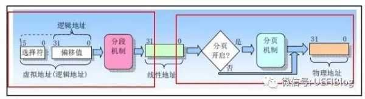

* content
{:toc}

地址分为逻辑地址（虚拟地址）、线性地址和物理地址。一个虚拟地址变换成物理地址的简单过程如下图

变换过程中线性地址到物理地址需要用到页表（page table）。页表由很多项组成，每一项叫一个页表项，整个页表由操作系统维护，并放置在内存中（或磁盘中）。我们知道，一次内存访问需要数百个时钟周期，如果每次地址转换都要查看内存页表也太浪费时间了。现代计算机为了加速这一过程，引入了翻译后援缓冲器TLB(Translation Lookaside Buffer)。TLB可以看作页表的Cache，CPU每次转换地址都会查看TLB，如果有了就不用去取内存页表了。TLB和Cache一样，也分级，分为L1和L2，还有数据TLB和代码TLB等等。

我们知道，现代操作系统进程地址空间都是分隔开来的，同一个线性地址VA1，在进程1中会被翻译成物理地址PA1，在进程2中也许会被翻译成PA2。它们的这种对应关系是因为不同的进程有不同的页表，页表的切换是在进程切换时候把页目录指针放入寄存器CR3来实现的。假如不做任何的处理，那么在进程1切换到进程2的时候，TLB中同时存在了1和2进程的页表数据，会造成混乱。这就需要我们在进程切换的时候清除TLB，给新换入的进程留下一个干净的空间。

### P2041 uboot

配置所需接口的TLB在[tlb.c](http://git.denx.de/?p=u-boot.git;a=blob;f=board/freescale/t104xrdb/tlb.c;h=6511c04f31a19617642fa0101888922bc100d87d;hb=HEAD)中。

~~~
#define SET_TLB_ENTRY(_tlb, _epn, _rpn, _perms, _wimge, _ts, _esel, _sz, _iprot) \
	{ .mas0 = FSL_BOOKE_MAS0(_tlb, _esel, 0), \
	  .mas1 = FSL_BOOKE_MAS1(1, _iprot, 0, _ts, _sz), \
	  .mas2 = FSL_BOOKE_MAS2(_epn, _wimge), \
	  .mas3 = FSL_BOOKE_MAS3(_rpn, 0, _perms), \
	  .mas7 = FSL_BOOKE_MAS7(_rpn), }
~~~

## reference
1. [什么是TLB和PCID？](https://zhuanlan.zhihu.com/p/32718446)
2. [translation lookaside buffer (TLB) ](https://whatis.techtarget.com/definition/translation-look-aside-buffer-TLB)
