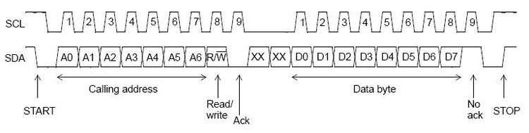
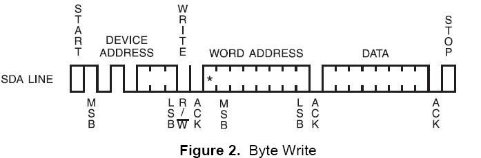
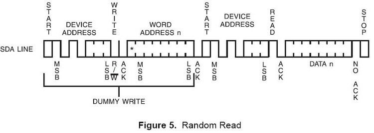

* content
{:toc}

I2C是由 Phiilps提出的，目前被广泛应用在系统内多个IC间的通讯。

## I2C协议

I2C 总线支持任何 IC 生产过程（ NMOS 、 CMOS 、双极性）。两线——串行数据（ SDA ）和串行时钟（ SCL ）线在连接到总线的器件间传递信息。每个器件都有一个唯一的地址识别，而且都可以作为一个发送器或接收器（由器件的功能决定）。

SDA 和 SCL 都是双向线路都通过一个电流源或上拉电阻连接到正的电源电压。 当总线空闲时，这两条线路都是高电平。连接到总线的器件输出级必须是漏极开路或集电极开路才能执行线与的功能。 I2C 总线上数据的传输速率在标准模式下可达 100kbit/s ， 在快速模式下可达 400kbit/s ， 在高速模式下可达 3.4Mbit/s 。 连接到总线的接口数量只由总线电容是 400pF 的限制决定。 

-   2条双向串行线，一条数据线SDA，一条时钟线SCL。
-   SDA传输数据是大端传输，每次传输8bit，即一字节。
-   支持多主控(multimastering)，任何时间点只能有一个主控。
-   总线上每个设备都有自己的一个addr，共7个bit，广播地址全0.
-   系统中可能有多个同种芯片，为此addr分为固定部分和可编程部份，细节视芯片而定，看datasheet。

#### 传输

**I2C位传输**
-   数据传输：SCL为高电平时，SDA线若保持稳定，那么SDA上是在传输数据bit；
-   若SDA发生跳变，则用来表示一个会话的开始或结束
-   数据改变：SCL为低电平时，SDA线才能改变传输的bit

**I2C开始和结束信号**
-  开始信号：SCL为高电平时，SDA由高电平向低电平跳变，开始传送数据。
-  结束信号：SCL为高电平时，SDA由低电平向高电平跳变，结束传送数据。

**I2C应答信号**
-   Master每发送完8bit数据后等待Slave的ACK。
-   即在第9个clock，若从IC发ACK，SDA会被拉低。
-   若没有ACK，SDA会被置高，这会引起Master发生RESTART或STOP流程，如下所示：

**I2C写流程**
1.    Master发起START
2.    Master发送I2C addr（7bit）和w操作0（1bit），等待ACK
3.    Slave发送ACK
4.    Master发送reg addr（8bit），等待ACK
5.    Slave发送ACK
6.   Master发送data（8bit），即要写入寄存器中的数据，等待ACK
7.    Slave发送ACK
8.    第6步和第7步可以重复多次，即顺序写多个寄存器
9.    Master发起STOP

**I2C读流程**

1.    Master发送I2Caddr（7bit）和 W操作1（1bit），等待ACK
2.    Slave发送ACK
3.    Master发送reg addr（8bit），等待ACK
4.    Slave发送ACK
5.   Master发起START
6.    Master发送I2C addr（7bit）和 R操作1（1bit），等待ACK
7.    Slave发送ACK
8.   Slave发送data（8bit），即寄存器里的值
9.   Master发送ACK
10.    第8步和第9步可以重复多次，即顺序读多个寄存器

## P2040 Driver

#### uboot

根据I2C的时序，和CPU的寄存器的定义，[uboot的代码](http://git.denx.de/?p=u-boot.git;a=blob;f=drivers/i2c/fsl_i2c.c;h=bf8d52d5ad5ffb2c48debe4c72948e1f1b7a05d1;hb=HEAD)很清晰。
~~~
typedef struct fsl_i2c {

	u8 adr;		/* I2C slave address */
	u8 res0[3];
#define I2C_ADR		0xFE
#define I2C_ADR_SHIFT	1
#define I2C_ADR_RES	~(I2C_ADR)

	u8 fdr;		/* I2C frequency divider register */
	u8 res1[3];
#define IC2_FDR		0x3F
#define IC2_FDR_SHIFT	0
#define IC2_FDR_RES	~(IC2_FDR)

	u8 cr;		/* I2C control redister	*/
	u8 res2[3];
#define I2C_CR_MEN	0x80 /*module enable*/
#define I2C_CR_MIEN	0x40 /*interrupt enable*/
#define I2C_CR_MSTA	0x20 /*start*/
#define I2C_CR_MTX	0x10 /* tx or rx*/
#define I2C_CR_TXAK	0x08/*tranfer ack*/
#define I2C_CR_RSTA	0x04/*repeat start*/
#define I2C_CR_BCST	0x01/*broadcast*/

	u8 sr;		/* I2C status register */
	u8 res3[3];
#define I2C_SR_MCF	0x80/*data tranfer completed*/
#define I2C_SR_MAAS	0x40/*address as slave*/
#define I2C_SR_MBB	0x20/*bus busy*/
#define I2C_SR_MAL	0x10/*arbitration lost*/
#define I2C_SR_BCSTM	0x08/*broadcast match*/
#define I2C_SR_SRW	0x04/*slave read/write*/
#define I2C_SR_MIF	0x02/*module interrupt*/
#define I2C_SR_RXAK	0x01/*receive ack*/

	u8 dr;		/* I2C data register */
	u8 res4[3];
#define I2C_DR		0xFF
#define I2C_DR_SHIFT	0
#define I2C_DR_RES	~(I2C_DR)
} fsl_i2c_t;
~~~
#### kernel

drivers/i2c/busses/i2c-mpc.c 和uboot一样，先实现了i2c的读写，然后利用读写函数实现i2c平台的xfer功能，利用i2c_msg消息机制来实现平台的读写。[lxr代码](https://elixir.bootlin.com/linux/v4.14.50/source/drivers/i2c/busses/i2c-mpc.c)

~~~
struct i2c_msg {
	__u16 addr;	/* slave address			*/
	__u16 flags;
#define I2C_M_RD		0x0001	/* read data, from slave to master */
					/* I2C_M_RD is guaranteed to be 0x0001! */
#define I2C_M_TEN		0x0010	/* this is a ten bit chip address */
#define I2C_M_RECV_LEN		0x0400	/* length will be first received byte */
#define I2C_M_NO_RD_ACK		0x0800	/* if I2C_FUNC_PROTOCOL_MANGLING */
#define I2C_M_IGNORE_NAK	0x1000	/* if I2C_FUNC_PROTOCOL_MANGLING */
#define I2C_M_REV_DIR_ADDR	0x2000	/* if I2C_FUNC_PROTOCOL_MANGLING */
#define I2C_M_NOSTART		0x4000	/* if I2C_FUNC_NOSTART */
#define I2C_M_STOP		0x8000	/* if I2C_FUNC_PROTOCOL_MANGLING */
	__u16 len;		/* msg length				*/
	__u8 *buf;		/* pointer to msg data			*/
};
~~~

对于i2c接口的芯片，利用i2c_msg和xfer来实现读写，然后实现其他功能。

比如[drivers/hwmon/sht21.c](https://elixir.bootlin.com/linux/v4.14.50/source/drivers/hwmon/sht21.c#L174)

~~~
	struct i2c_msg msgs[2] = {
		{
			.addr = client->addr,
			.flags = 0,
			.len = 2,
			.buf = tx,
		},
		{
			.addr = client->addr,
			.flags = I2C_M_RD,
			.len = 8,
			.buf = rx,
		},
	};

	ret = i2c_transfer(client->adapter, msgs, 2);
	if (ret < 0)
		goto out;	
~~~

## reference
1. [standard](https://www.nxp.com/docs/en/user-guide/UM10204.pdf)
2. [spi-csdn](https://blog.csdn.net/lingfeng5?t=1)
3. [baiduwenku](https://wenku.baidu.com/view/fb659f3331126edb6f1a106a.html)

