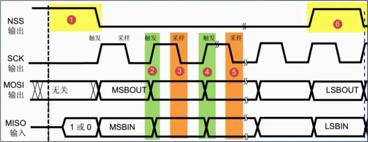
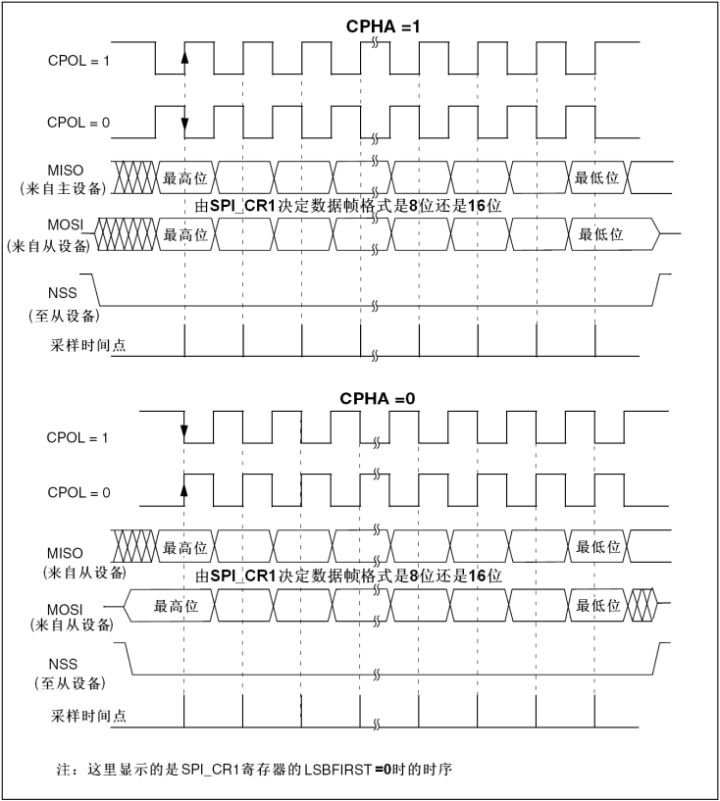

* content
{:toc}

SPI是串行外设接口（Serial Peripheral Interface）的缩写。SPI，是一种高速的，全双工，同步的通信总线.

SPI的通信原理很简单，它以主从方式工作，这种模式通常有一个主设备和一个或多个从设备，需要至少4根线，事实上3根也可以（单向传输时）。
|name|full name|fun|
|-|-|-|
|SDI|SerialData In|串行数据输入|
|SDO|SerialDataOut|串行数据输出|
|SCLK|Serial Clock|时钟信号，由主设备产生|
|CS|Chip Select|从设备使能信号，由主设备控制|

## 时序

#### 起始、停止信号

编号1和6即为起始和停止信号的发生区域。NSS电平由高变低，则产生起始信号；NSS电平由低变高，则产生停止信号。从机检测到自己的NSS线电平被置低，则开始与主机进行通讯；反之，检测到NSS电平被拉高，则停止通讯。
#### 数据有效性
MOSI和MISO线在SCK的每个时钟周期传输一位数据，开发者可以自行设置MSB或LSB先行，不过需要保证两个通讯设备都使用同样的协定。

SPI有四种通讯模式，在SCK上升沿触发，下降沿采样只是其中一种模式。四种模式的主要区别便是总线空闲时SCK的状态及数据采样时刻。

由CPOL(时钟极性 Clock Polarity)和CPHA(时钟相位 Clock Phase)的组合而产生了四种的通讯模式。CPOL表示SPI总线空闲的时候时钟的default状态，CPHA表示数据的采样时刻。

|mode|CPOL|CPHA|clock status|sample time|
|:-:|:-:|:-:|:-:|:-:|
|0|0|0|0|1st up|
|1|0|1|0|1st down|
|2|1|0|1|1st down|
|3|1|1|1|1st up|

## Driver

#### uboot

从[cmd/spi.c](http://git.denx.de/?p=u-boot.git;a=blob;f=cmd/spi.c;h=9a2edcff65cafaaaaaa19ad42d6b3bd1ff563a79;hb=HEAD)可以看到sspi的读写主要用到[如下函数](http://git.denx.de/?p=u-boot.git;a=blob;f=drivers/spi/fsl_espi.c;h=e9941593f5fdc08ee2b4e4b2cd30c7ce3bd4dc2e;hb=HEAD)
|fun|usage|
|:-:|-|
|spi_setup_slave|配置slave的cpu地址，速率，fsl_spi_slave的各个变量|
|spi_claim_bus|把fsl_spi_slave的配置写给cpu|
|spi_xfer|读写|
|spi_release_bus|释放总线|

主要用的结构体和寄存器如下：
~~~

struct fsl_spi_slave {
	struct spi_slave slave;
	ccsr_espi_t	*espi;
	unsigned int	div16;
	unsigned int	pm;
	int		tx_timeout;
	unsigned int	mode;
	size_t		cmd_len;
	u8		cmd_buf[16];
	size_t		data_len;
	unsigned int    max_transfer_length;
};
typedef struct ccsr_espi {
	u32	mode;		/* eSPI mode */
	u32	event;		/* eSPI event */
	u32	mask;		/* eSPI mask */
	u32	com;		/* eSPI command */
	u32	tx;		/* eSPI transmit FIFO access */
	u32	rx;		/* eSPI receive FIFO access */
	u8	res1[8];	/* reserved */
	u32	csmode[4];	/* 0x2c: sSPI CS0/1/2/3 mode */
	u8	res2[4048];	/* fill up to 0x1000 */
} ccsr_espi_t;
~~~

#### kernel

和I2C基本一样，只是kernel的数据结构不一样，可参考[fsl](https://elixir.bootlin.com/linux/v4.14.50/source/drivers/spi/spi-fsl-espi.c)和[mp25c80](https://elixir.bootlin.com/linux/v4.14.50/source/drivers/mtd/devices/m25p80.c)的代码,分别是master和dev。
~~~
struct spi_transfer {
	/* it's ok if tx_buf == rx_buf (right?)
	 * for MicroWire, one buffer must be null
	 * buffers must work with dma_*map_single() calls, unless
	 *   spi_message.is_dma_mapped reports a pre-existing mapping
	 */
	const void	*tx_buf;
	void		*rx_buf;
	unsigned	len;

	dma_addr_t	tx_dma;
	dma_addr_t	rx_dma;
	struct sg_table tx_sg;
	struct sg_table rx_sg;

	unsigned	cs_change:1;
	unsigned	tx_nbits:3;
	unsigned	rx_nbits:3;
#define	SPI_NBITS_SINGLE	0x01 /* 1bit transfer */
#define	SPI_NBITS_DUAL		0x02 /* 2bits transfer */
#define	SPI_NBITS_QUAD		0x04 /* 4bits transfer */
	u8		bits_per_word;
	u16		delay_usecs;
	u32		speed_hz;
	u32		dummy;
	struct list_head transfer_list;
};
~~~

## reference
1. [SPI协议（上）——基础介绍](https://zhuanlan.zhihu.com/p/27376153)
2. [wikipedia ](https://en.wikipedia.org/wiki/Serial_Peripheral_Interface_Bus)
3. [Linux下SPI和IIC驱动免在设备树上添加设备信息的编写方法](https://blog.csdn.net/mike8825/article/details/51335582)
4. [Linux中SPI驱动调试总结](https://blog.csdn.net/mike8825/article/details/50762023)
5. [Linux SPI 子系统驱动程序开发笔记](https://blog.csdn.net/lingfeng5/article/details/73070551)