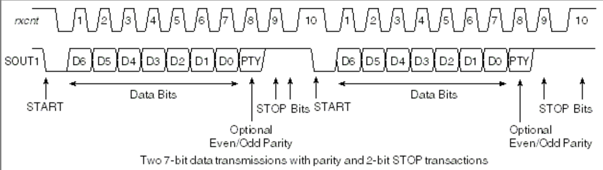

* content
{:toc}

通用异步收发传输器（Universal Asynchronous Receiver/Transmitter)，通常称作UART，是一种异步收发传输器。它将要传输的资料在串行通信与并行通信之间加以转换。作为把并行输入信号转成串行输出信号的芯片，UART通常被集成于其他通讯接口的连结上。

## 通信协议

UART作为异步串口通信协议的一种，工作原理是将传输数据的每个字符一位接一位地传输。
其中各位的意义如下：
- 起始位：先发出一个逻辑”0”的信号，表示传输字符的开始。
- 数据位：紧接着起始位之后。资料位的个数可以是4、5、6、7、8等，构成一个字符。通常采用ASCII码。从最低位开始传送，靠时钟定位。
- 奇偶校验位：资料位加上这一位后，使得“1”的位数应为偶数(偶校验)或奇数(奇校验)，以此来校验资料传送的正确性。
- 停止位：它是一个字符数据的结束标志。可以是1位、1.5位、2位的高电平。 
- 空闲位：处于逻辑“1”状态，表示当前线路上没有资料传送。
- 波特率：是衡量资料传送速率的指标。表示每秒钟传送的符号数（symbol）。

## RS232,RS485,TTL

- RS232标准定义逻辑“1”信号相对于地为-3到-15伏，而逻辑“0”相对于地为+3到+15伏。

- RS485标准与RS232不一样，数据信号采用差分传输方式。

> 通常情况下，发送发送器A、B之间的征地安排在+2~+6V，是一个1逻辑状态，负电平在-2~-6V，是另一个0逻辑状态。

> 对于接收发送器，收、发端通过平衡双绞线，当在接收端A-B之间有大于+200mV的电平时，输出正逻辑电平，小于-200mV时，输出负逻辑电平。

- TTL是指cpu的串行信号直接连接，不需转化，比如usb转ttl。

## uboot

1. init, enable fifo,interrupt,baudrate.
2. putc, write to tx reg.
3. getc, read from rx reg.

[/drivers/serial/ns16550.c][1]

[/drivers/serial/ns16550.h][2]

## kernel

[drivers/tty/serial/8250/8250_port.c](https://elixir.bootlin.com/linux/v4.14.50/source/drivers/tty/serial/8250/8250_port.c)

## reference
[1]: http://git.denx.de/?p=u-boot.git;a=blob;f=drivers/serial/ns16550.c;h=53550bfa8883317c4d82ca7e03a5fd75b9113727;hb=HEAD
[2]:http://git.denx.de/?p=u-boot.git;a=blob;f=include/ns16550.h;h=5fcbcd2e74e3a2965eda64905416f1f2b792d4bc;hb=HEAD

