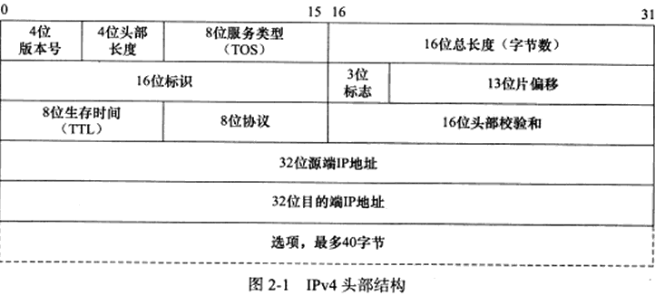
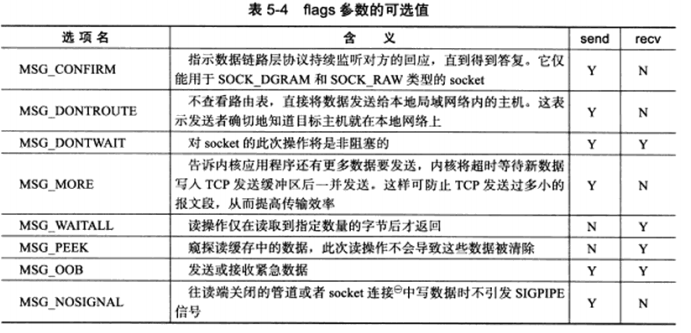

* content
{:toc}

## TCP IP 协议栈

**数据链路层**

数据链路层实现了网络接口的驱动程序，处理网络数据在物理介质上传播。
主要有两种协议：

1. ARP协议， Address Resolve Protocol. 用于ip地址和mac地址的相互转换。
2. RARP协议，Reverse Address Resolve Protocol.用于某些无盘工作站，利用网卡的物理地址向服务器请求ip地址。

**网络层**

网络层实现数据包的选路和转发。

1. IP协议，Internet Protocol。根据数据包的ip地址来决定数据包的走向，下一跳，hop by hop。
2. ICMP，Internet Control Mange Protocol。因特网控制报文协议，主要用于检测网络连接。

**传输层**

传输层为主机的应用程序提供端到端的通信。

1. TCP，Transmission Control Protocol，传输控制协议。为应用程序提供可靠，面向连接和基于流的服务。
1. UDP，User Datagram Protocol，用户数据包协议。为应用程序提供不可能，无连接和基于数据包的服务。
3. SCTP，Stream control Transmission Protocol，流控制传输协议。用于tcp上传输电话信号。

**应用层**

应用层负责处理应用程序的逻辑。

1. ping，利用ICMP报文检测网络连接。
2. telnet，远程登录协议。
3. OSPF，Open shortest Path First，开放最短路径优先。动态路由更新协议。
4. DNS， Domain Name Service，域名服务。用于域名和IP地址转换。

**ARP工作原理**

主机向自己所在网络广播一个arp请求，该请求包含如下图中的字段中的目标地址ip，只有目标机器会回应一个arp应答，包含自己的物理地址。

|name|fun|
|-|-|
|硬件类型|定义物理地址类型，1->mac|
|协议类型|表示要映射的协议地址类型，0x800->ip|
|硬件地址长度|MAC地址长度6|
|协议地址长度|ip地址长度4|
|操作|arp请求1，apr应答2，rarp请求3，rarp应答4|

**linux command**

~~~
//list all  ip and mac addr
arp -a  
// delete ip arp 
arp -d ipaddr
//add arp
arp -s ipaddr macaddr

sudo tcpdump -i enp0s3 -ent '(dst 10.13.11.104 and src 10.13.11.156) or (dst 10.13.11.156 and src 10.13.11.104)'
tcpdump: verbose output suppressed, use -v or -vv for full protocol decode
listening on enp0s3, link-type EN10MB (Ethernet), capture size 262144 bytes
08:00:27:7b:77:2f > ff:ff:ff:ff:ff:ff, ethertype ARP (0x0806), length 42: Request who-has 10.13.11.104 tell 10.13.11.156, length 28
ec:b1:d7:61:35:44 > 08:00:27:7b:77:2f, ethertype ARP (0x0806), length 60: Reply 10.13.11.104 is-at ec:b1:d7:61:35:44, length 46
~~~

## IP协议

IP协议为上层协议提供无状态，无连接，不可靠的服务。
- 无状态是ip通信双方不同步传输数据的状态信息，即所有的ip数据报的发送，传输和接收都是相互独立，没有上下文关系。无需保存通信状态，简单高效，无需内核资源。
- 无连接是ip通信双方不长久保存对方任何消息。
- 不可靠是不能保证ip数据报准确到达对方。

**IP头部结构**

- TOS,type of service,8位 按位被如下定义 PPP DTRC0,
~~~
PPP：定义包的优先级，取值越大数据越重要
D 时延: 0:普通 1:延迟尽量小
T 吞吐量: 0:普通 1:流量尽量大
R 可靠性: 0:普通 1:可靠性尽量大
M 传输成本: 0:普通 1:成本尽量小
0 最后一位被保留，恒定为0
~~~
- 标识符（Identifier）:每一个IP封包都有一个16位的唯一识别码｡标识字段唯一地标识主机发送的每一份数据报｡通常每发送一份消息它的值就会加1｡
- 标记(Flags),封包在传输过程中进行最佳组合时使用的3个bit的识别记号.第二位是DF（Don't Fragment）位，DF位设为1时表明路由器不能对该上层数据包分段。如果长度超过就丢弃并返回ICMP的错误报文。第三位是MF（More Fragments）位，此值为0就示该封包是最後一个封包,如果为1则表示其後还有被分割的封包｡
- 分段偏移(Fragment Offset,FO),是分片相对原始ip数据报开始的偏移。实际的偏移值是该值左移3位。
- 生存时间(Time To Live,TTL)：生存时间字段设置了数据报可以经过的最多路由器数,表示数据包在网络上生存多久｡TTL的初始值由源主机设置(通常为32或64),一旦经过一个处理它的路由器,它的值就减去1｡当该字段的值为0时,数据报就被丢弃,并发送ICMP消息通知源主机｡
- 协议(Protocol,PROT): 指该封包所使用的网络协议类型,如ICMP､DNS等｡存在/etc/protocol
- 头校验和(Header checksum)，指IPv4数据报包头的校验和｡

**linux command**

~~~
//grab icmp
tcpdump -ntv -i eth0 icmp

//add route
route add -host ipaddr dev eth0
//del route
route del -net ipaddr netmask 255.255.0.0
route del default

~~~

## TCP协议

TCP通信是面向连接，字节流的可靠传输。双方先建立连接，为连接分配必要的内核资源，管理连接的状态和数据传输，数据完成后释放系统资源。

- 源端口和目的端口：告知主机报文来自哪个端口，上传给哪个上层协议或程序（端口），定义在/etc/services.
- 序号：TCP是面向字节流的，TCP连接中传送的字节流中的每个字节都按顺序编号。整个要传送的字节流的起始序号必须要在连接建立时设置。首部中的序号字段值指的是本报文段所发送的数据的第一个字节的序号。
- 确认号：是期望收到对方下一个报文段的第一个数据字节的序号。若确认号=N，则表明：到序号N-1为止的所有数据都已正确收到。
- 紧急URG：当URG=1时，表明紧急指针字段有效。它告诉系统此报文段中有紧急数据，应尽快传送（相当于高优先级的数据.
- 确认ACK:仅当ACK=1时确认号字段才有效。
- 推送PSH:当两个应用进程进行交互式的通信时，接收方TCP收到PSH=1的报文段，就尽快地交付接收应用进程，而不再等到整个缓存都填满了后向上交付。
- 复位RST:tcp连接出现严重差错时释放连接，然后重新建立连接。
- 同步SYN:在连接建立时用来同步序号。当SYN=1而ACK=0时，表明这是一个连接请求报文段。对方若同意建立连接，则应在相应的报文段中使用SYN=1和ACK=1。因此，SYN置为1就表示这是一个连接请求或连接接受保温。
- 终止FIN:用来释放一个连接。当FIN=1时，表明此报文段的发送方的数据已发送完毕，并要求释放运输连接。
- 窗口:从本报文段首部中的确认号算起，接收方目前允许对方发送的数据量。
- 检验和：检验范围包括首部和数据两部分。
- 紧急指针：2字节。紧急指针仅在URG=1时才有意义，它指出本报文段中的紧急数据的字节数.
- MSS 最大报文段长度
- 窗口扩大:窗口扩大选项是为了扩大窗口。TCP首部中窗口字段长度是16位，因此最大窗口大小就是64k字节。
- 时间戳（计算RTT,防止序号绕回）： 用来计算往返时间RTT。发送方在发送报文段时把当前时钟的时间值放入时间戳字段，接收方在确认该报文段时把时间戳字段值复制到时间戳回送回答字段。因此，发送方在收到确认报文后，可以准确地计算RTT来。 

**TCP连接时序**

1. client发出一个SYNC的请求报文，ISN值为535734930
2. server回应同步报文，发出自己的ISN2159701207，并进行确认，确认值为535734930+1.
3. client回应ack，ISN= 2159701207+1.

---传出数据完成后---

---
4. client 发出fin标志。
5. server ack确认，可省略。
6. server发出fin和ack来确认。
7. client ack响应确认。

## Socket API

#### 大小端
network通常使用大端模式，所以数据需要转换
~~~
#include <netinet/in.h>
unsigned long int htonl(unsigned long int hoslong);
unsigned short int htons(unsigned short int hostshort);
unsigned long int ntohl(unsigned long int netlong);
unsigned short int ntohs(unsigned short int netshort);
~~~

#### sock地址

IPv4
~~~
#include <linux/in.h>
#define __SOCK_SIZE__   16      /* sizeof(struct sockaddr)  */
struct sockaddr_in {
  __kernel_sa_family_t  sin_family; /* Address family       */
  __be16        sin_port;   /* Port number          */
  struct in_addr    sin_addr;   /* Internet address     */

  /* Pad to size of `struct sockaddr'. */
  unsigned char     __pad[__SOCK_SIZE__ - sizeof(short int) -
            sizeof(unsigned short int) - sizeof(struct in_addr)];
};

 /* Internet address. */
 struct in_addr {
     __be32  s_addr;
 };
~~~

IPv6

~~~
#include <linux/in6.h>
 struct sockaddr_in6 {
    unsigned short int  sin6_family;    /* AF_INET6 */
    __be16          sin6_port;      /* Transport layer port # */
    __be32          sin6_flowinfo;  /* IPv6 flow information */
    struct in6_addr     sin6_addr;      /* IPv6 address */
    __u32           sin6_scope_id;  /* scope id (new in RFC2553) */
};

 #if __UAPI_DEF_IN6_ADDR
 struct in6_addr {
     union {
         __u8        u6_addr8[16];
 #if __UAPI_DEF_IN6_ADDR_ALT
         __be16      u6_addr16[8];
         __be32      u6_addr32[4];
 #endif
     } in6_u;
 #define s6_addr         in6_u.u6_addr8
 #if __UAPI_DEF_IN6_ADDR_ALT
 #define s6_addr16       in6_u.u6_addr16
 #define s6_addr32       in6_u.u6_addr32
 #endif
 };
 #endif /* __UAPI_DEF_IN6_ADDR */

~~~

#### IP地址转换函数
通常用十进制表示ipv4，十六进制表示ipv6，编程要转化成二进制。

~~~
#include<arpa/inet.h>
int inet_pton(int family, const char *strptr, void *addrptr);
const char *inet_ntop(int family, const void *addrptr, char *strptr, size_t len);

#define INET_ADDRSTRLEN   16
#define INET6_ADDRSTRLEN 46

~~~
family参数既可以是AF_INET，也可以是AF_INET6

inet_pton函数尝试转换由strptr指针所指的字符串，并通过addrptr指针存放二进制结果。若成功则返回1,否则如果对所指定的family而言输入的字符串不是有效的表达式，那么值为0。

inet_ntop进行相反的转换，从数值格式（addrptr）转换到表达格式（strptr）。len参数是目标存储单元的大小，以免该函数溢出其调用者的缓冲区。

#### 创建socket
~~~
#include <sys/types.h>
#include <sys/socket.h>
int socket(int domain,int type,int protocol);
~~~
1. domain表示用PF_INET or PF_INET6
2. type表示服务类型，SOCK_STREAM(流服务)，SOCK_UGRAM(数据报)，SOCK_NONBLOCK(非阻塞)，SOCK_CLOEXEC(用fork创建子进程时在子进程关闭socket)。
3. 具体协议，通常为0
4. 返回socket文件描述符，失败-1，设置errno。

#### 命名socket

作用是给socket设置地址

~~~
 int bind (int __fd, __CONST_SOCKADDR_ARG __addr, socklen_t __len)
~~~

#### 监听socket

创建监听队列存放待处理的客户连接。

~~~
/* Prepare to accept connections on socket FD.
   N connection requests will be queued before further requests are refused.
   Returns 0 on success, -1 for errors.  */
extern int listen (int __fd, int __n) __THROW;

~~~

#### 接收连接

从listen队列里接收连接，获取ipaddr和port。

~~~

/* Await a connection on socket FD.
   When a connection arrives, open a new socket to communicate with it,
   set *ADDR (which is *ADDR_LEN bytes long) to the address of the connecting
   peer and *ADDR_LEN to the address's actual length, and return the
   new socket's descriptor, or -1 for errors.
  */
extern int accept (int __fd, __SOCKADDR_ARG __addr,
           socklen_t *__restrict __addr_len);

~~~

#### 发起连接

客户端通过如下函数建立与服务器的连接
~~~

/* Open a connection on socket FD to peer at ADDR (which LEN bytes long).
   For connectionless socket types, just set the default address to send to
   and the only address from which to accept transmissions.
   Return 0 on success, -1 for errors.
   This function is a cancellation point and therefore not marked with
   __THROW.  */

extern int connect (int __fd, __CONST_SOCKADDR_ARG __addr, socklen_t __len);

~~~

#### 关闭连接

close 是标准函数，只有引用计数fd为0，才能真正关闭。在多进程程序中，需要在子进程和符进程里全部close。 网络专用shutdown来关闭。
~~~
#include <unistd.h>
int close(int fd);

#include <sys/socket.h>

/* Shut down all or part of the connection open on socket FD.
   HOW determines what to shut down:
     SHUT_RD   = No more receptions;
     SHUT_WR   = No more transmissions;
     SHUT_RDWR = No more receptions or transmissions.
   Returns 0 on success, -1 for errors.  */

extern int shutdown (int __fd, int __how) __THROW;

~~~

#### TCP数据读写

~~~
/* Send N bytes of BUF to socket FD.  Returns the number sent or -1.
   This function is a cancellation point and therefore not marked with
   __THROW.  */
extern ssize_t send (int __fd, const void *__buf, size_t __n, int __flags);

/* Read N bytes into BUF from socket FD.
   Returns the number read or -1 for errors.
   This function is a cancellation point and therefore not marked with
   __THROW.  */
extern ssize_t recv (int __fd, void *__buf, size_t __n, int __flags);

~~~

#### UDP数据读写

UDP没有连接的概念，所以每次都要指定socket地址。

如下函数也可以用于tcp，后面两个参数NULL。
~~~
/* Send N bytes of BUF on socket FD to peer at address ADDR (which is
   ADDR_LEN bytes long).  Returns the number sent, or -1 for errors.
   This function is a cancellation point and therefore not marked with
   __THROW.  */
extern ssize_t sendto (int __fd, const void *__buf, size_t __n,
               int __flags, __CONST_SOCKADDR_ARG __addr,
               socklen_t __addr_len);

/* Read N bytes into BUF through socket FD.
   If ADDR is not NULL, fill in *ADDR_LEN bytes of it with tha address of
   the sender, and store the actual size of the address in *ADDR_LEN.
   Returns the number of bytes read or -1 for errors.
   This function is a cancellation point and therefore not marked with
   __THROW.  */
extern ssize_t recvfrom (int __fd, void *__restrict __buf, size_t __n,
             int __flags, __SOCKADDR_ARG __addr,
             socklen_t *__restrict __addr_len);

~~~

#### 通用数据读写

利用msg来对通用数据读写，可用于tcp和udp。
~~~
 /* Send a message described MESSAGE on socket FD.
    Returns the number of bytes sent, or -1 for errors.

    This function is a cancellation point and therefore not marked with
    __THROW.  */
 extern ssize_t sendmsg (int __fd, const struct msghdr *__message,
             int __flags);

 /* Receive a message as described by MESSAGE from socket FD.
    Returns the number of bytes read or -1 for errors.

    This function is a cancellation point and therefore not marked with
    __THROW.  */
 extern ssize_t recvmsg (int __fd, struct msghdr *__message, int __flags);

 /* Structure describing messages sent by
     `sendmsg' and received by `recvmsg'.  */
  struct msghdr
    {
      void *msg_name;     /* Address to send to/receive from.  */
      socklen_t msg_namelen;  /* Length of address data.  */
      struct iovec *msg_iov;  /* Vector of data to send/receive into.  */
      size_t msg_iovlen;      /* Number of elements in the vector.  */
      void *msg_control;      /* Ancillary data (eg BSD filedesc passing). */
      size_t msg_controllen;  /* Ancillary data buffer length.
                     !! The type should be socklen_t but the
                     definition of the kernel is incompatible
                     with this.  */
      int msg_flags;      /* Flags on received message.  */
    };

~~~

#### 带外标记

~~~
/* Determine wheter socket is at a out-of-band mark.  */
extern int sockatmark (int __fd) __THROW;
~~~

#### 地址信息函数

~~~
 /* Put the local address of FD into *ADDR and its length in *LEN.  */
 extern int getsockname (int __fd, __SOCKADDR_ARG __addr,
             socklen_t *__restrict __len) __THROW;

 /* Put the address of the peer connected to socket FD into *ADDR
    (which is *LEN bytes long), and its actual length into *LEN.  */
 extern int getpeername (int __fd, __SOCKADDR_ARG __addr,
             socklen_t *__restrict __len) __THROW;

~~~

#### socket选项

~~~
 /* Put the current value for socket FD's option OPTNAME at protocol level LEVEL
    into OPTVAL (which is *OPTLEN bytes long), and set *OPTLEN to the value's
    actual length.  Returns 0 on success, -1 for errors.  */
 extern int getsockopt (int __fd, int __level, int __optname,
                void *__restrict __optval,
                socklen_t *__restrict __optlen) __THROW;

 /* Set socket FD's option OPTNAME at protocol level LEVEL
    to *OPTVAL (which is OPTLEN bytes long).
    Returns 0 on success, -1 for errors.  */
 extern int setsockopt (int __fd, int __level, int __optname,
                const void *__optval, socklen_t __optlen) __THROW;

~~~

#### 网络信息API

gethostbyaddr 和gethostbyname 获取host的信息。

getservbyname 和getservbyport 获取serivce服务的信息。

getaddrinfo可以通过主机名获取host地址，通过服务名获取端口号。

getnameinfo通过socket地址获取host name和服务名
~~~
#include <netdb.h>
 /* Return entry from host data base which address match ADDR with
    length LEN and type TYPE.

    This function is a possible cancellation point and therefore not
    marked with __THROW.  */
 extern struct hostent *gethostbyaddr (const void *__addr, __socklen_t __len,
                       int __type);

 /* Return entry from host data base for host with NAME.

    This function is a possible cancellation point and therefore not
    marked with __THROW.  */
 extern struct hostent *gethostbyname (const char *__name);

 /* Return entry from network data base for network with NAME and
    protocol PROTO.

    This function is a possible cancellation point and therefore not
    marked with __THROW.  */
 extern struct servent *getservbyname (const char *__name, const char *__proto);

 /* Return entry from service data base which matches port PORT and
    protocol PROTO.

    This function is a possible cancellation point and therefore not
    marked with __THROW.  */
 extern struct servent *getservbyport (int __port, const char *__proto);

 /* Translate name of a service location and/or a service name to set of
    socket addresses.

    This function is a possible cancellation point and therefore not
    marked with __THROW.  */
 extern int getaddrinfo (const char *__restrict __name,
             const char *__restrict __service,
             const struct addrinfo *__restrict __req,
             struct addrinfo **__restrict __pai);

 /* Translate a socket address to a location and service name.

    This function is a possible cancellation point and therefore not
    marked with __THROW.  */
 extern int getnameinfo (const struct sockaddr *__restrict __sa,
             socklen_t __salen, char *__restrict __host,
             socklen_t __hostlen, char *__restrict __serv,
             socklen_t __servlen, int __flags);

~~~

## 高级IO函数

#### pipe

pipe用来创建管道，实现进程间的通信。

~~~
#include <unistd.h>
int pipe(int fd[2]);
~~~

参数时文件描述符的数组，构成管道的两端。

pipe是一个单向管道，只能向fd[1]写入数据，fd[0]读数据

~~~
#include <socket.h>

~~~

###  reference

