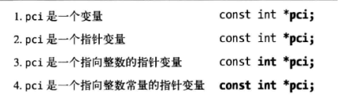

* content
{:toc}

## 认识指针

#### 指针与内存

C程序编译后，以四种形式存在于内存中

||作用域|生命周期|
|-|-|-|
|全局内存|整个文件|应用程序的生命周期|
|静态内存|声明他的函数内部|应用程序的生命周期|
|自动内存|声明他的函数内部|限制在函数执行的时间内|
|动态内存|由引用该内存的指针决定|直到内存释放|

#### 声明指针

星号两边的空白符号无关紧要，下面是等价的
~~~
int* ptr;
int * ptr;
int *ptr;
int*ptr;
~~~

#### 阅读声明

倒过来看，就容易理解了。

#### NULL

NULL 被赋值给指针表示指针不指向任何东西，在很多库里，
~~~
#define NULL ((void*)0)
~~~

#### void指针

void指针是通用指针，可以存放任何数据类型的引用。
1. void和char指针有相同的形式和对齐方式。
2. void和其他指针不会相等，除非都是NULL。
3. 任何指针都可以赋给void，然后可以转换回去。
4. void只用作数据指针，不能用于函数指针。

~~~
int num = 10;
int *p = &num;
void *pv = p;
int *pp = pv;
~~~

#### 常量

~~~
const int num = 50;
const int *pci = &num;//指向常量的指针

int num;
int *const cpi = &num; //指向非常量的常量指针

const int num = 100;
const int *const cpci = &num; //指向常量的的常量指针

~~~

## C的动态内存管理

#### 内存泄漏

1. 丢失内存地址，比如重复malloc给指针变量而丢失之前的地址。
2. 没有调用free

#### 动态分配函数

大部分在stdlib的头文件
|函数|描述|
|-|-|
|malloc|从堆上分配内存|
|realloc|在之前分配的内存上增加或者减小|
|calloc|分配内存并清零|
|free|内存返回堆|

- malloc

~~~
int *pi = (int*)malloc(sizeof(int));
~~~
静态，全局指针不能调用函数，需要单独分配。
~~~
static int *gpi;
gpi = malloc(sizeof(int));
~~~

- calloc

~~~
void *calloc(size_t numElements,size_t elementSize);

int *pi = calloc(5,sizeof(int));//给pi分配5个int空间，初始为0；
~~~

- realloc

~~~
void *realloc(void *ptr,size_t size);
~~~
 
- free
~~~
free(ptr);
~~~

#### 迷途指针
如果内存释放，而指针还在引用原始内存，这种指针叫迷途指针。
~~~
int *pi = (int*)malloc(sizeof(int));
free(pi);
*pi = 5;
~~~
处理迷途指针：  
1. 释放指针后置为NULL。
2. 特殊函数
~~~
void saferfree(void **pp)
{
    if(pp != NULL && *pp != NULL ){
        free (*pp);
        *pp = NULL;
    }
}
~~~

3. 有些系统会释放后置位。
4. 第三方工具检测。

## 指针与函数

#### 指针传递数据

用指针传递数据的一个主要原因是函数可以修改数据。

比如经典的交换数据。
~~~
void swap(int *pn1, int *pn2)
{
    int tmp;
    tmp = *pn1;
    *pn1 = *pn2;
    *pn2 = tmp;
}

int a, b;
swap(&a,&b);//类似于指针的定义赋值。
~~~

返回指针可以保证返回数据，用局部变量返回数据就消失了。
~~~
int* allocateArray(int size,int value)
{
    int* arr = (int*)malloc(size*sizeof(value));
    for(int i=0; i < size; i++)
        arr[i] = value;
    return arr;
}

int* vec = allocateArray(5,45);
free(vec);
~~~
或者利用空指针来传递数组指针

~~~
int* allocateArray(int *arr, int size,int value)
{
    if(arr != NULL){
        for(int i=0; i < size; i++)
            arr[i] = value;
    }
    return arr;
}

int* vec = (int*)malloc(size*sizeof(int));
allocateArray(vec,5,45);
free(vec);
~~~
如果需要修改指针，就需要传递指针的指针。
~~~
void allocateArray(int **arr, int size,int value)
{
    if(arr != NULL){
        for(int i=0; i < size; i++)
            *(*arr+i) = value;
    }
}

int* vec = (int*)malloc(5*sizeof(int));;
allocateArray(&vec,5,45);
free(vec);
~~~

#### 函数指针

1. 函数指针的定义

~~~
int (*f1)(double);//传入double，返回int
void (*f2)(char*);
double* (*f3)(int,int);
~~~

2. 简单使用

~~~
int add (int a, int b)
{
    return a+b;
}

int sub(int a, int b)
{
    return a-b;
}

typedef int(*fptr)(int,int);

int compute(fptr op,int a ,int b)
{
    return op(a,b);
}

printf("4+5 = %d\n",compute(add,4,5));
printf("4+5 = %d\n",compute(sub,4,5));
~~~

3. 返回函数指针

~~~
fptr select(char opcode){
    switch(opcode) {
        case '+': return add;
        case '-': return sub;
    }
}
~~~

4. 函数指针数组

~~~
fptr op[3] = {NULL};
op[0] = add;
~~~

## 指针与数组

#### 指针数组表示法等价关系
~~~
int vector[5] = {0,1,2,3,4};
int *pv = vector;
~~~

|值|等价1|等价2|等价3|
|-|-|-|-|
|vector|&vector[0]|pv|&pv[0]|

#### 指针数组的区别

1. vector[i]和*(vector+i)生成的机器码不一样，一个是从vector移动到i位置，取值。一个是vector加上i，然后取值。
2. vector不可修改，不能赋值给vector。
3. sizeof(vector)和sizeof(pv)是不一样的。

#### 多维数组

传递多维数组的方法
~~~
void display(int arr[][5],int rows);
void display(int (*arr)[5],int rows);

printf("%d",*(arr+i*col +j));
~~~

|值|等价1|等价2|等价3|等价4|
|-|-|-|-|-|
|vector|&vector[0]|&vector[0][0]|pv|&pv[0]|
|vector+1|&vector[1]|&vector[1][0]|pv+colsize|&pv[colsize]|

#### 动态分配二维数组

1. 不连续

~~~
int rows = 2;
int columns = 5;
int **matrix = (int**) malloc(rows*sizeof(int*));
for (int i = 0; i < rows; i++){
    matrix[i] = (int*)malloc(columns*sizeof(int));
}
~~~
2. 连续

~~~
int rows = 2;
int columns = 5;
int **matrix = (int**) malloc(rows*sizeof(int*));
matrix[0] = (int*) malloc(rows*columns*sizeof(int));
for (int i = 0; i < rows; i++){
    matrix[i] = matrix[0] + i * columns;

int *matrix = (int*)malloc(rows*columns*sizeof(int));
~~~

#### 不规则的数组和指针

复合字面量创建的数组
~~~
(int[3]){10,20,30}
~~~

不规则的就可以这样定义了
~~~
    int (*(arr3[])) = {
        (int[]) {0,1,2},
        (int[]) {3},
        (int[]) {4,5}};
~~~

## 指针与字符串

#### 标准字符串操作函数

|函数|原型|返回值|
|-|-|-|
|strcmp|int strcmp(const char *s1,const char *s2)|r<0 s1<s2, r=0 s1=s2, r>0 s1<s2|
|strcpy|char* strcpy(char *s1, char *s2)||
|strcat|char *strcat(char *s1, char *s2)||

#### 传递需要初始化的字符串的需求

1. 必须传递缓冲区的地址和长度
2. 调用者负责释放缓冲区。
3. 函数通常返回缓冲区的指针。

## 指针与结构体

参见C语言数据结构

## 安全问题和指针误用

#### 不恰当的指针声明

~~~
int* ptr1, ptr2; // ptr2 is not ptr;

#define POINT int*
POINT ptr1, ptr2;// ptr2 is not ptr

#typedef int* POINT
POINT ptr1, ptr2; //all are ptr
~~~

#### 野指针
没有初始化就使用的指针会导致程序错误，通常称为野指针
~~~
int *pi;
printf("%d",pi);
~~~

通常有三种处理方法：

1. 总用NULL来初始化。
2. 用assert测试空值。
3. 第三方工具。

        gcc 使用-Wall启用告警

#### 指针使用问题
1. malloc后NULL来测试指针
2. 错误使用&来引用地址。
3. 迷途指针
4. 越过数组边际访问内存
5. 错误计算数组长度
6. sizeof使用错误
7. 指针类型要匹配
8. 指针使用限定在有效区域
9. 字符串的安全问题，注意strcpy和strcat的增强函数，strncpy，strncat。
10. 结构体的指针通常不是连续的
11. 函数指针注意参数匹配
12. 不要重复释放
13. 清楚敏感数据，free，覆写。

## 其他重要内容

#### 访问特殊用途地址

通常使用的嵌入式设备上，比如pc的显存地址，这个地址装的是字符模式的第一个字符。
~~~
#define VIDEO_BASE 0xb8000
int *video = (int*)VIDEO_BASE;
*video = 'a';
~~~

#### 访问端口

~~~
#define PORT 0xB0000000
unsigned int volatile * const port = (unsigned int *)PORT

*port = 0x0BF// write data
value = *port //read from port
~~~

#### 字节序

~~~
    int num = 0x12345678;
    char *pc = (char*)(&num);
    for(int i = 0; i < 4; i++){
        printf("%p:%x\n",pc,*pc++);
    }    
~~~

#### 强别名

使用restrict关键字可以告诉编译器这个指针没有别名，不允许不同指针指向同一地址。
有时候能正确工作，但是结果是不可靠的。
~~~
int add(int size,int* restrict arr1, int* restrict arr2)
{
    for(int i = 0 ;i < size ;i++)
    {
        arr1[i] += arr2[i];
    }
}
~~~

## reference

