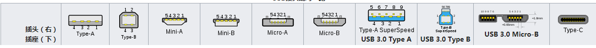
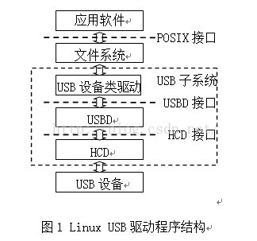

* content
{:toc}

USB是一个外部总线标准，用于规范电脑与外部设备的连接和通讯。USB接口即插即用和热插拔功能。USB接口可连接127种外设，如鼠标和键盘等。USB是在1994年底由英特尔等多家公司联合在1996年推出后，已成功替代串口和并口，已成为当今电脑与大量智能设备的必配接口。USB版本经历了多年的发展，到如今已经发展为3.0版本

## 发展历程

#### USB 1.0

USB 1.0是在1996年出现的，速度只有1.5Mb/s(位每秒)； 1998年升级为USB 1.1，速度也大大提升到12Mb/s，在部分旧设备上还能看到这种标准的接口。USB1.1是较为普遍的USB规范，其高速方式的传输速率为12Mbps，低速方式的传输速率为1.5Mbps.

#### USB 2.0

USB2.0规范是由USB1.1规范演变而来的。它的传输速率达到了480Mbps，折算为MB为60MB/s，足以满足大多数外设的速率要求。USB 2.0中的“增强主机控制器接口”（EHCI）定义了一个与USB 1.1相兼容的架构。

#### USB 3.0

SB 3.0的理论速度为5.0Gb/s，物理层采用8b/10b编码方式，这样算下来的理论速度也就4Gb/s.

## 协议

#### 编码方式

USB使用NRZI编码方式：当数据为0时，电平翻转；数据为1时，电平不翻转。为了防止出现过长时间电平不变化现象，在发送数据时采用位填充处理。具体过程如下：当遇见连续6个高电平时，就强制插入一个0。经过位填充后的数据由串行接口引擎（SIE）将数据串行化和NRZI编码后，发送到USB的差分数据线上。接收端完成的过程和发送端刚好相反。

#### 传输方式

1. 控制传输（Control）——一般用于短的、简单的对设备的命令和状态反馈，例如用于总线控制的0号管道。
2. 同步传输（Isochronous）——按照有保障的速度（可能但不必然是尽快地）传输，可能有数据丢失，例如实时的音频、视频。
3. 中断传输（Interrupt）——用于必须保证尽快反应的设备（有限延迟），例如鼠标、键盘。
4. 批量传输（Bulk）——使用余下的带宽大量地（但是没有对于延迟、连续性、带宽和速度的保证）传输数据，例如普通的文件传输。

#### 数据包格式

|偏移|类型|大小|值|
|-|-|-|-|
|0|HeaderChksum|1|利用添加包头进行效验，不包括包头本身的校验。|
|1|	HeaderSize|1|包头的大小，包括可用的字符串。|
|2|	Signature|2|数据值为0x1234|
|4|	VendorID|2|USB提供商的ID|
|6|	ProductID|2|USB产品ID|
|8|	ProductVersion|1|产品版本号|
|9|	FirmwareVersion|1|固件版本|
|10|USB属性	|1|	USB Attribute: Bit 0：如果设为1，包头包括以下三个字符串：语言、制造商、产品字符串；如果设为0，包头不包括任何字符串。Bit 2：如果设为1，设备自带电源；如果设为0，无自带电源。|Bit 3：如果设为1，设备可以通过总线供电；如果设为0，无法通过总线供电。Bits 1 and 4—7：保留。|
|11	|最大电力|1	|设备需要的最大电力，以2mA（毫安培）为单位。|
|12	|设备属性|1|	Device Attributes:   Bit 0：如果设为1，CPU运行在24 MHz；如果设为0，CPU运行在12 MHz。Bit 3：如果设为1，设备的EEPROM可以支持400 MHz；如果设为0，不支持400 MHz。Bits 1, 2 and 4 ... 7：保留。|
|13	|WPageSize|1|I2C的最大写入页面大小|
|14	|数据类型|1|	该数值定义设备是软件EEPROM还是硬件EEPROM。0x02：硬件EEPROM其它数值无效。|
|15	|RpageSize|1	|I2C最大读取页面大小。如果值为0，整个负载大小由一个I2C读取装置读取。|
|16	|PayLoadSize|2|如果将EEPROM作为软件EEPROM使用，表示软件的大小；除此之外该值都是0。|

#### usb接头

## linux 驱动数据结构

一个USB设备由3个功能模块组成：USB总线接口、USB逻辑设备和功能单元。

USB提出了设备架构的概念，USB设备是由一些配置、接口和端点组成，即一个USB设备可以含有一个或多个配置，在每个配置中可含有一个或多个接口，在每个接口中可含有若干个端点。其中，配置和接口是对USB设备功能的抽象，实际的数据传输由端点来完成。在使用USB设备前，必须指明其采用的配置和接口。

#### 设备

~~~

    struct usb_device {  
             int             devnum;         //devnum只是usb设备在一条usb总线上的编号.一条usb_bus_type类型的总线上最多可以连上128个设备  
             char            devpath [16];   /* Use in messages: /port/port/*/  //对于root hub.会将dev->devpath[0]=’0’  
             enum usb_device_state   state;  //设备的状态Attached，Powered，Default，Address，Configured，Suspended；  
                                   //Attached表示设备已经连接到usb接口上了，是hub检测到设备时的初始状态。那么这里所谓的USB_STATE_NOTATTACHED就是表示设备并没有Attached。  
                                   //Address状态表示主机分配了一个唯一的地址给设备，此时设备可以使用缺省管道响应主机的请求  
                                   //Configured状态表示设备已经被主机配置过了，也就是协议里说的处理了一个带有非0值的SetConfiguration()请求，此时主机可以使用设备提供的所有功能  
                                   //Suspended挂起状态，为了省电，设备在指定的时间内，3ms吧，如果没有发生总线传输，就要进入挂起状态。此时，usb设备要自己维护包括地址、配置在内的信息               
      
             enum usb_device_speed   speed;  /* high/full/low (or error) */  
            struct usb_tt   *tt;            //如果一个高速设备里有这么一个TT，那么就可以连接低速/全速设备，如不然，那低速/全速设备没法用，只能连接到OHCI/UHCI那边出来的hub口里。  
             int             ttport;         //如果一个高速设备里有这么一个TT，那么就可以连接低速/全速设备，如不然，那低速/全速设备没法用，只能连接到OHCI/UHCI那边出来的hub口里。  
             unsigned int toggle[2];         /* one bit for each endpoint     //他实际上就是一个位图.IN方向的是toggle[0].OUT方向的是toggle[1].其实,这个数组中的每一位表示ep的toggle值  
                                              * ([0] = IN, [1] = OUT) */它里面的每一位表示的就是每个端点当前发送或接收的数据包是DATA0还是DATA1  
             struct usb_device *parent;      /* our hub, unless we're the root */  
                                  //USB设备是从Root Hub开始，一个一个往外面连的，比如Root Hub有4个口，每个口连一个USB设备，比如其中有一个是Hub，那么这个Hub有可以继续有多个口，于是一级一级的往下连，  
                                   //最终连成了一棵树。  
             struct usb_bus *bus;            /* Bus we're part of */设备所在的总线  
             struct usb_host_endpoint ep0;   //端点0的特殊地位决定了她必将受到特殊的待遇，在struct usb_device对象产生的时候它就要初始化  
             struct device dev;              /* Generic device interface */嵌入到struct usb_device结构里的struct device结构  
      
             struct usb_device_descriptor descriptor;/* Descriptor */设备描述符，此结构体的bMaxPacketSize0 filed保存了端点0的maximum packet size  
            struct usb_host_config *config; //设备拥有的所有配置  
      
             struct usb_host_config *actconfig;//设备正在使用的配置  
             struct usb_host_endpoint *ep_in[16];//ep_in[16]，359行，ep_out[16]，除了端点0，一个设备即使在高速模式下也最多只能再有15个IN端点和15个OUT端点，端点0太特殊了，  
             struct usb_host_endpoint *ep_out[16];//对应的管道是Message管道，又能进又能出特能屈能伸的那种，所以这里的ep_in和ep_out数组都有16个值  
             char **rawdescriptors;          /* Raw descriptors for each config */  
             unsigned short bus_mA;          /* Current available from the bus */这个值是在host controller的驱动程序中设置的，通常来讲，计算机的usb端口可以提供500mA的电流  
             u8 portnum;                     //不管是root hub还是一般的hub，你的USB设备总归要插在一个hub的端口上才能用，portnum就是那个端口号。  
             u8 level;                       //层次，也可以说是级别，表征usb设备树的级连关系。Root Hub的level当然就是0，其下面一层就是level 1，再下面一层就是level 2，依此类推  
      
             unsigned discon_suspended:1;    /* Disconnected while suspended */  
             unsigned have_langid:1;         /* whether string_langid is valid */  
             int string_langid;              /* language ID for strings */  
            /* static strings from the device */  
             char *product;                  /* iProduct string, if present */  
             char *manufacturer;             /* iManufacturer string, if present */  
             char *serial;                   /* iSerialNumber string, if present */  
                                     //分别用来保存产品、厂商和序列号对应的字符串描述符信息  
             struct list_head filelist;  
     #ifdef CONFIG_USB_DEVICE_CLASS  
             struct device *usb_classdev;  
     #endif  
     #ifdef CONFIG_USB_DEVICEFS  
             struct dentry *usbfs_dentry;    /* usbfs dentry entry for the device */  
     #endif  
             /*  
              * Child devices - these can be either new devices  
              * (if this is a hub device), or different instances  
              * of this same device.  
              *  
              * Each instance needs its own set of data structures.  
              */  
      
             int maxchild;                   /* Number of ports if hub */  
            struct usb_device *children[USB_MAXCHILDREN];  
             int pm_usage_cnt;               /* usage counter for autosuspend */  
             u32 quirks;                     //quirk就是用来判断这些有毛病的产品啥毛病的  
     #ifdef CONFIG_PM  
             struct delayed_work autosuspend; /* for delayed autosuspends */  
             struct mutex pm_mutex;          /* protects PM operations */  
             unsigned long last_busy;        /* time of last use */  
             int autosuspend_delay;          /* in jiffies */  
             unsigned auto_pm:1;             /* autosuspend/resume in progress */  
             unsigned do_remote_wakeup:1;    /* remote wakeup should be enabled */  
             unsigned autosuspend_disabled:1; /* autosuspend and autoresume */  
            unsigned autoresume_disabled:1;  /*  disabled by the user */  
     #endif  
     };  
~~~
#### 设备描述符usb_device_descriptor

设备代表一个USB设备，它由一个或多个配置组成。设备描述符用于说明设备的总体信息，并指明其所含的配置的个数。一个USB设备只能有一个设备描述符。

[kernel4.1](https://elixir.bootlin.com/linux/v4.1/source/include/uapi/linux/usb/ch9.h#L258)

~~~
    struct usb_device_descriptor
    {
    	_ _u8 bLength; //描述符长度
    	_ _u8 bDescriptorType; //描述符类型编号
     
    	_ _le16 bcdUSB; //USB版本号
    	_ _u8 bDeviceClass; //USB分配的设备类code
    	_ _u8 bDeviceSubClass;// USB分配的子类code
    	_ _u8 bDeviceProtocol; //USB分配的协议code
    	_ _u8 bMaxPacketSize0; //endpoint0最大包大小
    	_ _le16 idVendor; //厂商编号
    	_ _le16 idProduct; //产品编号
    	_ _le16 bcdDevice; //设备出厂编号
    	_ _u8 iManufacturer; //描述厂商字符串的索引
    	_ _u8 iProduct; //描述产品字符串的索引
    	_ _u8 iSerialNumber; //描述设备序列号字符串的索引
    	_ _u8 bNumConfigurations; //可能的配置数量
    } _ _attribute_ _ ((packed));
~~~

#### sys里的命名

~~~
#ls /sys/bus/usb/devices/
1-0:1.0  1-1  1-1:1.0  2-0:1.0  2-1  2-1:1.0  3-0:1.0  3-11  3-11:1.0  3-4  3-4:1.0  3-4:1.1  4-0:1.0  usb1  usb2  usb3  usb4
~~~
- usb1-4 表示有4个usb主机控制器
- 4-0:1.0 ： 4 表示4号总线，0表示devpath，1表示配置，0表示接口号。4号总线的0端口设备，使用配置1，接口0.
- 顶级设备的devpath就是连在roothub的端口号0，如果4-0:1.0是一个hub，那么它下面的端口1就是4-0.1:1.0.然后一级一级向下加。

#### 配置

~~~
struct usb_host_config {
	struct usb_config_descriptor	desc;

	char *string;		/* iConfiguration string, if present */

	/* List of any Interface Association Descriptors in this
	 * configuration. */
	struct usb_interface_assoc_descriptor *intf_assoc[USB_MAXIADS];

	/* the interfaces associated with this configuration,
	 * stored in no particular order */
	struct usb_interface *interface[USB_MAXINTERFACES];

	/* Interface information available even when this is not the
	 * active configuration */
	struct usb_interface_cache *intf_cache[USB_MAXINTERFACES];

	unsigned char *extra;   /* Extra descriptors */
	int extralen;
};
~~~

#### 配置描述符usb_config_descriptor
 一个USB设备可以包含一个或多个配置，如USB设备的低功耗模式和高功耗模式可分别对应一个配置。在使用USB设备前，必须为其选择一个合适的配置。配置描述符用于说明USB设备中各个配置的特性，如配置所含接口的个数等。USB设备的每一个配置都必须有一个配置描述符。

 ~~~
     struct usb_config_descriptor
    {
    	_ _u8 bLength; //描述符长度
    	_ _u8 bDescriptorType; //描述符类型编号
    	
    	_ _le16 wTotalLength; //配置所返回的所有数据的大小
    	_ _u8 bNumInterfaces; // 配置所支持的接口数
    	_ _u8 bConfigurationValue; //Set_Configuration命令需要的参数值
    	_ _u8 iConfiguration; //描述该配置的字符串的索引值
    	_ _u8 bmAttributes; //供电模式的选择
    	_ _u8 bMaxPower; //设备从总线提取的最大电流
    } _ _attribute_ _ ((packed));
~~~

#### 接口是设备的接口 usb_interface   

~~~
struct usb_interface   
{  
         /* array of alternate settings for this interface,  
          * stored in no particular order */  
         struct usb_host_interface *altsetting;  
  
         struct usb_host_interface *cur_altsetting;      /* the currently  
                                          * active alternate setting */  
         unsigned num_altsetting;        /* number of alternate settings */  
  
         int minor;                      /* minor number this interface is  
                                          * bound to */  
         enum usb_interface_condition condition;         /* state of binding */  
         unsigned is_active:1;           /* the interface is not suspended */  
         unsigned needs_remote_wakeup:1; /* driver requires remote wakeup */  
  
         struct device dev;              /* interface specific device info */  
         struct device *usb_dev;         /* pointer to the usb class's device, if any */  
         int pm_usage_cnt;               /* usage counter for autosuspend */  
};  
~~~

#### 设置是接口的设置

~~~

    struct usb_host_interface   
    {  
             struct usb_interface_descriptor desc;//usb描述符，主要有四种usb描述符，设备描述符，配置描述符，接口描述符和端点描述符，协议里规定一个usb设备是必须支持这四大描述符的。  
                                     //usb描述符放在usb设备的eeprom里边  
             /* array of desc.bNumEndpoint endpoints associated with this  
              * interface setting. these will be in no particular order.  
              */  
             struct usb_host_endpoint *endpoint;//这个设置所使用的端点  
      
             char *string;           /* iInterface string, if present */  
             unsigned char *extra;   /* Extra descriptors */关于额外描述符  
             int extralen;  
    };  
~~~

#### 接口描述符usb_interface_descriptor
一个配置可以包含一个或多个接口，例如对一个光驱来说，当用于文件传输时，使用其大容量存储接口；而当用于播放CD时，使用其音频接口。接口是端点的集合，可以包含一个或多个可替换设置，用户能够在USB处于配置状态时改变当前接口所含的个数和特性。接口描述符用于说明设备中各个接口的特性，如接口所属的设备类及其子类等。USB设备的每个接口都必须有一个接口描述符
~~~
struct usb_interface_descriptor
{
	_ _u8 bLength;           //描述符长度
	_ _u8 bDescriptorType; //描述符类型
	
	_ _u8 bInterfaceNumber;   // 接口的编号
	_ _u8 bAlternateSetting; //备用的接口描述符编号
	_ _u8 bNumEndpoints;      //该接口使用的端点数，不包括端点0
	_ _u8 bInterfaceClass;    //接口类型
	_ _u8 bInterfaceSubClass; //接口子类型
	_ _u8 bInterfaceProtocol; //接口所遵循的协议
	_ _u8 iInterface; //描述该接口的字符串索引值
} _ _attribute_ _ ((packed));
~~~

#### 端点

~~~
 struct usb_host_endpoint   
{  
         struct usb_endpoint_descriptor desc;  
         struct list_head                urb_list;//端点要处理的urb队列.urb是usb通信的主角，设备中的每个端点都可以处理一个urb队列.要想和你的usb通信，就得创建一个urb，并且为它赋好值，  
                                   //交给咱们的usb core，它会找到合适的host controller，从而进行具体的数据传输  
         void                            *hcpriv;//这是提供给HCD（host controller driver）用的  
         struct ep_device                *ep_dev;        /* For sysfs info */  
  
         unsigned char *extra;   /* Extra descriptors */  
         int extralen;  
};
~~~
#### 端点描述符usb_endpoint_descriptor

端点是USB设备中的实际物理单元，USB数据传输就是在主机和USB设备各个端点之间进行的。 

0号端点比较特殊，它有数据输入IN和数据输出OUT两个物理单元，且只能支持控制传输。所有的USB设备都必须含有一个0号端点，用作默认控制管道。

根据具体应用的需要，USB设备还可以含有多个除0号端点以外的其他端点。对于低速设备，其附加的端点数最多为2个；对于全速/高速设备，其附加的端点数最多为15个.

~~~
struct usb_endpoint_descriptor
{
	_ _u8 bLength; //描述符长度
	_ _u8 bDescriptorType; //描述符类型
	_ _u8 bEndpointAddress; //端点地址：0～3位是端点号，第7位是方向(0-OUT,1-IN)
	_ _u8 bmAttributes; //端点属性：bit[0:1] 的值为00表示控制，为01表示同步，为02表示批量，为03表示中断
	_ _le16 wMaxPacketSize; //// 本端点接收或发送的最大信息包的大小
	_ _u8 bInterval;//轮询数据传送端点的时间间隔
	                       //对于批量传送的端点以及控制传送的端点，此域忽略
	                    //对于同步传送的端点，此域必须为1
	_ _u8 bRefresh;
	_ _u8 bSynchAddress;
} _ _attribute_ _ ((packed));
~~~

## Linux USB子系统分析

USB主机驱动程序由3部分组成：USB主机控制器驱动（HCD）、USB核心驱动（USBD）和不同种类的USB设备类驱动，如下所示。其中HCD和USBD被称为协议软件或者协议栈，这两部分共同处理与协议相关的操作。

USB设备类驱动可以包含多个，不同的功能接口对应不同的驱动程序，它们不直接与USB设备硬件打交道，而是通过协议软件的抽象处理来完成与设备的不同功能接口之间的通信。

HCD是直接和硬件进行交互的软件模块，是USB协议栈的最底层部分，是USB主机控制器硬件和数据传输的一种抽象。

HCD向上仅对USB总线驱动程序服务，HCD提供了一个软件接口，即HCDI，使得各种USB主机控制器的硬件特性都被软件化，并受USB总线驱动程序的调用和管理。HCD向下则直接管理和检测主控制器硬件的各种行为。HCD提供的功能主要有：主机控制器硬件初始化；为USBD层提供相应的接口函数；提供根HUB（ROOT HUB）设备配置、控制功能；完成4种类型的数据传输等。

USBD部分是整个USB主机驱动的核心，主要实现的功能有：USB总线管理；USB总线设备管理、USB总线带宽管理、USB的4种类型数据传输、USB HUB驱动、为USB设备驱动提供相关接口、提供应用程序访问USB系统的文件接口等。其中USB HUB作为一类特殊的USB设备，其驱动程序被包含在USBD层。

在嵌入式Linux系统中，已经包含HCD模块和USB核心驱动USBD，不需要用户重新编写，用户仅仅需要完成USB设备类驱动即可。

#### 主要数据结构

- usb_device保存一个USB设备的信息，包括设备地址，设备描述符，配置描述符等。
- usb_bus保存一个USB总线系统的信息，包括总线上设备地址信息，根集线器，带宽使用情况等。一个USB总线系统至少有一个主机控制器和一个根集线器，Linux系统支持多USB总线系统。
- usb_driver保存客户驱动信息，包括驱动名称，以及驱动提供给USB内核使用的函数指针等。
- URB（Universal Request Block）是进行USB通信的数据结构，USBD通过URB在USB设备类驱动和USBD、USBD和HCD间进行数据传输。

#### USB 驱动程序步骤

1. 创建主要结构体struct usb_driver

~~~
static struct usb_driver skel_driver = {
	.name =		"skeleton",
	.probe =	skel_probe,
	.disconnect =	skel_disconnect,
	.suspend =	skel_suspend,
	.resume =	skel_resume,
	.pre_reset =	skel_pre_reset,
	.post_reset =	skel_post_reset,
	.id_table =	skel_table,
	.supports_autosuspend = 1,
};
~~~
2. usb_register()注册将struct usb_driver 注册到usb核心，传统是在usb驱动程序模块初始化代码中完成该工作的

~~~
    static int __init usb_skel_init(void)
    {
           ... 
           usb_register(&skel_driver);
           ...
    }
~~~

3. skel_probe 实现driver class的识别和注册

~~~
static int skel_probe(struct usb_interface *interface,
		      const struct usb_device_id *id)
{

        ...
	/* save our data pointer in this interface device */
	usb_set_intfdata(interface, dev);

	/* we can register the device now, as it is ready */
	retval = usb_register_dev(interface, &skel_class);
	
        ...
~~~
4. class 定义和实现

~~~
static const struct file_operations skel_fops = {
	.owner =	THIS_MODULE,
	.read =		skel_read,
	.write =	skel_write,
	.open =		skel_open,
	.release =	skel_release,
	.flush =	skel_flush,
	.llseek =	noop_llseek,
};

/*
 * usb class driver info in order to get a minor number from the usb core,
 * and to have the device registered with the driver core
 */
static struct usb_class_driver skel_class = {
	.name =		"skel%d",
	.fops =		&skel_fops,
	.minor_base =	USB_SKEL_MINOR_BASE,
};
~~~

## reference

1. [Linux USB 驱动开发（五）—— USB驱动程序开发过程简单总结](https://blog.csdn.net/zqixiao_09/article/details/51057086)
2. [Linux USB 驱动开发（四）—— 热插拔那点事](https://blog.csdn.net/zqixiao_09/article/details/51056903)
3. [usb驱动的基本结构和函数简介](https://blog.csdn.net/zqixiao_09/article/details/52971630)

