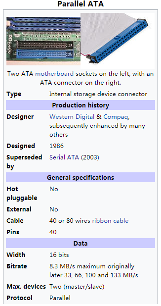
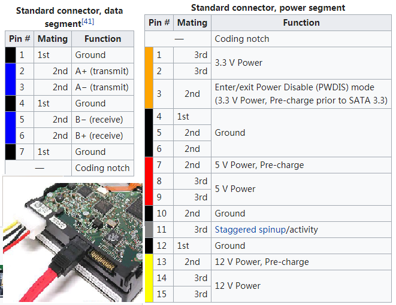
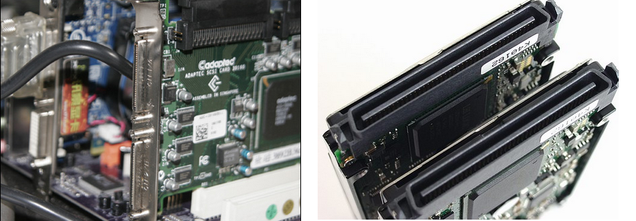
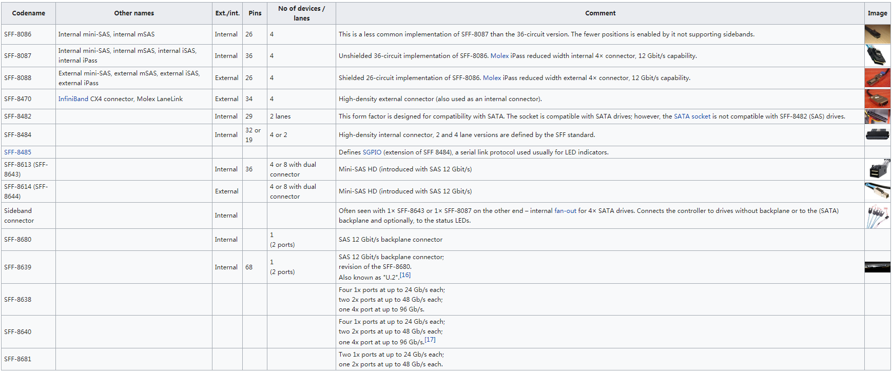
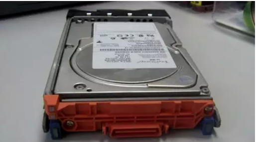
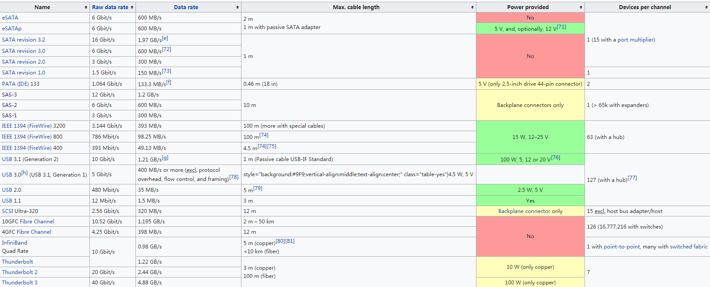

* content
{:toc}

## ATA

AT attachment 是IDE(Integrated Drive Electronics)硬盘的接口标准。包括PIO(Programming I/O)和DMA(Direct Memory Access) 两种传输模式。ATA本身可以支持串行或并行。

#### IDE(Intergrated Device Electronics)

IDE一般是有扁平电缆连接的，一个扁平电缆可以连接2个IDE硬盘，而一个计算机一般提供2个扁平电缆，所以一般允许4块IDE硬盘。IDE经过多年的发展，成熟，廉价，稳定。一般老式的电脑中装的都是这种硬盘。

一般使用16-bit数据总线, 每次总线处理时传送2个字节。PATA接口一般是100Mbytes/sec带宽，数据总线必须锁定在50MHz，为了减小滤波设计的复杂性，PATA使用Ultra总线，通过“双倍数据比率”或者2个边缘(上升沿和下降沿)时钟机制用来进行DMA传输。这样在数据滤波的上升沿和下降沿都采集数据，就降低一半所需要的滤波频率。这样带宽就是:25MHz 时钟频率x 2 双倍时钟频率x 16 位/每一个边缘/ 8 位/每个字节= 100 Mbytes/sec。

#### SATA

SATA是Intel公司在IDF2000大会上推出的，该技术可以让用户拥有高效能的硬盘，却不必牺牲资料的完整性。SATA最大的优势是传输速率高。SATA的工作原理非常简单：采用连续串行的方式来实现数据传输从而获得较高传输速率。2003年发布SATA1.0规格提供的传输率就已经达到了150MB/s，不但已经高出普通IDE硬盘所提供的100MB/s(ATA100)甚至超过了133MB/s(ATA133)的最高传输速率。

SATA有SATA1、SATA2、SATA3三代，传输速度分为为1.5G、3G、6G。

- SATA不需要设置主从盘跳线。BIOS会为它按照1、2、3顺序编号。这取决于驱动器接在哪个SATA连接器上（安装方便）。而IDE硬盘需要设置通过跳线来设置主从盘。
- SATA还支持热插拔，可以像U盘一样使用。而IDE硬盘不支持热插拔。

## SCSI
SCSI(Small Computer System Interface)是一种专门为小型计算机系统设计的存储单元接口模式，可以对计算机中的多个设备进行动态分工操作，对于系统同时要求的多个任务可以灵活机动的适当分配，动态完成。

SCSI硬盘一般来讲只有服务器才用到的，在个人电脑上我们很少见到SCSI硬盘的存在。

- SCSI可支持多个设备，SCSI-2(FastSCSI)最多可接7个SCSI设备，WideSCSI-2以上可接16个SCSI设备。
- SCSI还允许在对一个设备传输数据的同时，另一个设备对其进行数据查找。
- SCSI设备还具有智能化，SCSI卡自己可对CPU指令进行排队，这样就提高了工作效率。

## SAS

SAS（Serial Attached SCSI），串行连接SCSI接口，串行连接小型计算机系统接口。

SAS是新一代的SCSI技术，和现在流行的Serial ATA(SATA)硬盘相同，都是采用串行技术以获得更高的传输速度，并通过缩短连结线改善内部空间等。SAS是并行SCSI接口之后开发出的全新接口。此接口的设计是为了改善存储系统的效能、可用性和扩充性，提供与串行ATA (Serial ATA，缩写为SATA)硬盘的兼容性。

SAS的优势主要体现在：灵活性，可以兼容SATA，为用户节省投资；扩展性，一个SAS域最多可以直连16384个设备；性能卓越，点对点的架构使性能随端口数量增加而提高；更合理的电缆设计，在高密度环境中提供更有效的散热。

## FC
FC(Fibre Channel)光纤通道,以前它是专为网络设计的，后来随着存储器对高带宽的需求，慢慢移植到现在的存储系统上来了。光纤通道通常用于连接一个SCSI RAID（或其它一些比较常用的RAID类型），以满足高端工作或服务器对高数据传输率的要求。

最初是从SCSI开始的，它也是存储领域最为广泛的协议；SCSI的命令和数据，可以直接在SCSI接口中传输，也可以通过封装进行传输，比如用USB，FC等方式。由于在传统的SCSI接口中，其传输的距离有限；因此用FC来扩大传输距离就应运而生，从而封装SCSI的FC接口流行起来，物理上它只是加上的FC的电路，其核心的SCSI部分基本不做修改，因此软件上移植SCSI HBA到FC的HBA实现难度并不大。

## 
## compare

## reference

1. [Serial ATA](https://en.wikipedia.org/wiki/Serial_ATA)
2. [
Serial Attached SCSI](https://en.wikipedia.org/wiki/Serial_Attached_SCSI)
3. [接口知识大全](https://blog.csdn.net/weixin_42229404/article/details/81209266)
4. [IDE、SATA、SCSI、FC、SAS简介与区别](https://blog.csdn.net/hs794502825/article/details/8231342)

