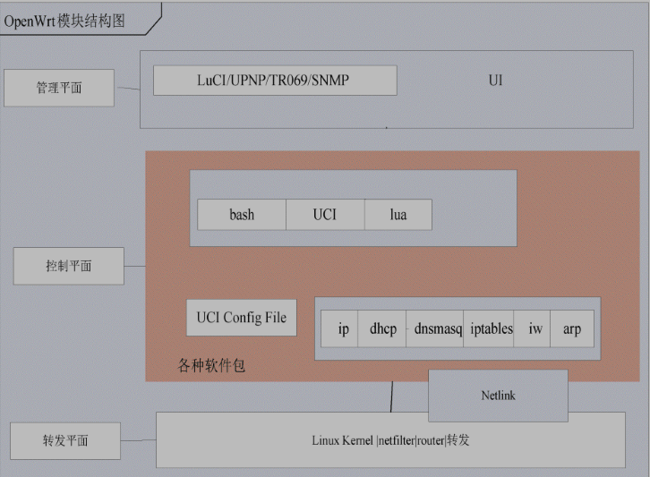

* content
{:toc}

## openWrt 简介

OpenWrt的主要特点在于其高扩展性，并且文件系统可写，开发者无需在每一次修改后完全重新编译，只要编译自己的软件包即可，这样就加快了开发的进度。另外OpenWrt提供了SDK，每个运行软件均能够以SDK来进行编译，以软件包形式进行安装卸载。

典型架构划分为管理平面、控制平面和数据转发平面

OpenWrt是一个基于Linux的智能路由器操作系统,用户可以自定义安装各种应用软件。其主要功能可以分为3个部分：网络功能、系统管理功能和状态监控功能。

## 开发环境

#### 编译
~~~
//安装编译环境所需软件
sudo apt-get install subversion g++ flex patch libncurses5-dev zlib1g-dev git libssl-dev gawk xz-utils
//下载代码
git clone https://git.openwrt.org/openwrt/openwrt.git
//更新最新的包定义 
./scripts/feeds update 
 //安装所有的包
 ./scripts/feeds install -a
 //配置
 make menuconfig
 //编译 -j2 V=s print detail error
 make 
~~~

#### qemu
~~~
sudo apt-get install qemu bridge-utils

//under openwrt/bin/targets/x86/64
gzip -d openwrt-x86-64-combined-ext4.img.gz
qemu-system-x86_64 -M pc -hda openwrt-x86-64-combined-ext4.img
~~~
#### virtualbox
~~~
qemu-img convert -f raw -O vmdk openwrt-x86-generic-combined-ext4.img openwrt-x86-generic-combined-ext4.vmdk

//virtualbox set linux2.6-4
~~~

#### 文件结构
下载文件目录：
|文件名|作用|
|-|-|
|config|编译选项配置文件，包含全局编译设置、开发人员编译设置、目标文件格式设置和内核编译设置等4部分|
|include|包含准备环境脚本、下载补丁脚本、编译Makefile以及编译指令等|
|package|各种功能的软件包，软件包仅包含Makefile和修改补丁及配置文件。其中Makefile包含源代码真正的地址及MD5值。OpenWrt社区的修改代码以补丁包形式管理，package只保存一些常用的软件包|
|scripts|包含准备环境脚本、下载补丁脚本、编译Makefile以及编译指令等|
|target|指的是嵌入式平台，包括特定嵌入式平台的内容|
|toolchain|编译器和C库等，例如包含编译工具gcc和glibc库|
|tools|通用命令，用来生成固件的辅助工具，如打补丁工具patch、编译工具make及squashfs等|

编译生成的目录
|文件名|作用|
|-|-|
|dl|下载软件代码包临时目录。编译前，将原始的软件代码包下载到该目录|
|feeds|扩展软件包目录。将一些不常用的软件包放在其他代码库中，通过feed机制可以自定义下载及配置|
|bin|编译完成后的最终成果目录。例如安装映像文件及ipk安装包|
|build_dir|编译中间文件目录。例如生成的.o文件|
|staging_dir|编译安装目录。文件安装到这里，并由这里的文件生成最终的编译成果|
|log|如果打开了针对开发人员log选项，则将编译log保存在这个目录下，否则该目录并不会创建|

#### feeds
feeds是OpenWrt开发所需要的软件包套件的工具及更新地址集合，这些软件包通过一个统一的接口地址进行访问。

它包含扩展包位置配置文件feeds.conf.default和脚本工具feeds。配置文件最重要的软件扩展包有以下四个：
- ‘LuCI’OpenWrt默认的Web浏览器图形用户接口。
- ‘routing’一些额外的基础路由器特性软件，包含动态路由Quagga等。
- ‘telephony’IP电话相关的软件包，例如freeswitch和Asterisk等。
- ‘management’TR069等各种管理软件包。

主要命令：

~~~
./scripts/feed

update: 下载feeds.conf或者在feeds.conf.default文件中的软件包列表并创建索引。
list：从索引读取列表显示
install：安装文件包以及所依赖的软件包，从feeds安装到package/feeds
serarch：查找软件包
uninstall：卸载
clean：删除
~~~

## OpenWrt包管理系统
OPKG（Open/OpenWrtPackage）是一个轻量快速的软件包管理系统，是IPKG的克隆，目前已成为开源嵌入式系统领域的事实标准。

#### opkg命令

|command|function|
|-|-|
|opkg update |该命令用于更新可以安装的软件包列表。|
|opkg install| 该命令用于安装软件包，需要一个参数，传递一个软件包名称。|
|opkg remove |该命令用于卸载软件包，需要一个参数，传递一个软件包名称。|
|opkg upgrade |该命令用于升级软件包。|
|pkg list |该命令用于列出所有可使用的软件包，|
|opkg list-installed |该命令用于列出系统中已经安装的软件包。|
|opkg list-changed-conffiles |该命令用于列出用户修改过的配置文件。|
|opkg files <pkg> |该命令用于列出属于这个软件包（<pkg>）中的所有文件，这个软件包必须已经安装。|
|opkg search |该命令用于列出提供<file>的软件包，|
|opkg find <regexp> |该命令用于列出软件包名称和<regexp>匹配的软件包。|
|opkg info [pkg] |该命令用于显示已安装[pkg]软件包的信息，包含软件包名称、版本、所依赖的软件包名称、安装状态和安装时间等。|
|opkg download <pkg>| 该命令用于将软件包<pkg>下载到当前目录。|
|opkg print-architecture |该命令用于列出安装包的架构。|

#### opkg配置

OPKG配置OPKG需要一个配置文件来保存全局配置，例如软件从哪里下载、安装到哪里等。

OPKG配置文件默认是/etc/opkg.conf。 
~~~
src/gz attitude_adjustment http://192.168.1.106:8080/openwrt 
dest root /
dest ram /tmp 
lists_dir ext /var/opkg-lists 
option overlay_ root /overlay
~~~
1. src/gz 定义了仓库
2. dest规定了安装地址。

### opkg包结构

OPKG安装包（ipk文件）是一个gzip压缩文件，可以用file命令来查看文件格式描述。

~~~
$ tar -xzvf hello_1.0.0_x86_64.ipk
./debian-binary
./data.tar.gz
./control.tar.gz
~~~
解压缩完成后生成3个文件，其中debian-binary是一个纯文本文件，包含字符串“2.0”，表示格式为debian2.0格式。

data.tar.gz包含“/usr/bin/hello”文件，在安装时复制到安装目录下。
~~~
$ tar -xzvf data.tar.gz 
./
./usr/
./usr/bin/
./usr/bin/hello
~~~

control.tar.gz解压缩后发现包含
~~~
$ tar -xzvf control.tar.gz 
./
./control
./postinst
./prerm
~~~

|文件|含义|
|-|-|
|control|控制文件，包含软件包名称、版本、依赖关系和所属分类等信息|
|conffiles|配置文件，内容包含该软件的配置文件列表，一个文件占一行|
|preinst|安装文件之前执行脚本|
|postinst|安装文件之后执行脚本，例如安装之后设置用户及启动程序等|
|prerm|卸载之前执行的脚本，例如卸载之前首先结束运行的程序进程|
|postrm|卸载之后执行的脚本|

## openWrt配置

#### UCI
MVC（Model-View-Control）模式是经典的Web开发编程模式，OpenWrt也采用该设计模式。该设计模式为分层设计，模型层负责数据的持久化操作。OpenWrt的模型层采用统一配置接口（UnifiedConfigurationInterface，UCI）。

配置文件由配置节（section）组成，配置节由多个“name/values”选项对组成。每一个配置节都需要有一个类型标识，但不一定需要名称。每一个选项对都有名称和值，写在其所属于的配置节中。语法如下：
~~~
config <type> ["<name>"] #Section
	option <name> "<value>" #Option
~~~
示例：
~~~
$ cat etc/config/dropbear 
config dropbear
	option PasswordAuth 'on'
	option RootPasswordAuth 'on'
	option Port         '22'
#	option BannerFile   '/etc/banner'
~~~
OpenWrt有很多独立的第三方应用程序，大多数应用程序的软件包维护者已经制作了UCI兼容的配置文件，启动时由UCI配置文件转换为软件包的原始配置文件。

OpenWrt的大多数配置都基于UCI文件，如果你想在软件原始的配置文件调整设置，可以通过禁用UCI方法来实现。

#### 内核配置

sysctl的配置文件在etc/sysctl.d/10-default.conf， 主要内容如下

~~~
# Do not edit, changes to this file will be lost on upgrades
# /etc/sysctl.conf can be used to customize sysctl settings

kernel.panic=3
kernel.core_pattern=/tmp/%e.%t.%p.%s.core
fs.suid_dumpable=2

fs.protected_hardlinks=1
fs.protected_symlinks=1

net.ipv4.conf.default.arp_ignore=1
net.ipv4.conf.all.arp_ignore=1
net.ipv4.ip_forward=1
net.ipv4.icmp_echo_ignore_broadcasts=1
net.ipv4.icmp_ignore_bogus_error_responses=1
net.ipv4.igmp_max_memberships=100
net.ipv4.tcp_fin_timeout=30
net.ipv4.tcp_keepalive_time=120
net.ipv4.tcp_syncookies=1
net.ipv4.tcp_timestamps=1
net.ipv4.tcp_sack=1
net.ipv4.tcp_dsack=1

net.ipv6.conf.default.forwarding=1
net.ipv6.conf.all.forwarding=1
~~~

sysctl是用于修改运行中的内核参数的命令，所有可用的内核参数均在/proc/sys目录下。运行sysctl需要procfs文件系统支持。可以用sysctl读取和修改内核参数数据。参数以key=value形式进行设置。
~~~
-n：查询时输出配置项的值，但不输出配置项。
-e：当碰到不认识的配置项时，忽略错误。
-w：使用这个选项来修改系统设置。
-p：从指定的配置文件中加载配置，如果没有指定则使用默认的配置文件/etc/sysctl.conf。
-a：显示当前所有可用的值。
~~~

常用命令举例如下：
~~~
/sbin/sysctl-a，显示所有的内核配置；
/sbin/sysctl-nkernel.hostname，查询kernel.hostname的值；
/sbin/sysctl-wkernel.hostname="zhang"，修改系统主机名称为zhang；
/sbin/sysctl-p/etc/sysctl.conf，加载配置。
~~~

#### 系统配置
|文件|作用|
|-|-|
|/etc/rc.local|这个文件在系统每次启动时由/etc/rc.d/S95done调用，是一个shell脚本，是在系统开机之后最后会调用到的脚本。|
|/etc/profile|为系统的每个登录用户设置环境变量。|
|/etc/shells|shell是外壳的意思，是相对于Linux内核来说的。Linux有多个命令解析外壳程序，shells文件包含系统中所有外壳程序的列表。|
|/etc/fstab|这个文件是关于文件系统的静态信息，系统启动时读取并设置。|
|/etc/services|这个文件是互联网网络服务类型列表。这是一个普通的ASCII编码文件，提供了友好的文本名称和互联网服务之间的映射，还包含了端口号和协议类型。|
|/etc/protocols|这个文件是协议定义描述文件，是一个普通的ASCII码文本文件，用于描述各种各样的因特网网络协议。|

## 软件开发
OpenWrt的典型软件包目录，你会发现目录下一般会有两个文件夹和一个Makefile文件，以dnsmasq软件为例会有以下文件和目录
~~~
dnsmasq/Makefile
dnsmasq/files
dnsmasq/patches。
~~~
补丁（patches）目录是可选的，典型包含缺陷修改或者用于优化可执行程序大小的补丁文件。

files目录也是可选的，它一般用于保存默认配置文件和初始化启动脚本.如果为OpenWrt本身项目所包含的软件模块，因为代码将完全受到自己控制，这时将不会有patches目录存在，而是会有一个src目录，代码直接放在src目录下。

Makefile提供下载、编译、安装以及生成OPKG安装包的功能，这个文件是必须有的。

#### Makefile的基本单元
[dnsmasq/Makefile](https://git.openwrt.org/?p=openwrt/openwrt.git;a=blob;f=package/network/services/dnsmasq/Makefile;h=936d73895e8b7c534da7132094cc3a97127ecf69;hb=HEAD)

|name|fun|
|-|-|
|PKG_NAME |软件包的名称，可以通过menuconfig和ipkg查看到|
|PKG_VERSION |上游软件的版本号|
|PKG_RELEASE|Makefile的版本号|
|PKG_SOURCE|原始的源代码文件名|
|PKG_SOURCE_URL|用于下载源码的地址（目录）|
|PKG_MD5SUM|软件包的MD5值，用于验证下载的文件是否正确|
|PKG_LICENSE|这个软件的许可协议，开源软件的许可证以GPL家族最多|
|PKG_LICENSE_FILES|许可协议文件，是指代码目录下的文件名，一般均为COPYING|
|PKG_BUILD_DIR|软件包的编译目录|
|PKG_INSTALL|设置为1将调用软件包自己的“makeinstall”，安装目录前缀为PKG_INSTALL_DIR|
|PKG_BUILD_PARALLEL|是否可以并行编译|
|PKG_CONFIG_DEPENDS|编译依赖，指定哪些选项依赖本软件包|
|PKG_INSTALL_DIR|当调用原始软件包“makeinstall”时的安装目录|
|PKG_SOURCE_PROTO|用于下载的传输协议（git、svn），如果为压缩包则不用指定下载目录，如果下载传输协议为“svn”或“git”时必须指定。例如："PKG_SOURCE_SUBDIR:=$(PKG_NAME)-$(PKG_VERSION)"|
|PKG_SOURCE_VERSION|下载协议为“git”时必须指定，指定的提交哈希点将会被检出|
|PKG_MAINTAINER|维护者的姓名和邮件地址|
|PKG_BUILD_DEPENDS|软件包编译依赖，即在这个包编译之前编译，但是在运行时不需要，和DEPENDS有相同的语法|

公共命名：
|name|fun|
|-|-|
|INCLUDE_DIR| 源代码目录下的include目录。|
|BUILD_DIR|代码编译的根目录，通常为“build_dir/target-*”目录。|
|TARGET_CFLAGS|指定目标平台的C语言编译选项。|
|TARGET_LDFLAGS|指定目标平台的编译链接选项。|
|INSTALL_DIR|创建目录，并设置目录权限。|
|INSTALL_DATA|安装数据文件，即复制并设置权限为0644。|
|INSTALL_CONF|安装配置文件，即复制并设置权限为0600。|
|INSTALL_BIN|安装可执行程序，即复制并增加执行权限，设置权限表示为0777。|

软件包类型
|name|fun|
|-|-|
|SECTION|软件包的类型，如network、Sound、Utilities或Multimedia等。|
|CATEGORY|在menuconfig中显示到菜单分类中。|
|TITLE|标题，是软件包的简短描述。|
|URL|软件包的原始网站地址，可以在这里找到该软件。|
|MAINTAINER|维护者的姓名和邮件地址。一般为这个软件包作者的邮件地址。|
|DEPENDS|（可选）依赖项，需要在本软件包之前编译和安装的软件包。|

编译
|name|fun|
|-|-|
|Build/Prepare| 一组用于解包及打补丁的命令，也可以不使用|
|Build/Configure| 如果源代码不需要configure来生成Makefile或者是通用的configure脚本，就不需要这部分。否则就需要你自己的命令脚本或者使用"$(callBuild/Configure/Default,FOO=bar)"增加额外的参数传递给configure脚本|
|Build/Compile|  编译源代码，在大多数情况下应该不用定义而使用默认值。如果你想传递给make特定的参数，可以使用“$(callBuild/Compile/Default,FOO=bar)”|
|Build/Install|  安装编译后的文件，默认是调用make install，如果需要传递指定的参数，使用$(callBuild/Install/Default,install install-foo)。注意你需要传递所有的参数，要增加在“install”参数后面，不要忘了“install”参数|
|Build/InstallDev| 例如静态库和头文件等，但是不需要在目标设备上使用|

#### helloworld
代码放在[github](https://github.com/junote/helloOpenWrt)
 编译命令
 ~~~
 make package/hello/compile
 make menuconfig
 ~~~

#### 启动 

init进程是所有系统进程的父进程，它被内核调用起来并负责调用所有其他的进程。如果任何进程的父进程退出，init进程将成为它的父进程。

内核启动完成后读取/etc/inittab文件，然后执行inittab中的sysinit所指的脚本。OpenWrt的inittab文件内容如下：

~~~
::sysinit:/etc/init.d/rcS S boot
::shutdown:/etc/init.d/rcS K shutdown
ttyS0::askfirst:/usr/libexec/login.sh
hvc0::askfirst:/usr/libexec/login.sh
tty1::askfirst:/usr/libexec/login.sh
~~~

内核启动完成后首先调用“/etc/init.d/rcS”，然后再由rcS逐个启动各个软件进程。

OpenWrt引入了一个便于控制的启动机制，这种机制是在/etc/rc.d目录下创建每个软件的软链接方式，由rcS脚本在该目录读取启动命令的软链接，然后启动软链接所指向的程序，由于每一个软链接均包含一个数字，这样就可以按照数字顺序读取并进行启动了。

所有软件的启动脚本都放在/etc/init.d/目录下，如果需要随系统启动，将启动脚本链接到/etc/rc.d/S*下即可。

系统启动时将执行/etc/init.d/rcS脚本，并传递两个参数S和boot。S表示软件启动模块，是和K（软件关闭）相对应的；boot则表示首次启动。rcS脚本通过run_scripts函数来启动软件，将每一个以/etc/rc.d/S开头的脚本按照数字顺序传递boot参数并调用。这些启动脚本通常包含start、stop和restart这3个函数。

~~~
#!/bin/sh /etc/rc.common 
# hello script 
START=15 
STOP=85 
start() { 
	echo "start HelloRoute!" 
	hello 
} 
stop() { 
	echo "stop HelloRoute!" 
	#hello -t 
} 
EXTRA_ COMMANDS=" custom" 
EXTRA_ HELP=" custom Help for the custom command" 
custom() { 
	echo "custom command" 
}
~~~

rc.common的函数
|name|fun|
|-|-|
|start| 启动服务。相当于C++语言中的虚函数，通常情况下每一个服务均需重写该函数 |
|stop|关闭服务。相当于C++语言中的虚函数，通常情况下每一个服务均需重写该函数|
|restart|重启服务。调用stop函数退出进程，然后再调用start函数启动进程|
|reload|重新读取配置，如果读取配置失败则调用restart函数重启进程|
|enable|打开服务自启动，即将启动脚本软链接文件放在/etc/rc.d目录下|
|disable|关闭服务自启动，删除在/etc/rc.d的软链接文件|
|enabled|提供服务自启动的状态查询|
|boot|调用start函数|
|shutdown|调用stop函数|
|help|输出帮助信息|

通过调用“enable”命令可安装成功。START=15意味着启动文件将创建软链接“/etc/rc.d/S15hello”来指向“/etc/init.d/hello”，也就是说，它在START=14之后启动，在START=16之前启动。

## reference

1. [智能路由器开发指南](https://book.douban.com/subject/27129853/)

