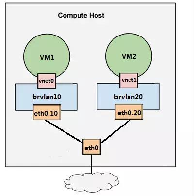
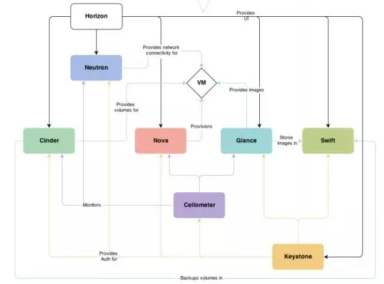

* content
{:toc}

## 虚拟化

虚拟化使得在一台物理的服务器上可以跑多台虚拟机，虚拟机共享物理机的 CPU、内存、IO 硬件资源，但逻辑上虚拟机之间是相互隔离的。

虚拟化又分为两种：1型虚拟化和2型虚拟化。

1型虚拟化： Hypervisor 直接安装在物理机上，多个虚拟机在 Hypervisor 上运行。Xen 和 VMWare 的 ESXi 都属于这个类型。

2型虚拟化： 物理机上首先安装常规的操作系统，Hypervisor 作为 OS 上的一个程序模块运行，并对管理虚拟机进行管理。KVM、VirtualBox 和 VMWare Workstation 都属于这个类型。

KVM 全称是 Kernel-Based Virtual Machine。也就是说 KVM 是基于 Linux 内核实现的。KVM有一个内核模块叫 kvm.ko，只用于管理虚拟 CPU 和内存。

IO 的虚拟化交给 Linux 内核和Qemu来实现。

Libvirt管理 KVM，还能管理 Xen，VirtualBox 等。OpenStack 底层也使用Libvirt。

Libvirt 包含 3 个东西：后台 daemon程序libvirtd、API 库和命令行工具 virsh
- libvirtd是服务程序，接收和处理 API 请求；
- API 库使得其他人可以开发基于 Libvirt 的高级工具,比如virt-manager，这是个图形化的 KVM 管理工具
- virsh 是我们经常要用的 KVM 命令行工具

## KVM 实验

KVM 是 2 型虚拟化，是运行在操作系统之上的，所以我们先要装一个 Linux。基本的 Ubuntu 操作系统装好之后，安装 KVM 需要的包
~~~
$ sudo apt-get install qemu-kvm qemu-system libvirt-bin virt-manager bridge-utils vlan
~~~
- qemu-kvm 和 qemu-system 是 KVM 和 QEMU 的核心包，提供 CPU、内存和 IO 虚拟化功能
- libvirt-bin 就是 libvirt，用于管理 KVM 等 Hypervisor
- virt-manager 是 KVM 图形化管理工具
- bridge-utils 和 vlan，主要是网络虚拟化需要.

ubuntu配置
~~~
修改 /etc/ssh/sshd_config，设置：
PermitRootLogin yes

# service ssh restart

//配置/etc/apt/sources.list aliyun

sudo vi /etc/default/grub 
找到GRUB_CMDLINE_LINUX=""
改为GRUB_CMDLINE_LINUX="net.ifnames=0 biosdevname=0"
然后sudo grub-mkconfig -o /boot/grub/grub.cfg
重启后，网卡名称果然变成了eth0和wlan0

//add root ssh
sudo vi /etc/ssh/sshd_config
PermitRootLogin no 改为如下的； PermitRootLogin yes

//add root account
sudo su -
passwd

---------------------

本文来自 wenwenxiong 的CSDN 博客 ，全文地址请点击：https://blog.csdn.net/wenwenxiong/article/details/52937539?utm_source=copy 

~~~

下载软件包
~~~
wget http://download.cirros-cloud.net/0.4.0/cirros-0.4.0-x86_64-disk.img
sudo cp ~/Downloads/cirros-0.4.0-x86_64-disk.img /var/lib/libvirt/images/
virt-manager
~~~

## cpu虚拟化原理

KVM 的虚拟化是需要 CPU 硬件支持的，如果有输出 vmx 或者 svm，就说明当前的 CPU 支持 KVM。

~~~
# egrep -o '(vmx|svm)'  /proc/cpuinfo
vmx
~~~

KVM 虚机在宿主机中其实是一个 qemu-kvm 进程，与其他 Linux 进程一样被调度。 

虚机中的每一个虚拟 vCPU 则对应 qemu-kvm 进程中的一个线程。

虚机的 vCPU 总数可以超过物理 CPU 数量，这个叫 CPU overcommit（超配）。 KVM 允许 overcommit，这个特性使得虚机能够充分利用宿主机的 CPU 资源，但前提是在同一时刻，不是所有的虚机都满负荷运行。

## 内存虚拟化原理
KVM 通过内存虚拟化共享物理系统内存，动态分配给虚拟机。

为了在一台机器上运行多个虚拟机，KVM 需要实现 VA（虚拟内存） -> PA（物理内存） -> MA（机器内存）之间的地址转换。虚机 OS 控制虚拟地址到客户内存物理地址的映射 （VA -> PA），但是虚机 OS 不能直接访问实际机器内存，因此 KVM 需要负责映射客户物理内存到实际机器内存 （PA -> MA）。

内存也是可以 overcommit 的，即所有虚机的内存之和可以超过宿主机的物理内存。但使用时也需要充分测试，否则性能会受影响。

## KVM 存储虚拟化

KVM 的存储虚拟化是通过存储池（Storage Pool）和卷（Volume）来管理的。

文件目录是最常用的 Storage Pool 类型。KVM 将宿主机目录 /var/lib/libvirt/images/ 作为默认的 Storage Pool。

Volume 是该目录下面的文件了，一个文件就是一个 Volume。

使用文件做 Volume 有很多优点：存储方便、移植性好、可复制、可远程访问。 

KVM 支持多种 Volume 文件格式，

- raw 是默认格式，即原始磁盘镜像格式，移植性好，性能好，但大小固定，不能节省磁盘空间。
- qcow2 是推荐使用的格式，cow 表示 copy on write，能够节省磁盘空间，支持 AES 加密，支持 zlib 压缩，支持多快照，功能很多。
- vmdk 是 VMWare 的虚拟磁盘格式，也就是说 VMWare 虚机可以直接在 KVM上 运行。

不仅一个文件可以分配给客户机作为虚拟磁盘，宿主机上 VG 中的 LV 也可以作为虚拟磁盘分配给虚拟机使用。不过，LV 由于没有磁盘的 MBR 引导记录，不能作为虚拟机的启动盘，只能作为数据盘使用。

宿主机上的 VG 就是一个 Storage Pool，VG 中的 LV 就是 Volume。 LV 的优点是有较好的性能；不足的地方是管理和移动性方面不如镜像文件，而且不能通过网络远程使用。

## KVM 网络虚拟化基础

#### Linux Bridge 
Linux Bridge 是 Linux 上用来做 TCP/IP 二层协议交换的设备，其功能大家可以简单的理解为是一个二层交换机或者 Hub。

编辑 /etc/network/interfaces，配置 br0
~~~
auto lo
iface lo inet loopback

auto br0
iface br0 inet dhcp
        bridge_ports eth0
        bridge_stp off
        bridge_fd 0
        bridge_maxwait 0    

~~~

- 之前宿主机的 IP 是通过 dhcp 配置在 eth0 上的；创建 Linux Bridge 之后，IP 就必须放到 br0 上了。
- 在 br0 的配置信息中请注意最后一行 “bridge_ports eth0”，其作用就是将 eth0 挂到 br0 上。
- 在 virt-manager 中查看一下 VM1 的网卡配置, 选择br0
- 启动vm，配置ip。br0之间可以ping通。
- vbox使用NAT模式

#### virbr0

virbr0 是 KVM 默认创建的一个 Bridge，其作用是为连接其上的虚机网卡提供 NAT 访问外网的功能。virbr0 默认分配了一个IP 192.168.122.1，并为连接其上的其他虚拟网卡提供 DHCP 服务。

在 virt-manager 打开 VM1 的配置界面，网卡 Source device 选择 “default（NAT）”，将 VM1 的网卡挂在 virbr0 上。

#### vlan

通常交换机的端口有两种配置模式： Access 和 Trunk。

Access 口
这些端口被打上了 VLAN 的标签，表明该端口属于哪个 VLAN。 Access 口只能属于一个 VLAN。

Trunk 口
假设有两个交换机 A 和 B。AB都有vlan1，vlan2，将 A 和 B 连起来，而且连接 A 和 B 的端口要允许 VLAN1、2  VLAN 的数据都能够通过。这样的端口就是Trunk口。

~~~
sudo vconfig add eth0 10
sudo brctl addbr br0
sudo brctl addif br0 eth0.10

sudo vconfig add eth0 20
sudo brctl addbr br20
sudo brctl addif br20 eth0.20
~~~

在 virt-manager 中将 VM1 的虚拟网卡挂到 br0 上。specify shared device naem br0

- 物理交换机存在多个 VLAN，每个 VLAN 拥有多个端口。 同一 VLAN 端口之间可以交换转发，不同 VLAN 端口之间隔离。 所以交换机其包含两层功能：交换与隔离。
- Linux 的 VLAN 设备实现的是隔离功能，但没有交换功能。
- Linux Bridge 专门实现交换功能。

## 云计算
计算（CPU/内存）、存储和网络是 IT 系统的三类资源。 通过云计算平台，这三类资源变成了三个池子 当需要虚机的时候，只需要向平台提供虚机的规格。 平台会快速从三个资源池分配相应的资源，部署出这样一个满足规格的虚机。 

云平台是一个面向服务的架构，按照提供服务的不同分为 IaaS、PaaS 和 SaaS。 

- IaaS（Infrastructure as a Service）提供的服务是虚拟机。 IaaS 负责管理虚机的生命周期，包括创建、修改、备份、启停、销毁等。典型的 IaaS 例子有 AWS、Rackspace、阿里云等。
- PaaS（Platform as a Service）提供的服务是应用的运行环境和一系列中间件服务（比如数据库、消息队列等）。典型的 PaaS 有 Heroku、Google App Engine、IBM BlueMix 等。
- SaaS（Software as a Service）提供的是应用服务。 典型的 SaaS 有 Google Gmail、Salesforce 等。
## openstack 架构

- Nova 管理计算资源，是核心服务。
- Neutron 管理网络资源，是核心服务。
- Glance 为 VM 提供 OS 镜像，属于存储范畴，是核心服务。
- Cinder 提供块存储，VM怎么也得需要数据盘吧，是核心服务。
- Swift 提供对象存储，不是必须的，是可选服务。
- Keystone 认证服务，没它 OpenStack 转不起来，是核心服务。
- Ceilometer 监控服务，不是必须的，可选服务。
- Horizon 大家都需要一个操作界面吧。

## 搭建 OpenStack 实验环境
OpenStack 是一个分布式系统，由若干不同功能的节点（Node）组成：

- 控制节点（Controller Node） 管理 OpenStack，其上运行的服务有 Keystone、Glance、Horizon 以及 Nova 和 Neutron 中管理相关的组件。 控制节点也运行支持 OpenStack 的服务，例如 SQL 数据库（通常是 MySQL）、消息队列（通常是 RabbitMQ）和网络时间服务 NTP。
- 网络节点（Network Node） 其上运行的服务为 Neutron。 为 OpenStack 提供 L2 和 L3 网络。 包括虚拟机网络、DHCP、路由、NAT 等
- 存储节点（Storage Node） 提供块存储（Cinder）或对象存储（Swift）服务。
- 计算节点（Compute Node） 其上运行 Hypervisor（默认使用 KVM）。 同时运行 Neutron 服务的 agent，为虚拟机提供网络支持。

按照物理资源需求创建 devstack-controller 和 devstak-compute 虚拟机

#### devstack-controller

1. 安装 Ubuntu 16.04，devstack-controller 三个eth， 一个bridge adpater， 一个internal， 一个host-only。devstak-compute两个，一个bridge adpater，一个internal。
2. devstack-controller 安装软件
~~~
apt-get install python-pip
apt-get install git -y
git clone https://git.openstack.org/openstack-dev/devstack 
~~~
3. 配置 stack 用户
~~~
devstack/tools/create-stack-user.sh
mv devstack /opt/stack -f
chown -R stack:stack /opt/stack/devstack
~~~
4. 编写运行配置文件,在 /opt/stack/devstack 目录下，创建 local.conf。
~~~
[[local|localrc]]

MULTI_HOST=true
HOST_IP=10.13.11.123 # management & api network
LOGFILE=/opt/stack/logs/stack.sh.log

# Credentials
ADMIN_PASSWORD=admin
MYSQL_PASSWORD=secret
RABBIT_PASSWORD=secret
SERVICE_PASSWORD=secret
SERVICE_TOKEN=abcdefghijklmnopqrstuvwxyz

# enable neutron-ml2-vlan
disable_service n-net
enable_service q-svc,q-agt,q-dhcp,q-l3,q-meta,neutron,q-lbaas,q-fwaas,q-vpn
Q_AGENT=linuxbridge
ENABLE_TENANT_VLANS=True
TENANT_VLAN_RANGE=3001:4000
PHYSICAL_NETWORK=default

LOG_COLOR=False
LOGDIR=$DEST/logs
SCREEN_LOGDIR=$LOGDIR/screen

# use TryStack git mirror
GIT_BASE=http://git.trystack.cn
NOVNC_REPO=http://git.trystack.cn/kanaka/noVNC.git
SPICE_REPO=http://git.trystack.cn/git/spice/spice-html5.git
~~~
另外，为了加快安装速度，还可以加上下面的配置使用国内的 pip 镜像站点
~~~
vi /root/.pip/pip.conf
vi /opt/stack/.pip/pip.conf
//add flow
[global]
index-url = https://pypi.tuna.tsinghua.edu.cn/simple
~~~
5. 
~~~
su stack
cd /opt/stack/devstack/
./stack.sh
~~~

#### devstak-compute 虚拟机

1. 安装 Ubuntu 16.04，devstack-controller 三个eth， 一个bridge adpater， 一个internal， 一个host-only。devstak-compute两个，一个bridge adpater，一个internal。
2. devstack-controller 安装软件
~~~
apt-get install python-pip
apt-get install git -y
git clone https://git.openstack.org/openstack-dev/devstack 
~~~
3. 配置 stack 用户
~~~
devstack/tools/create-stack-user.sh
mv devstack /opt/stack -f
chown -R stack:stack /opt/stack/devstack
~~~
4. 为了加快安装速度，还可以加上下面的配置使用国内的 pip 镜像站点
~~~
vi /root/.pip/pip.conf
vi /opt/stack/.pip/pip.conf
//add flow
[global]
index-url = https://pypi.tuna.tsinghua.edu.cn/simple
~~~
5. 编写运行配置文件,在 /opt/stack/devstack 目录下，创建 local.conf。
~~~
[[local|localrc]]

MULTI_HOST=true
HOST_IP=10.13.11.127 # management & api network

# Credentials
ADMIN_PASSWORD=admin
MYSQL_PASSWORD=secret
RABBIT_PASSWORD=secret
SERVICE_PASSWORD=secret
SERVICE_TOKEN=abcdefghijklmnopqrstuvwxyz

# Service information
SERVICE_HOST=10.13.11.123
MYSQL_HOST=$SERVICE_HOST
RABBIT_HOST=$SERVICE_HOST
GLANCE_HOSTPORT=$SERVICE_HOST:9292
Q_HOST=$SERVICE_HOST
KEYSTONE_AUTH_HOST=$SERVICE_HOST
KEYSTONE_SERVICE_HOST=$SERVICE_HOST

CEILOMETER_BACKEND=mongodb
DATABASE_TYPE=mysql

ENABLED_SERVICES=n-cpu,q-agt,neutron
Q_AGENT=linuxbridge
ENABLE_TENANT_VLANS=True
TENANT_VLAN_RANGE=3001:4000
PHYSICAL_NETWORK=default

# vnc config
NOVA_VNC_ENABLED=True
NOVNCPROXY_URL="http://$SERVICE_HOST:6080/vnc_auto.html"
VNCSERVER_LISTEN=$HOST_IP
VNCSERVER_PROXYCLIENT_ADDRESS=$VNCSERVER_LISTEN

LOG_COLOR=False
LOGDIR=$DEST/logs
SCREEN_LOGDIR=$LOGDIR/screen

# use TryStack git mirror
GIT_BASE=http://git.trystack.cn
NOVNC_REPO=http://git.trystack.cn/kanaka/noVNC.git
SPICE_REPO=http://git.trystack.cn/git/spice/spice-html5.git
~~~

5. start setup

~~~
su stack
cd /opt/stack/devstack/
./stack.sh
~~~

装了十几次还是装不下去了，可能电脑性能不够，放弃。

## reference
1.  [每天5分钟玩转 OpenStack](https://mp.weixin.qq.com/s/7AIkehI2X8wlIxNVU_YUwg)

