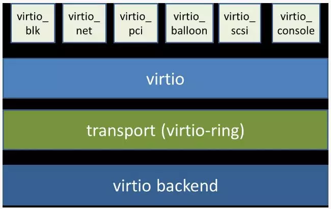

* content
{:toc}

## Qemu-kvm介绍 
Qemu是一个广泛使用的开源计算机仿真器和虚拟机。当作为仿真器时，可以在一种架构(如PC机)下运行另一种架构(如ARM)下的操作系统和程序。而通过动态转化，其可以获得很高的运行效率。当作为一个虚拟机时，qemu可以通过直接使用真机的系统资源，让虚拟系统能够获得接近于物理机的性能表现。

QEMU 当运行与主机架构相同的目标架构时可以使用KVM。例如，当在一个x86兼容处理器上运行 qemu-system-x86 时，可以利用 KVM 加速——为宿主机和客户机提供更好的性能。

Qemu有如下几个部分组成
- 处理器模拟器(x86、PowerPC和Sparc)
- 仿真设备(显卡、网卡、硬盘、鼠标等)
- 用于将仿真设备连接至主机设备(真实设备)的通用设备
- 模拟机的描述信息
- 调试器
- 与模拟器交互的用户接口；

KVM包含一个内核模块kvm.ko用来实现核心虚拟化功能，以及一个和处理器强相关的模块如kvm-intel.ko或kvm-amd.ko。KVM本身不实现任何模拟，仅仅是暴露了一个/dev/kvm接口，这个接口可被宿主机用来主要负责vCPU的创建，虚拟内存的地址空间分配，vCPU寄存器的读写以及vCPU的运行。有了KVM以后，guest os的CPU指令不用再经过QEMU来转译便可直接运行，大大提高了运行速度。但KVM的kvm.ko本身只提供了CPU和内存的虚拟化

KVM负责cpu虚拟化+内存虚拟化，实现了cpu和内存的虚拟化，但kvm并不能模拟其他设备。还必须有个运行在用户空间的工具才行，KVM的开发者选择了比较成熟的开源虚拟化软件QEMU来作为这个工具，QEMU模拟IO设备（网卡，磁盘等），对其进行了修改，最后形成了QEMU-KVM。

Intel系列CPU支持虚拟化的标志为"vmx气系列CPU的标志为"svm气所以可以用如下命令行查看"vmx"或者"svm"标志。

~~~
grep -E '(vmx|svm)' /proc/cpuinfo
~~~

kvm的代码位置在[gitkernel](https://git.kernel.org/pub/scm/virt/kvm/kvm.git/)
测试img在[cirros](https://download.cirros-cloud.net/0.4.0/cirros-0.4.0-x86_64-disk.img)

## 虚拟机

PVE（Proxmox） 、 esxi（vmware） 、 xenserver， kvm+webvirtmgr，Hyper-v Server VMware vSphere Hypervisor

## qemu command

qemu-kvm的标准选项主要涉及指定主机类型、CPU模式、NUMA、软驱设备、光驱设备及硬件设备等。

~~~
-name name：设定虚拟机名称；
-M machine：指定要模拟的主机类型，如Standard PC、ISA-only PC或Intel-Mac等，可以使用“qemu-kvm -M ?”获取所支持的所有类型；
-m megs：设定虚拟机的RAM大小；
-cpu model：设定CPU模型，如coreduo、qemu64等，可以使用“qemu-kvm -cpu ?”获取所支持的所有模型；
-smp n[,cores=cores][,threads=threads][,sockets=sockets][,maxcpus=maxcpus]：设定模拟的SMP架构中CPU的个数等、每个CPU的核心数及CPU的socket数目等；PC机上最多可以模拟255颗CPU；maxcpus用于指定热插入的CPU个数上限；
-numa opts：指定模拟多节点的numa设备；
-fda file
-fdb file：使用指定文件(file)作为软盘镜像，file为/dev/fd0表示使用物理软驱；
-hda file
-hdb file
-hdc file
-hdd file：使用指定file作为硬盘镜像；
-cdrom file：使用指定file作为CD-ROM镜像，需要注意的是-cdrom和-hdc不能同时使用；将file指定为/dev/cdrom可以直接使用物理光驱；
-drive option[,option[,option[,...]]]：定义一个硬盘设备；可用子选项有很多。
    file=/path/to/somefile：硬件映像文件路径；
    if=interface：指定硬盘设备所连接的接口类型，即控制器类型，如ide、scsi、sd、mtd、floppy、pflash及virtio等；
    index=index：设定同一种控制器类型中不同设备的索引号，即标识号；
    media=media：定义介质类型为硬盘(disk)还是光盘(cdrom)；
    snapshot=snapshot：指定当前硬盘设备是否支持快照功能：on或off；
    cache=cache：定义如何使用物理机缓存来访问块数据，其可用值有none、writeback、unsafe和writethrough四个；
    format=format：指定映像文件的格式，具体格式可参见qemu-img命令；
-boot [order=drives][,once=drives][,menu=on|off]：定义启动设备的引导次序，每种设备使用一个字符表示；不同的架构所支持的设备及其表示字符不尽相同，在x86 PC架构上，a、b表示软驱、c表示第一块硬盘，d表示第一个光驱设备，n-p表示网络适配器；默认为硬盘设备；
-boot order=dc,once=d
~~~

下面三个命令等价

~~~
qemu-system-x86_64 -m 1024 -smp 2 rhel6u3.img
qemu-system-x86_64 -m 1024 -smp 2 -hda rhel6u3.img
qemu-system-x86_64 -m 1024 -smp 2 -drive file=rhel6u3.img,if=ide,cache=writethrough
~~~

## qemu-img command
~~~
check[-ffmt] filename 对磁盘镜像文件进行一致性检查，查找镜像文件中的错误，目前仅支持对"qcow2","qed","vdi"格式文件的检查。
crate[-f fmt][-o options] filename [size] 创建一个格式为fmt，大小为size,文件名为filename的镜像文件。根据文件格式fmt的不同，还可以添加一个或多个选项(options)来附加对该文件的各种功能设置，可以使用"o？"来查询某种格式文件支持哪些选项。
commit[-f fmt] filename 提交filename文件中的更改到后端支持的镜像文件。
convert [-f fmt] [-O out_fmt] filename output_filename 转换文件格式
info filename 显示文件信息
resize filename [+|-] size 改变文件大小

~~~

客户机镜像文件可以由很多种方式来构建，其中几种如下：
1）本地存储的客户机镜像文件。推荐使用qow2，支持加密。
2）物理磁盘或磁盘分区。
3）LW(LogicalVolumeManagement)，逻辑分区。
4）NFS（№tworkFileSystem)，网络文件系统。
5）iSCSI(InternetSmallComputerSystemInterface)，基于Internet的小型计算机系统接口。
6）本地或光纤通道连接的LUN(LogicalUnitNumber)
7）GFS2(GlobalFileSystem2）．redhat主导开发的主要给集群使用的共享磁盘文件系统

## 网络属性相关选项

~~~
-net nic[,vlan=n][,macaddr=mac][,model=type][,name=name][,addr=addr][,vectors=v]：创建一个新的网卡设备并连接至vlan n中；PC架构上默认的NIC为e1000，macaddr用于为其指定MAC地址，name用于指定一个在监控时显示的网上设备名称；emu可以模拟多个类型的网卡设备，如virtio、i82551、i82557b、i82559er、ne2k_isa、pcnet、rtl8139、e1000、smc91c111、lance及mcf_fec等；不过，不同平台架构上，其支持的类型可能只包含前述列表的一部分，可以使用“qemu-kvm -net nic,model=?”来获取当前平台支持的类型；
-net tap[,vlan=n][,name=name][,fd=h][,ifname=name][,script=file][,downscript=dfile]：通过物理机的TAP网络接口连接至vlan n中，使用script=file指定的脚本(默认为/etc/qemu-ifup)来配置当前网络接口，并使用downscript=file指定的脚本(默认为/etc/qemu-ifdown)来撤消接口配置；使用script=no和downscript=no可分别用来禁止执行脚本；
-net user[,option][,option][,...]：在用户模式配置网络栈，其不依赖于管理权限；有效选项有：
    vlan=n：连接至vlan n，默认n=0；
    name=name：指定接口的显示名称，常用于监控模式中；
    net=addr[/mask]：设定GuestOS可见的IP网络，掩码可选，默认为10.0.2.0/8；
    host=addr：指定GuestOS中看到的物理机的IP地址，默认为指定网络中的第二个，即x.x.x.2；
    dhcpstart=addr：指定DHCP服务地址池中16个地址的起始IP，默认为第16个至第31个，即x.x.x.16-x.x.x.31；
    dns=addr：指定GuestOS可见的dns服务器地址；默认为GuestOS网络中的第三个地址，即x.x.x.3；
    tftp=dir：激活内置的tftp服务器，并使用指定的dir作为tftp服务器的默认根目录；
    bootfile=file：BOOTP文件名称，用于实现网络引导GuestOS；如：qemu -hda linux.img -boot n -net user,tftp=/tftpserver/pub,bootfile=/pxelinux.0   

~~~

#### 网桥模式

~~~
-net tap[,vlan=n][,name=name][,fd=h][,ifname=name][,script=file][,downscript=dfile]：通过物理机的TAP网络接口连接至vlan n中，使用script=file指定的脚本(默认为/etc/qemu-ifup)来配置当前网络接口，并使用downscript=file指定的脚本(默认为/etc/qemu-ifdown)来撤消接口配置；使用script=no和downscript=no可分别用来禁止执行脚本；
~~~

1. 需要bridge的两个包，bridge-utils和tunctl。
2. 编辑 /etc/network/interfaces，配置 br0
~~~
auto lo
iface lo inet loopback

auto br0
iface br0 inet dhcp
        bridge_ports eth0
        bridge_stp off
        bridge_fd 0
        bridge_maxwait 0    

~~~
3. 配置/etc/qemu-ifup
~~~
#! /bin/sh

switch=br0

if [ -n "$1" ]; then
	ip link set $1 up
	sleep 1
	brctl addif ${switch} $1
	exit 0
else
	echo "error :no interface specified"
	exit 1
fi
~~~
4. vbox里设置NAT模式，重启网络
~~~
sudo systemctl restart networking
~~~
5. 启动qemu
~~~
sudo qemu-system-x86_64 cirros-0.4.0-x86_64-disk.img -m 100 -net nic -net tap,ifname=tap1,script=/etc/qemu-ifup,downscript=no -nographic
~~~
6. 配置vbox的NAT的foward rule。
~~~
host ip :127.0.0.1
host port:2222
guestip: 10.0.2.17//ifconfig from qemu
guestport :22
~~~
7. ssh to qemu.

#### NAT模式
NAT（Network Addresss Translation,网络地址转换），属于广域网接入技术的一种，它将内网地址转化为外网的合法IP地址，它被广泛应用于各种类型的Internet接入方式和各种类型的网络之中。NAT将来自内网IP数据包的包头中的源IP地址转换为一个外网的IP地址。

1. 默认安装libvirt，ifconfig里存在一个virbr0的NAT的网桥。
2. 配置/etc/qemu-ifup
~~~
#! /bin/sh

switch=virbr0

if [ -n "$1" ]; then
	ip link set $1 up
	sleep 1
	brctl addif ${switch} $1
	exit 0
else
	echo "error :no interface specified"
	exit 1
fi
~~~
3. 启动qemu
~~~
sudo qemu-system-x86_64 cirros-0.4.0-x86_64-disk.img -m 100 -net nic -net tap,ifname=tap1,script=/etc/qemu-ifup,downscript=no -nographic
~~~
4. qemu可以访问外网，但是外网无法访问qemu，需要配置iptable。

#### 用户模式
"-net nic -net user"提供了一种用户模式(user-mode)的网络模拟。使用用户模式的网络的客户机可以连通宿主机及外部的网络。用户模式网络是完全由QEMU咱身实现的，不依赖于其他的工具，而且不需要root用户权限,QEMU使用Slirp实现了一整套TCP/IP协议栈，并且使用协议栈实现了一套虚拟的NAT网络。

缺点：
1. 内部实现，性能差。
2. 不支持部分协议，比如ICMP,无法ping测试。
3. 不能从宿主机或外部网络访问客户机。

测试命令：开启tftp，宿主机的5022转到客户机的22，宿主机的5080转到客户机的80，
~~~
sudo qemu-system-x86_64 cirros-0.4.0-x86_64-disk.img -m 100 -net nic -net user,tftp=/root/tftp,hostfwd=tcp::5022-:22,hostfwd=tcp::5080-:80 -nographic 
ssh jcai@10.13.11.104--ok
~~~

## virtio

virtio 是一种 I/O 半虚拟化解决方案，是一套通用 I/O 设备虚拟化的程序，是对半虚拟化 Hypervisor 中的一组通用 I/O 设备的抽象。提供了一套上层应用与各 Hypervisor 虚拟化设备（KVM，Xen，VMware等）之间的通信框架和编程接口，减少跨平台所带来的兼容性问题，大大提高驱动程序开发效率。

virtio 可以分为四层，包括前端 guest 中各种驱动程序模块，后端 Hypervisor （实现在Qemu上）上的处理程序模块，中间用于前后端通信的 virtio 层和 virtio-ring 层，virtio 这一层实现的是虚拟队列接口，算是前后端通信的桥梁，而 virtio-ring 则是该桥梁的具体实现，它实现了两个环形缓冲区，分别用于保存前端驱动程序和后端处理程序执行的信息。

- KVM的内存气球技术使得可以在虚拟机中按照需要调整的内存大小，提升内存的利用率。
~~~
qemu-system-x86_64 rhel6u3.img -smp 2 -m 2048 -balloon virtio
~~~
- 使用virtio_net半虚拟化驱动，可以提高网络吞吐量（thoughput）和降低网络延迟（latency).
~~~
qemu-system-x86_64 rhel6u3.img -smp 2 -m 1024 -net nic,model=virtio-net tap,ifname=tap1,script=/etc/qemu-ifup,downscript=no -nographic >
~~~
- virtio_blk驱动使用Virtio API为客户机的提供了一个高效访问块设备I/O的方法
~~~
qemu-system-x86_64 -smp 2 -m 1024 -net nic -net tap –drive file=rhel6u3.img,if=virtio
~~~

## VT-d概述 

在QEMU/KVM中，客户机能使用的设备，大致可分为如下三种类型。
1. Emulated device：QEMU纯软件模拟的设备。
2. Virtio device： 实现VIRTIO API的半虚拟化驱动的设备。
3. PCI device assignment： PCI设备直接分配。

Intel定义的I/O虚拟化技术规范为“Intel(R) Virtualization Technology for Directed I/O”（VT-d），而AMD的为“AMD-V”（也叫做IOMMU）。

1. 根据cpu区别开放IOMMU，DMAR，irq_remap. 重新编译内核。
2. 确定iommu，dmr是否打开
~~~
dmesg |grep -i iommu
dmsg |grep -i DMar
~~~
3. 在宿主机里隐藏设备,查询所在的pcibus，
4. 通过qemu -device 分配到客户机,下面例子分配pci网卡到qemu，不使用虚拟网卡。
~~~
//网卡
qemu-system-x86_64 a.img -m 1024 -device pci-assign,host=08:00.0,id=mynic -net none
//硬盘
qemu-system-x86_64 a.img -m 1024 -device pci-assign,host=00:1f.2,addr=0x6 -net nic -net tap
//usb
qemu-system-x86_64 a.img -m 1024 -device pci-assign,host=00:1d.0,addr=0x5 -net nic -net tap
~~~

普通VT-d技术实现了设备直接分配，尽管其性能非常好，但是它的一个物理设备只能分配给一个客户机使用。为了实现多个虚拟机能够共享同一个物理设备的资源，并且达到设备直接分配的性能，PCI-SIG[8]组织发布了SR-IOV（SingleRootI/OVirtualizationandSharing）规范，该规范定义了一个标准化的机制用以原生地支持实现多个共享的设备（不一定是网卡设备）。不过，目前SR-IOV（单根I/O虚拟化）最广泛的应用还是在以太网卡设备的虚拟化方面。
##  hotplug

目前，在服务器硬件中，可实现热插拔的部件主要有SATA硬盘（IDE不支持热插拔）、CPU、内存、风扇、USB、网卡等。在虚拟化环境中，在不关闭客户机的情况下，也可以对客户机的设备进行热插拔。目前，KVM对热插拔的支持还不够完善，主要支持PCI设备和CPU的热插拔，也可以通过balloonine间接实现内存的热插拔.

在qemu的terminal
1. pcie
~~~
[qemu-bin + storage options] \
-m 2G \
-device pcie-root-port,bus=pcie.0,id=rp1 \
-device pcie-root-port,bus=pcie.0,id=rp2 \
-device pcie-root-port,bus=pcie.0,id=rp3,bus-reserve=1 \
-device pcie-pci-bridge,id=br1,bus=rp1 \
-device pcie-pci-bridge,id=br2,bus=rp2 \
-device e1000,bus=br1,addr=8

Then in monitor it's OK to execute next commands:
device_add pcie-pci-bridge,id=br3,bus=rp3 \
device_add e1000,bus=br2,addr=1 \
device_add e1000,bus=br3,addr=1

Here you have:
 (1) Cold-plugged:
    - Root ports: 1 QEMU generic root port with the capability mentioned above,
                  2 QEMU generic root ports without this capability;
    - 2 PCIE-PCI bridges plugged into 2 different root ports;
    - e1000 plugged into the first bridge.
 (2) Hot-plugged:
    - PCIE-PCI bridge, plugged into QEMU generic root port;
    - 2 e1000 cards, one plugged into the cold-plugged PCIE-PCI bridge,
                     another plugged into the hot-plugged bridge.
~~~
2. usb
~~~

info usbhost
device_add usb-host，hostbus=1，hostport=2

(1) vendorid+productid -- match for a specific device, pass it to
      the guest when it shows up somewhere in the host.

(2) hostbus+hostport -- match for a specific physical port in the
    host, any device which is plugged in there gets passed to the
    guest.
(3) hostbus+hostaddr -- most useful for ad-hoc pass through as the
    hostaddr isn't stable, the next time you plug in the device it
    gets a new one ...
~~~

## nographic
1. ttys0
~~~
systemctl enable serial-getty@ttyS0.service
systemctl start serial-getty@ttyS0.service
~~~
2. 修改/etc/default/grub
~~~
GRUB_CMDLINE_LINUX_DEFAULT="console=tty0 console=ttyS0"
GRUB_TERMINAL="serial console"
~~~
3. update grub
~~~
update-grub
~~~
4. 使用nographic就可以了，ctrl+a c切换到qemuterminal

## virsh
#### 基本概念
- 节点（Node）是一个物理机器，上面可能运行着多个虚拟客户机。Hypervisor和Domain都运行在节点之上。
- Hypervisor也称虚拟机监控器（VMM），如KVM、Xen、VMware、Hyper-V等，是虚拟化中的一个底层软件层，它可以虚拟化一个节点让其运行多个虚拟客户机
- 域（Domain）是在Hypervisor上运行的一个客户机操作系统实例。
#### 配置文件
libvirt相关的配置文件都在/etc/libvirt/目录之中，

1. /etc/libvirt/libvirt.conf文件用于配置一些常用libvirt连接（通常是远程连接）的别名
2. /etc/libvirt/libvirtd.conf是libvirt的守护进程libvirtd的配置文件,被修改后需要让libvirtd重新加载配置文件（或重启libvirtd）才会生效。
3. /etc/libvirt/qemu.conf是libvirt对QEMU的驱动的配置文件，包括VNC、SPICE等和连接它们时采用的权限认证方式的配置，也包括内存大页、SELinux、Cgroups等相关配置。
4. /etc/libvirt/qemu/目录存放的是使用QEMU驱动的域的配置文件，
#### 命令
|命令| 	解释|
|-|-|
|虚拟机创建||
|virsh define DomainName.xml| 	通过配置文件定义一个虚拟机(这个虚拟机还不是活动的)|
|virsh create DomainName.xml |	创建虚拟机(创建后，虚拟机立即执行，成为活动主机)|
|虚拟机编辑||
|virsh edit DomainName 	|修改TestKVM的配置文件，效果等于先dumpxml得到配置文件，然后vi xml，最后后define该xml文件(建议关机修改，修改完virsh define防止不生效)|
|虚拟机查看||
|virsh list --all 	|查看虚拟机和状态|
|virsh dominfo DomainName |	显示虚拟机的基本信息|
|virsh domname 2 |	显示id号为2的虚拟机名|
|virsh domid DomainName |	显示虚拟机id号|
|virsh domuuid DomainName 	|显示虚拟机的uuid|
|virsh domstate DomainName |	显示虚拟机的当前状态|
|virsh dumpxml DomainName |	显示虚拟机的当前配置文件|
|虚拟机启停||
|virsh start DomainName |	启动该虚拟机|
|virsh reboot DomainName 	|重启虚拟机|
|virsh suspend DomainName |	虚拟机处于paused暂停状态,一般情况下是被admin运行了virsh suspend才会处于这种状态,但是仍然消耗资源,只不过不被超级管理程序调度而已。|
|virsh resume DomainName 	|把虚拟机唤醒，使其恢复到running状态|
|virsh shutdown DomainName |	正常关闭虚拟机，使虚拟机进入shutoff状态，系统提示虚拟机正在被关闭，却未必能成功|
|virsh destroy DomainName |	强制关闭该虚拟机，但并非真的销毁该虚拟机，只是关闭而已。|
|虚拟机备份、删除、恢复、克隆||
|virsh save DomainName a 	|将该虚拟机的运行状态存储到文件a中|
|virsh restore a 	|根据文件a恢复被存储状态的虚拟机的状态，即便虚拟机被删除也可以恢复（如果虚拟机已经被undefine移除，那么恢复的虚拟机也只是一个临时的状态，关闭后自动消失）|
|virsh undefine DomainName |	移除虚拟机，虚拟机处于关闭状态后还可以启动，但是被该指令删除后不能启动。在虚拟机处于Running状态时，调用该指令，该指令暂时不生效，但是当虚拟机被关闭后，该指令生效移除该虚拟机，也可以在该指令生效之前调用define+TestKVM.xml取消该指令|
|virt-clone -o DomainName -n DomainName01 –file /data/DomainName01.img 	|在-o后面为被克隆虚拟机名称，-n后克隆所得虚拟机名称，file为克隆所得虚拟机镜像存放地址。克隆的好处在于，假如一个虚拟机上安装了操作系统和一些软件，那么从他克隆所得的虚拟机也有一样的系统和软件，大大节约了时间。|

## reference

[1] [KVM虚拟化技术](https://book.douban.com/subject/25743939/)

