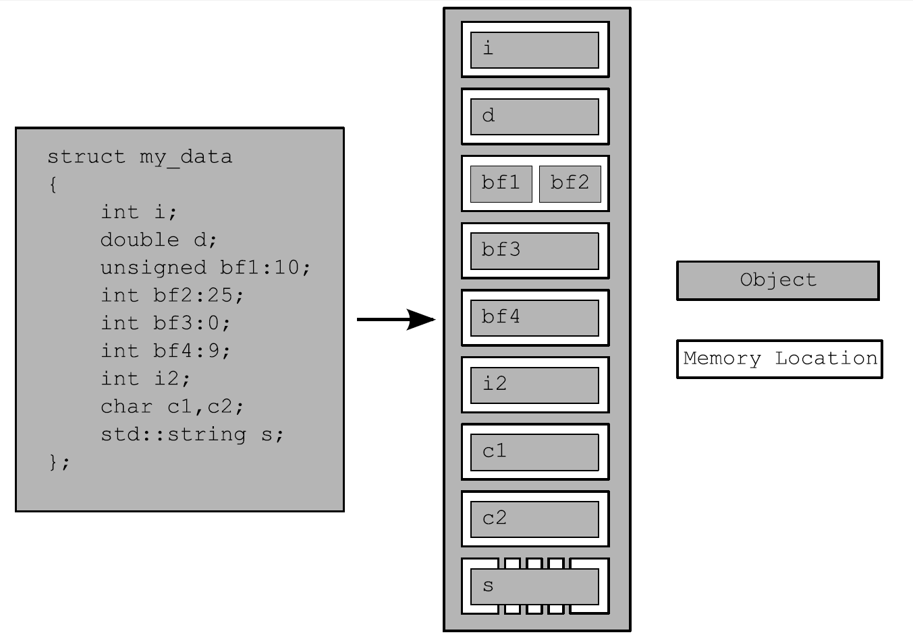

* content
{:toc}

## 你好

#### 什么是并发
计算机领域的并发指的是在单个系统里同时执行多个独立的任务，而非顺序的进行一些活动.

并发的两种方式：双核机器的真正并行 Vs. 单核机器的任务切换

四个任务在两个核心之间的切换

并发有两种途径，进程和线程。

1. 进程独立占有资源，只有一个线程，通过操作系统的通讯渠道（信号，套接字，文件，管道）与其他进程通信。
2. 线程共享地址空间，相互独立运行，

#### 为什么使用并发

1. 为了分离专注点，不同的程序关注不同的事情。
2. 为了性能，多核的时代。

线程是有限的资源。如果让太多的线程同时运行，则会消耗很多操作系统资源，从而使得操作系统整体上运行得更加缓慢。

当性能增益可能会小于预期，就不要使用线程了。

#### hello，thread

~~~
#include <iostream>
#include <thread>
using namespace std;
void hello()
{
    cout << "hello,concurrent world\n";
}
int main()
{
    std::thread t(hello);
    t.join();
}
~~~

在vimrc里添加alias，否则g++无法编译
~~~
alias g++="g++ -std=c++11 -pthread"
~~~

## 线程管理

#### 启动线程

1. inlcude <thread>   
2. thread.detach()  不等待线程结束就执行下一步。 后台运行线程
3. thread.join()  等待线程完成,只能对给定的对象调用一次
4. t.joinable() 判断线程是否已加入

#### 向线程函数传递参数

1. 简单参数

~~~
void f(int i, std::string const& s);
std::thread t(f, 3, "hello");
~~~

2. 对象

~~~
class X
{
public:
  void do_lengthy_work(int);
};
X my_x;
int num(0);
std::thread t(&X::do_lengthy_work, &my_x, num);
~~~

3. move

~~~
void process_big_object(std::unique_ptr<big_object>);

std::unique_ptr<big_object> p(new big_object);
p->prepare_data(42);
std::thread t(process_big_object,std::move(p));
~~~

## 转移线程所有权

~~~
void some_function();
void some_other_function();
std::thread t1(some_function);            // 1
std::thread t2=std::move(t1);            // 2
t1=std::thread(some_other_function);    // 3
std::thread t3;                            // 4
t3=std::move(t2);                        // 5
t1=std::move(t3);                        // 6 赋值操作将使程序崩溃
~~~

## 运行时决定线程数量

std::thread::hardware_concurrency() 这个函数将返回能同时并发在一个程序中的线程数量。

## 识别线程

1. 通过调用std::thread对象的成员函数get_id()来直接获取。
2. 当前线程中调用std::this_thread::get_id()。

## 线程间共享数据

## 使用互斥量保护共享数据

1. C++中通过实例化std::mutex创建互斥量，通过调用成员函数lock()进行上锁，unlock()进行解锁。
2. C++标准库为互斥量提供了一个RAII语法的模板类std::lock_guard，其会在构造的时候提供已锁的互斥量，并在析构的时候进行解锁，从而保证了一个已锁的互斥量总是会被正确的解锁。
~~~
#include <list>
#include <mutex>
#include <algorithm>

std::list<int> some_list;    // 1
std::mutex some_mutex;    // 2

void add_to_list(int new_value)
{
  std::lock_guard<std::mutex> guard(some_mutex);    // 3
  some_list.push_back(new_value);
}

bool list_contains(int value_to_find)
{
  std::lock_guard<std::mutex> guard(some_mutex);    // 4
  return std::find(some_list.begin(),some_list.end(),value_to_find) != some_list.end();
}
~~~

3.  std::unique_lock——灵活的锁, 首先，可将std::adopt_lock作为第二个参数传入构造函数，对互斥量进行管理；也可以将std::defer_lock作为第二个参数传递进去，表明互斥量应保持解锁状态。这样，就可以被std::unique_lock对象(不是互斥量)的lock()函数的所获取，或传递std::unique_lock对象到std::lock()中。

~~~
class some_big_object;
void swap(some_big_object& lhs,some_big_object& rhs);
class X
{
private:
  some_big_object some_detail;
  std::mutex m;
public:
  X(some_big_object const& sd):some_detail(sd){}
  friend void swap(X& lhs, X& rhs)
  {
    if(&lhs==&rhs)
      return;
    std::unique_lock<std::mutex> lock_a(lhs.m,std::defer_lock); // 1 
    std::unique_lock<std::mutex> lock_b(rhs.m,std::defer_lock); // 1 std::def_lock 留下未上锁的互斥量
    std::lock(lock_a,lock_b); // 2 互斥量在这里上锁
    swap(lhs.some_detail,rhs.some_detail);
  }
};
~~~
4.  保护共享数据的初始化过程

使用一个互斥量的延迟初始化(线程安全)过程

~~~
std::shared_ptr<some_resource> resource_ptr;
std::mutex resource_mutex;

void foo()
{
  std::unique_lock<std::mutex> lk(resource_mutex);  // 所有线程在此序列化 
  if(!resource_ptr)
  {
    resource_ptr.reset(new some_resource);  // 只有初始化过程需要保护 
  }
  lk.unlock();
  resource_ptr->do_something();
}
~~~

C++标准库提供了std::once_flag和std::call_once来处理条件竞争.
~~~
class X
{
private:
  connection_info connection_details;
  connection_handle connection;
  std::once_flag connection_init_flag;

  void open_connection()
  {
    connection=connection_manager.open(connection_details);
  }
public:
  X(connection_info const& connection_details_):
      connection_details(connection_details_)
  {}
  void send_data(data_packet const& data)  // 1
  {
    std::call_once(connection_init_flag,&X::open_connection,this);  // 2
    connection.send_data(data);
  }
  data_packet receive_data()  // 3
  {
    std::call_once(connection_init_flag,&X::open_connection,this);  // 2
    return connection.receive_data();
  }
};
~~~

使用boost::shared_mutex对数据结构进行保护
~~~
#include <map>
#include <string>
#include <mutex>
#include <boost/thread/shared_mutex.hpp>

class dns_entry;

class dns_cache
{
  std::map<std::string,dns_entry> entries;
  mutable boost::shared_mutex entry_mutex;
public:
  dns_entry find_entry(std::string const& domain) const
  {
    boost::shared_lock<boost::shared_mutex> lk(entry_mutex);  // 1
    std::map<std::string,dns_entry>::const_iterator const it=
       entries.find(domain);
    return (it==entries.end())?dns_entry():it->second;
  }
  void update_or_add_entry(std::string const& domain,
                           dns_entry const& dns_details)
  {
    std::lock_guard<boost::shared_mutex> lk(entry_mutex);  // 2
    entries[domain]=dns_details;
  }
};
~~~

## 同步并发操作

#### 等待一个事件或其他条件

1. 使用std::this_thread::sleep_for()进行周期性的间歇, 检查一个标志位。
~~~
bool flag;
std::mutex m;

void wait_for_flag()
{
  std::unique_lock<std::mutex> lk(m);
  while(!flag)
  {
    lk.unlock();  // 1 解锁互斥量
    std::this_thread::sleep_for(std::chrono::milliseconds(100));  // 2 休眠100ms
    lk.lock();   // 3 再锁互斥量
  }
}
~~~
2. 使用std::condition_variable处理数据等待条件达成

~~~

<condition_variable>

std::mutex mut;
std::queue<data_chunk> data_queue;  // 1 一个用来在两个线程之间传递数据的队列
std::condition_variable data_cond;

void data_preparation_thread()
{
  while(more_data_to_prepare())
  {
    data_chunk const data=prepare_data();
    std::lock_guard<std::mutex> lk(mut);
    data_queue.push(data);  // 2 使用std::lock_guard对队列上锁，将准备好的数据压入队列中
    data_cond.notify_one();  // 3 notify_one()成员函数，对等待的线程(如果有等待线程)进行通知
  }
}

void data_processing_thread()
{
  while(true)
  {
    std::unique_lock<std::mutex> lk(mut);  // 4 
    data_cond.wait(
         lk,[]{return !data_queue.empty();});  // 5
    data_chunk data=data_queue.front();
    data_queue.pop();
    lk.unlock();  // 6
    process(data);
    if(is_last_chunk(data))
      break;
  }
}
~~~

wait()会去检查这些条件(通过调用所提供的lambda函数)，当条件满足(lambda函数返回true)时返回。如果条件不满足(lambda函数返回false)，wait()函数将解锁互斥量，并且将这个线程(上段提到的处理数据的线程)置于阻塞或等待状态。当准备数据的线程调用notify_one()通知条件变量时，处理数据的线程从睡眠状态中苏醒，重新获取互斥锁，并且对条件再次检查，在条件满足的情况下，从wait()返回并继续持有锁。

#### 使用期望等待一次性事件

使用std::async启动一个异步任务。与std::thread对象等待的方式不同，std::async会返回一个std::future对象，这个对象持有最终计算出来的结果。当你需要这个值时，你只需要调用这个对象的get()成员函数；并且会阻塞线程直到“期望”状态为就绪为止；之后，返回计算结果。

~~~
#include <string>
#include <future>
struct X
{
  void foo(int,std::string const&);
  std::string bar(std::string const&);
};
X x;
auto f1=std::async(&X::foo,&x,42,"hello");  // 调用p->foo(42, "hello")，p是指向x的指针
auto f2=std::async(&X::bar,x,"goodbye");  // 调用tmpx.bar("goodbye")， tmpx是x的拷贝副本
struct Y
{
  double operator()(double);
};
Y y;
auto f3=std::async(Y(),3.141);  // 调用tmpy(3.141)，tmpy通过Y的移动构造函数得到
auto f4=std::async(std::ref(y),2.718);  // 调用y(2.718)
X baz(X&);
std::async(baz,std::ref(x));  // 调用baz(x)
class move_only
{
public:
  move_only();
  move_only(move_only&&)
  move_only(move_only const&) = delete;
  move_only& operator=(move_only&&);
  move_only& operator=(move_only const&) = delete;

  void operator()();
};
auto f5=std::async(move_only());  // 调用tmp()，tmp是通过std::move(move_only())构造得到

auto f6=std::async(std::launch::async,Y(),1.2);  // 在新线程上执行
auto f7=std::async(std::launch::deferred,baz,std::ref(x));  // 在wait()或get()调用时执行
auto f8=std::async(
              std::launch::deferred | std::launch::async,
              baz,std::ref(x));  // 实现选择执行方式
auto f9=std::async(baz,std::ref(x));
f7.wait();  //  调用延迟函数
~~~

std::packaged_task<>对一个函数或可调用对象，绑定一个期望。当std::packaged_task<> 对象被调用，它就会调用相关函数或可调用对象，将期望状态置为就绪，返回值也会被存储为相关数据。

指定函数签名的返回类型可以用来标识，从get_future()返回的std::future<>的类型，不过函数签名的参数列表，可用来指定“打包任务”的函数调用操作符。

使用“承诺”解决单线程多连接问题
~~~
#include <future>

void process_connections(connection_set& connections)
{
  while(!done(connections))  // 1 
  {
    for(connection_iterator  // 2
            connection=connections.begin(),end=connections.end();
          connection!=end;
          ++connection)
    {
      if(connection->has_incoming_data())  // 3
      {
        data_packet data=connection->incoming();
        std::promise<payload_type>& p=
            connection->get_promise(data.id);  // 4ID映射到一个std::promise，并且值是设置在包的有效负载中的。
        p.set_value(data.payload);
      }
      if(connection->has_outgoing_data())  // 5
      {
        outgoing_packet data=
            connection->top_of_outgoing_queue();
        connection->send(data.payload);
        data.promise.set_value(true);  // 6 当发送完成，与传出数据相关的“承诺”将置为true，来表明传输成功
      }
    }
  }
}
~~~

std::shared_future的实例同步std::future实例的状态。当std::future对象没有与其他对象共享同步状态所有权，那么所有权必须使用std::move将所有权传递到std::shared_future，其默认构造函数如下：

~~~
std::promise<int> p;
std::future<int> f(p.get_future());
assert(f.valid());  // 1 "期望" f 是合法的
std::shared_future<int> sf(std::move(f));
assert(!f.valid());  // 2 "期望" f 现在是不合法的
assert(sf.valid());  // 3 sf 现在是合法的
~~~

#### 限定等待时间

1. std::chrono::system_clock::now()是将返回系统时钟的当前时间。
2. 时钟节拍被指定为1/x(x在不同硬件上有不同的值)秒，这是由时间周期所决定——一个时钟一秒有25个节拍，因此一个周期为std::ratio<1, 25>，当一个时钟的时钟节拍每2.5秒一次，周期就可以表示为std::ratio<5, 2>。
3. std::chrono::duration<>函数模板能够对时延进行处理。
4. 标准库在std::chrono命名空间内，为延时变量提供一系列预定义类型：nanoseconds[纳秒] , microseconds[微秒] , milliseconds[毫秒] , seconds[秒] , minutes[分]和hours[时]。
5. 基于时延的等待可由std::chrono::duration<>来完成。例如，你等待一个“期望”状态变为就绪已经35毫秒：
~~~
std::future<int> f=std::async(some_task);
if(f.wait_for(std::chrono::milliseconds(35))==std::future_status::ready)
  do_something_with(f.get());
~~~
6. 时钟的时间点可以用std::chrono::time_point<>的类型模板实例来表示，实例的第一个参数用来指定所要使用的时钟，第二个函数参数用来表示时间的计量单位(特化的std::chrono::duration<>)。
~~~
auto start=std::chrono::high_resolution_clock::now();
do_something();
auto stop=std::chrono::high_resolution_clock::now();
std::cout<<”do_something() took “
  <<std::chrono::duration<double,std::chrono::seconds>(stop-start).count()
  <<” seconds”<<std::endl;
~~~
7. 等待一个条件变量——有超时功能
~~~
#include <condition_variable>
#include <mutex>
#include <chrono>

std::condition_variable cv;
bool done;
std::mutex m;

bool wait_loop()
{
  auto const timeout= std::chrono::steady_clock::now()+
      std::chrono::milliseconds(500);
  std::unique_lock<std::mutex> lk(m);
  while(!done)
  {
    if(cv.wait_until(lk,timeout)==std::cv_status::timeout)
      break;
  }
  return done;
}
~~~
8. 可接受超时的函数

|类型/命名空间|函数|返回值|
|-|:-:|:-:|:-:|
|std::this_thread[namespace] |sleep_for(duration)  | NA|
||sleep_until(time_point)|NA|
|std::condition_variable|wait_for(lock, duration) 	|std::cv_status::time_out 或 std::cv_status::no_timeout|
|或 std::condition_variable_any|wait_until(lock, time_point)||
|| 	wait_for(lock, duration, predicate)|bool —— 当唤醒时，返回谓词的结果|
||wait_until(lock, duration, predicate)|as up|
|std::timed_mutex 或 std::recursive_timed_mutex|try_lock_for(duration)|bool —— 获取锁时返回true，否则返回fasle|
||try_lock_until(time_point)||
|std::unique_lock<TimedLockable>|unique_lock(lockable, duration)|N/A —— 对新构建的对象调用owns_lock();|
||unique_lock(lockable, time_point)| 	当获取锁时返回true，否则返回false|
||try_lock_for(duration)|bool —— 当获取锁时返回true，否则返回false|
||try_lock_until(time_point)||
|std::future<ValueType>或std::shared_future<ValueType>|wait_for(duration)|当等待超时，返回std::future_status::timeout|
||wait_until(time_point)|当“期望”准备就绪时，返回std::future_status::ready,当“期望”持有一个为启动的延迟函数，返回std::future_status::deferred|

## C++内存模型和原子类型操作

####  内存模型基础

struct 展示不同对象的内存位置

四个需要牢记的原则：
~~~
1. 每一个变量都是一个对象，包括作为其成员变量的对象。
2. 每个对象至少占有一个内存位置。
3. 基本类型都有确定的内存位置(无论类型大小如何，即使他们是相邻的，或是数组的一部分)。
4. 相邻位域是相同内存中的一部分。
~~~

#### C++中的原子操作和原子类型

原子操作 是个不可分割的操作。它要么就是做了，要么就是没做，只有这两种可能。 
非原子操作可能会被另一个线程观察到只完成一半。 

标准 原子类型 定义在头文件<atomic>中。

标准原子类型的备选名和与其相关的std::atomic<>特化类
|原子类型|相关特化类|
|-|:-:|
|atomic_bool 	    |std::atomic<bool>|              
|atomic_char 	    |std::atomic<char>          |
|atomic_schar 	    |std::atomic<signed char>|
|atomic_uchar 	    |std::atomic<unsigned char>|
|atomic_int 	    |std::atomic<int>|
|atomic_uint 	    |std::atomic<unsigned>|
|atomic_short 	    |std::atomic<short>|
|atomic_ushort 	    |std::atomic<unsigned short>|
|atomic_long 	    |std::atomic<long>|
|atomic_ulong 	    |std::atomic<unsigned long>|
|atomic_llong 	    |std::atomic<long long>|
|atomic_ullong 	    |std::atomic<unsigned long l|ong>
|atomic_char16_t 	|std::atomic<char16_t>|
|atomic_char32_t 	|std::atomic<char32_t>|
|atomic_wchar_t 	|std::atomic<wchar_t>|

标准原子类型定义(typedefs)和对应的内置类型定义(typedefs)

|原子类型定义|标准库中相关类型定义|
|-|:-:|
|atomic_int_least8_t 	|int_least8_t |
|atomic_uint_least8_t 	|uint_least8_t|
|atomic_int_least16_t 	|int_least16_t|
|atomic_uint_least16_t 	|uint_least16_t|
|atomic_int_least32_t 	|int_least32_t|
|atomic_uint_least32_t 	|uint_least32_t|
|atomic_int_least64_t 	|int_least64_t|
|atomic_uint_least64_t 	|uint_least64_t|
|atomic_int_fast8_t 	|int_fast8_t|
|atomic_uint_fast8_t 	|uint_fast8_t|
|atomic_int_fast16_t 	|int_fast16_t|
|atomic_uint_fast16_t 	|uint_fast16_t|
|atomic_int_fast32_t 	|int_fast32_t|
|atomic_uint_fast32_t 	|uint_fast32_t|
|atomic_int_fast64_t 	|int_fast64_t|
|atomic_uint_fast64_t 	|uint_fast64_t|
|atomic_intptr_t 	    |intptr_t|
|atomic_uintptr_t 	    |uintptr_t|
|atomic_size_t 	        |size_t|
|atomic_ptrdiff_t 	    |ptrdiff_t|
|atomic_intmax_t 	    |intmax_t|
|atomic_uintmax_t 	    |uintmax_t|

通常，标准原子类型是不能拷贝和赋值，他们没有拷贝构造函数和拷贝赋值操作。
因为可以隐式转化成对应的内置类型，所以这些类型依旧支持赋值.

std::atomic<>类模板操作分为三类

~~~
1. Store操作，可选如下顺序：memory_order_relaxed, memory_order_release, memory_order_seq_cst。
2. Load操作，可选如下顺序：memory_order_relaxed, memory_order_consume, memory_order_acquire, memory_order_seq_cst。
3. Read-modify-write(读-改-写)操作，可选如下顺序：memory_order_relaxed, memory_order_consume, memory_order_acquire, memory_order_release, memory_order_acq_rel, memory_order_seq_cst。
所有操作的默认顺序都是memory_order_seq_cst。
~~~

###### std::atomic_flag的相关操作
~~~
1. std::atomic_flag是最简单的标准原子类型，它表示了一个布尔标志。这个类型的对象可以在两个状态间切换：设置和清除。
2. std::atomic_flag类型的对象必须被ATOMIC_FLAG_INIT初始化。初始化标志位是“清除”状态。这里没得选择；这个标志总是初始化为“清除”：

std::atomic_flag f = ATOMIC_FLAG_INIT;

当你的标志对象已初始化，那么你只能做三件事情：销毁，清除或设置(查询之前的值)。

这些事情对应的函数分别是：clear()成员函数，和test_and_set()成员函数。
~~~
 使用std::atomic_flag实现自旋互斥锁
~~~
class spinlock_mutex
{
  std::atomic_flag flag;
public:
  spinlock_mutex():
    flag(ATOMIC_FLAG_INIT)
  {}
  void lock()
  {
    while(flag.test_and_set(std::memory_order_acquire));
  }
  void unlock()
  {
    flag.clear(std::memory_order_release);
  }
};
~~~ 

###### std::atomic的相关操作
~~~
std::atomic<bool> b; 
bool x=b.load(std::memory_order_acquire);//调用load()来完成支持对值的普通(不可修改)查找
b.store(true);//store()是一个存储操作
x=b.exchange(false, std::memory_order_acq_rel);//exchange()是一个“读-改-写”操作
~~~

###### std::atomic<T*>:指针运算
~~~
class Foo{};
Foo some_array[5];
std::atomic<Foo*> p(some_array);
Foo* x=p.fetch_add(2);  // p加2，并返回原始值
assert(x==some_array);
assert(p.load()==&some_array[2]);
x=(p-=1);  // p减1，并返回原始值
assert(x==&some_array[1]);
assert(p.load()==&some_array[1]);
~~~

#### 同步操作和强制排序

不同线程对数据的读写

~~~
#include <vector>
#include <atomic>
#include <iostream>

std::vector<int> data;
std::atomic<bool> data_ready(false);

void reader_thread()
{
  while(!data_ready.load())  // 1
  {
    std::this_thread::sleep(std::milliseconds(1));
  }
  std::cout<<"The answer="<<data[0]<<"\m";  // 2
}
void writer_thread()
{
  data.push_back(42);  // 3
  data_ready=true;  // 4
}
~~~

