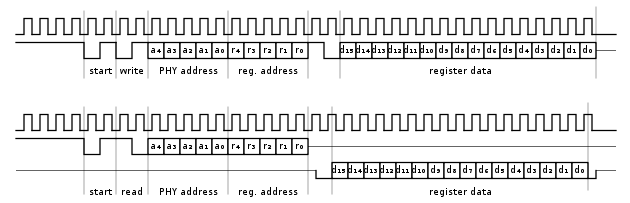

* content
{:toc}

## MDIO接口

SMI：串行管理接口（Serial Management Interface），也被称作MII管理接口（MII Management Interface），包括MDC和MDIO两条信号线。MDIO是一个PHY的管理接口，用来读/写PHY的寄存器，以控制PHY的行为或获取PHY的状态，MDC为MDIO提供时钟。

MDIO原本是为MII总线接口定义的，MII用于连接MAC和PHY，包含两种信号接口：

1. 一个数据接口用于MAC和PHY之间接收和发送以太网帧数据。

2. 一个PHY管理接口，即MDIO，用于读写每个PHY的控制寄存器和状态寄存器，以达到控制PHY行为和监控PHY状态的目的。

MDIO是双向的，只支持一个MAC连接最多32个PHY的连接方式，且MAC作为master，PHY作为slave。在写PHY寄存器的时候，由MAC驱动MDIO向PHY写入数据；在读PHY寄存器时，前半段由MAC驱动发送寄存器地址，后半段由PHY驱动回复寄存器的值。

MDC要求由MAC输出，是非周期性的，即不要求提供固定频率的时钟，对于PHY芯片则作为输入，以在上升沿触发MDIO的读写。MDC的时钟频率可以是DC-2.5MHz，即最小的时钟周期为400ns。

#### MDIO数据传输协议

MDIO数据格式定义在IEEE 802.3以太网标准中，如下图所示（数据传输顺序为从左至右）：

Preamble+Start：32bits的前导码,通常全1，或者。

ST： 前导码01.

OP Code：2bits的操作码，10表示读，01表示写。

PHYAD：5bits的PHY地址，一般PHY地址从0开始顺序编号，例如6口switch中PHY地址为0-5。

REGAD：5bits的寄存器地址，即要读或写的寄存器。

Turn Around：2bits的TA，在读命令中，MDIO在此时由MAC驱动改为PHY驱动，并等待一个时钟周期准备发送数据。在写命令中，不需要MDIO方向发生变化，则只是等待两个时钟周期准备写入数据。

Data：16bits数据，在读命令中，PHY芯片将读到的对应PHYAD的REGAD寄存器的数据写到Data中，在写命令中，MAC将要写入对应PHYAD的REGAD寄存器的值写入Data中。

## linux中MDIO的实现

读写PHY寄存器时通过2个函数

phy_read()和phy_write()，

最终调用
~~~
int gfar_local_mdio_read(struct gfar_mii *regs, int mii_id, int regnum)
int gfar_local_mdio_write(struct gfar_mii *regs, int mii_id, int regnum, u16 value)
~~~
参数regs就是MDIO相关寄存器：

    struct gfar_mii {
    u32 miimcfg; /* 0x.520 - MII Management Config Register */
    u32 miimcom; /* 0x.524 - MII Management Command Register */
    u32 miimadd; /* 0x.528 - MII Management Address Register */
    u32 miimcon; /* 0x.52c - MII Management Control Register */
    u32 miimstat; /* 0x.530 - MII Management Status Register */
    u32 miimind; /* 0x.534 - MII Management Indicator Register */
    };

参数mii_id，就是PHY的id

参数regnum，就是寄存器地址

## reference
1. [SMI（MDC/MDIO）总线接口介绍](https://blog.csdn.net/jasonchen_gbd/article/details/51628992)
2. [wiki](https://en.wikipedia.org/wiki/Management_Data_Input/Output)